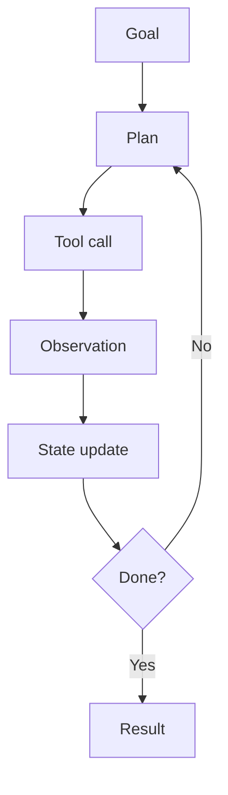

An agent loop is a control system wrapped around a language model. The basic cycle is plan, act, observe, update state, and decide whether to continue.

Reliability comes from making each boundary explicit: what tools can do, what state is persisted, what errors mean, and how the loop stops.
