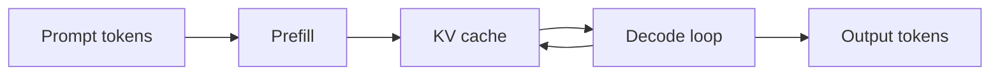

Autoregressive inference is shaped by a simple constraint: each generated token depends on the tokens before it. The key-value cache avoids recomputing attention state for the full context at every step, but it moves pressure onto memory capacity and bandwidth.

Useful questions for inference design:

- How large is the cache per request?
- Can multiple requests be batched without wasting memory?
- What is the prefill versus decode latency profile?
- When does quantization help or hurt?

