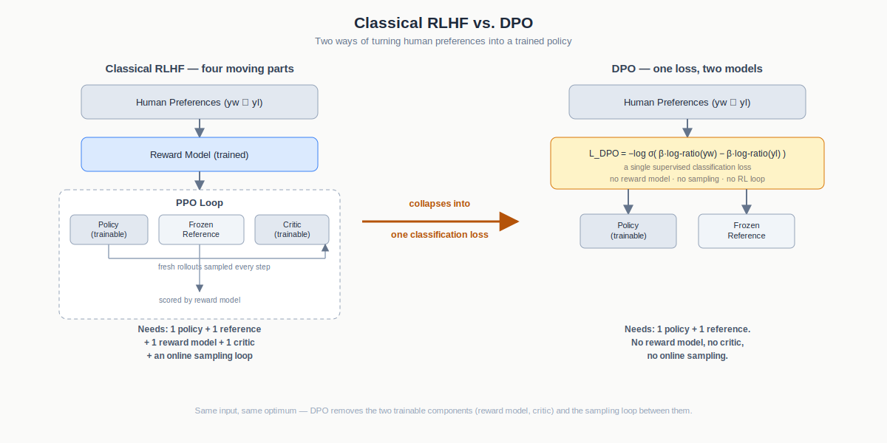
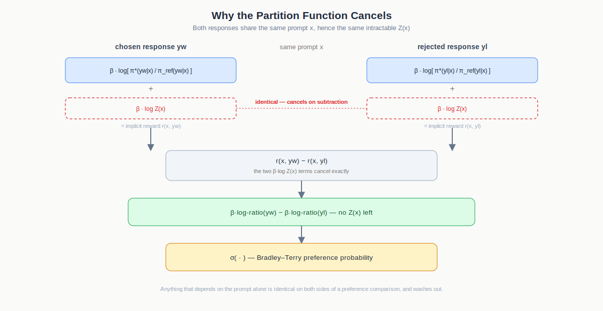
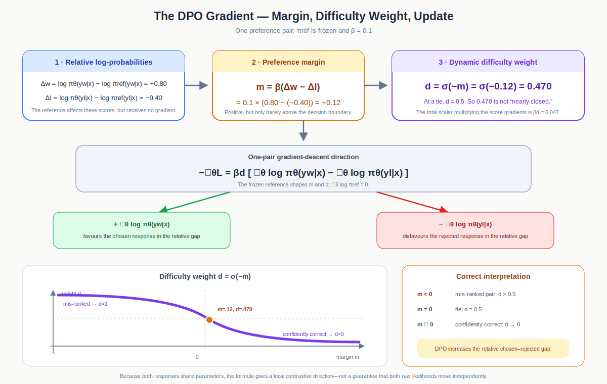

# Direct Preference Optimization: Collapsing RLHF Into One Loss

> [!abstract]
> **The Elevator Pitch**
>
> Reinforcement Learning from Human Feedback is usually presented as a two-stage pipeline: train a reward model on human comparisons, then run PPO against it. This note explains why that pipeline is not load-bearing. The KL-constrained RLHF objective has a closed-form optimal policy; that optimum can be inverted to read a reward directly off the policy; and substituting this implicit reward into the Bradley–Terry preference model collapses the entire two-stage procedure into a single supervised classification loss. DPO is therefore not an approximation to RLHF. It is RLHF, re-derived until the reward model and the RL loop are no longer necessary.

Fig 1 Classical RLHF needs a policy, a frozen reference, a trained reward model, a critic, and an online sampling loop. DPO needs a policy, a frozen reference, and a single classification loss.

## Contents

1. [[#Two models and an RL loop, or one loss]]
2. [[#The KL-constrained objective]]
3. [[#The closed-form optimal policy]]
4. [[#Reading the optimum backwards — the implicit reward]]
5. [[#Bradley–Terry, and where the partition function goes]]
6. [[#The DPO loss]]
7. [[#Why the substitution is valid — reward equivalence]]
8. [[#A complete worked example]]
9. [[#The gradient, decomposed]]
10. [[#Temperature controls more than drift]]
11. [[#What DPO gives up]]
12. [[#Questions and answers]]
13. [[#Key takeaways]]

---

## Two models and an RL loop, or one loss

By the time RLHF became the standard recipe for aligning a language model, the pipeline had settled into a familiar shape: collect human comparisons between pairs of responses, fit a reward model on those comparisons, then run PPO against that learned reward, while a frozen reference model holds the policy back from drifting into gibberish that games the reward. It works. It is also expensive in a specific way. At training time you need a trainable policy, a frozen reference policy, a learned reward model, and — if you run PPO honestly — a critic, plus fresh rollouts sampled from the policy at every step so the reward model has something to score.

DPO asks a blunter question. The whole point of the reward model is to produce a scalar that ranks two responses; the whole point of PPO is to push the policy toward whatever that scalar prefers. Why route through the scalar at all, if the reward the RL stage is chasing turns out to already be expressible in terms of the very policy that is training against it? Once you see that, the two-stage pipeline stops looking like necessary machinery and starts looking like a needlessly indirect way of fitting one classifier.

> [!info]
> DPO is not "RLHF without a reward model." It is the same RLHF objective, algebraically rearranged until the reward model becomes redundant. The result is exact, not a heuristic approximation — which is exactly why it works as well as it does.

---

## The KL-constrained objective

Three ingredients set up the problem. A **reference policy** $\pi_{\text{ref}}(y \mid x)$ — your supervised fine-tuned model, frozen, serving as an anchor. A **reward function** $r(x,y)$, a number scoring how good response $y$ is for prompt $x$ — in classical RLHF, the output of a separately trained reward model. And the objective itself, which asks for a new policy that earns high reward without straying far from the anchor:

$$
\arg\max_{\pi}\;\; \mathbb{E}_{x\sim D,\, y\sim\pi(\cdot\mid x)}\big[\, r(x,y) \,\big] \;-\; \beta\, \mathrm{KL}\big(\pi(\cdot\mid x)\,\|\,\pi_{\text{ref}}(\cdot\mid x)\big).
$$

Read in words: maximise expected reward, minus a penalty for how far the new policy drifts from the reference. The KL term is always non-negative and is zero exactly when the two policies coincide. The temperature $\beta$ sets the trade-off — large $\beta$ keeps the policy glued to the reference, small $\beta$ lets it chase reward aggressively, at the risk of collapsing into reward-hacking gibberish.

> [!important]
> The entire DPO result answers one question: for a *fixed* reward, what is the single best policy this objective can produce? Once that optimum is known in closed form, it can be read backwards to recover the reward — and the reward model turns out never to have been necessary.

---

## The closed-form optimal policy

For any reward $r(x,y)$, the policy maximising the objective above is

$$
\pi^*(y \mid x) \;=\; \frac{1}{Z(x)}\, \pi_{\text{ref}}(y \mid x)\, \exp\!\Big(\tfrac{1}{\beta} r(x,y)\Big), \qquad
Z(x) = \sum_{y} \pi_{\text{ref}}(y \mid x)\, \exp\!\Big(\tfrac{1}{\beta} r(x,y)\Big).
$$

$Z(x)$ is the **partition function**: it sums over every possible response so the probabilities integrate to one. It depends on the prompt, never on any single response.

The proof needs no calculus of variations. Fix a prompt, divide the objective by $\beta$ (a positive constant, so it doesn't move the maximiser), and fold reward and KL into one expectation:

$$
\frac{1}{\beta}(\text{objective}) \;=\; \mathbb{E}_{y\sim\pi}\Big[\tfrac{1}{\beta}r(x,y) - \log\tfrac{\pi(y\mid x)}{\pi_{\text{ref}}(y\mid x)}\Big].
$$

Since $\tfrac{1}{\beta}r = \log\exp(\tfrac{1}{\beta}r)$, the bracket becomes a single log of a ratio. Multiply and divide by $Z(x)$ inside that log — since $\log Z(x)$ doesn't depend on $y$, it pulls straight out of the expectation — and the whole expression reduces to

$$
-\,\mathrm{KL}\big(\pi(\cdot\mid x)\,\|\,\pi^*(\cdot\mid x)\big) \;-\; \log Z(x).
$$

The second term is a constant, untouched by $\pi$. The first is a negative KL divergence, which is maximised — driven to zero — exactly when $\pi = \pi^*$. No Lagrange multipliers, no gradient ascent: the objective was rewritten until it read "minus a distance to a target, plus a constant we can't influence," and the best you can do against a distance is close it.

> [!info]
> The target $\pi^*$ is the reference reshaped by the reward: responses with higher reward get their probability multiplied up by $\exp(r/\beta)$, and everything is renormalised by $Z(x)$.

---

## Reading the optimum backwards — the implicit reward

Equation (3) gives the policy in terms of the reward. DPO's move is to run it in reverse — solve for the reward in terms of the policy. Taking logs,

$$
\log \pi^*(y\mid x) \;=\; \log \pi_{\text{ref}}(y\mid x) + \tfrac{1}{\beta} r(x,y) - \log Z(x),
$$

and isolating $r(x,y)$:

$$
r(x,y) \;=\; \beta \log \frac{\pi^*(y\mid x)}{\pi_{\text{ref}}(y\mid x)} \;+\; \beta \log Z(x).
$$

This is the reframe the whole method rests on. The reward is no longer a mysterious external object trained by a separate network — it is written entirely in terms of policies. Whatever reward produced the optimal policy, it can be recovered from the policy's own log-ratio against the reference. Call $\beta \log \tfrac{\pi^*(y\mid x)}{\pi_{\text{ref}}(y\mid x)}$ the **implicit reward**: it measures how much the optimal policy raises or lowers the probability of $y$ relative to the reference.

> [!warning]
> The $\beta\log Z(x)$ term is a problem as it stands — $Z(x)$ sums over every possible response and is intractable to compute. If it had to be evaluated, this reframe would be a dead end. The next step shows it disappears entirely, which is precisely why DPO is tractable.

---

## Bradley–Terry, and where the partition function goes

Human preference data doesn't arrive as numeric rewards. It arrives as comparisons: shown two responses, a person picks a winner $y_w$ over a loser $y_l$. The standard model connecting rewards to such choices is Bradley–Terry:

$$
P(y_w \succ y_l \mid x) \;=\; \sigma\big(r(x,y_w) - r(x,y_l)\big), \qquad \sigma(z) = \frac{1}{1+e^{-z}}.
$$

In words: the probability a human prefers the winner is the logistic sigmoid of the reward gap. Crucially, it only ever uses the *difference* of two rewards, never a reward in isolation.

Substitute the implicit reward for both responses and watch the $\beta\log Z(x)$ terms:

$$
r(x,y_w) - r(x,y_l) \;=\;
\Big[\beta\log\tfrac{\pi^*(y_w\mid x)}{\pi_{\text{ref}}(y_w\mid x)} + \underbrace{\beta\log Z(x)}_{\text{cancels}}\Big]
-
\Big[\beta\log\tfrac{\pi^*(y_l\mid x)}{\pi_{\text{ref}}(y_l\mid x)} + \underbrace{\beta\log Z(x)}_{\text{cancels}}\Big].
$$

Both responses share the same prompt, hence the same $Z(x)$; on subtraction the two copies cancel exactly. The intractable partition function is simply gone, leaving

$$
P(y_w \succ y_l \mid x) \;=\; \sigma\!\Big(\beta\log\tfrac{\pi^*(y_w\mid x)}{\pi_{\text{ref}}(y_w\mid x)} - \beta\log\tfrac{\pi^*(y_l\mid x)}{\pi_{\text{ref}}(y_l\mid x)}\Big).
$$

> [!info]
> The cancellation is not a trick specific to this algebra — it's a structural fact. $Z(x)$ depends only on the prompt, and a preference always compares two responses to the *same* prompt. Anything that depends on $x$ alone is identical on both sides of the comparison and washes out.

Fig 2 Both responses to the same prompt carry an identical β·log Z(x) term. Subtracting one implicit reward from the other cancels it exactly, leaving a quantity computable from the policy alone.

---

## The DPO loss

The equation above is written for the unknown optimal policy $\pi^*$ — which is exactly what training is trying to find. Replace it with a trainable model $\pi_\theta$ and ask: which $\theta$ makes the observed human preferences most likely? That is plain maximum-likelihood logistic regression. Minimising the negative log-likelihood of the preference dataset gives the **DPO objective**:

$$
\mathcal{L}_{\text{DPO}}(\pi_\theta;\pi_{\text{ref}}) \;=\; -\,\mathbb{E}_{(x,y_w,y_l)\sim D}\left[\log\sigma\!\Big(\beta\log\tfrac{\pi_\theta(y_w\mid x)}{\pi_{\text{ref}}(y_w\mid x)} - \beta\log\tfrac{\pi_\theta(y_l\mid x)}{\pi_{\text{ref}}(y_l\mid x)}\Big)\right].
$$

That is the entire algorithm. Computing it needs only a forward pass of the trainable policy and the frozen reference on the chosen and rejected responses, four log-probabilities, a subtraction, and a sigmoid. No reward model, no sampling, no RL loop.

> [!important]
> This loss is *exactly* the loss used to train a Bradley–Terry reward model — a binary classifier on (winner, loser) pairs — except the reward has been replaced by the implicit reward $\beta\log\tfrac{\pi_\theta}{\pi_{\text{ref}}}$. DPO is reward-model training and policy optimisation fused into a single step: the object being optimised is the policy, and the reward is simply a way of reading it.

---

## Why the substitution is valid — reward equivalence

One objection remains. The reward recovered from the policy is *implicit*, not the reward a separately trained model would have produced. Could DPO be quietly optimising the wrong target?

It cannot, and the reason is precise. Two rewards that differ only by a function of the prompt,

$$
r'(x,y) = r(x,y) + g(x),
$$

induce the *same* optimal policy and the *same* Bradley–Terry preferences. In the optimal policy, $g(x)$ enters as a common factor $e^{g(x)/\beta}$ in both the numerator and $Z(x)$, so it cancels; in Bradley–Terry, $g(x)$ is added to both rewards and cancels in the difference. Rewards therefore form equivalence classes, and prompt-only shifts are invisible to everything that matters. The implicit reward is simply the canonical representative of the same equivalence class as the "true" reward — so optimising it lands on the same optimal policy. The DPO optimum *is* the RLHF optimum.

This is what lets the two-stage pipeline collapse safely into one loss: the information lost by not training an explicit reward model — the prompt-only term $g(x)$ — is exactly the information that never influenced the policy to begin with.

---

## A complete worked example

The algebra above is exact but abstract. Here is the entire pass through real numbers, fixing $\beta = 0.1$ throughout.

**The preference.** A user asks: *"Should I put all my savings into one stock?"* A human labeller is shown two answers and picks a winner.

- Chosen $y_w$: *"No — putting everything in one stock is very risky; spread it across a low-cost index fund and keep an emergency buffer."*
- Rejected $y_l$: *"Yes, go all in — bet everything on it."*

No score is attached to either response — only the ordering $y_w \succ y_l$. That ordering is the entire input DPO needs.

**Scoring each answer.** A language model assigns probability to a whole response by summing per-token log-probabilities. Define the per-response log-ratio against the reference,

$$
\Delta(y) \;=\; \log\pi_\theta(y\mid x) - \log\pi_{\text{ref}}(y\mid x) \;=\; \sum_t\big[\log\pi_\theta(y_t\mid x,y_{<t}) - \log\pi_{\text{ref}}(y_t\mid x,y_{<t})\big].
$$

Scoring the six tokens of the rejected answer, *"Yes, go all in."*, token by token:

| token | $\log\pi_\theta$ | $\log\pi_{\text{ref}}$ | difference |
|---|---|---|---|
| Yes | −0.85 | −0.80 | −0.05 |
| , | −0.30 | −0.18 | −0.12 |
| go | −1.10 | −1.07 | −0.03 |
| all | −0.60 | −0.50 | −0.10 |
| in | −0.40 | −0.34 | −0.06 |
| . | −0.20 | −0.16 | −0.04 |
| **sum** | **−3.45** | **−3.05** | **−0.40** |

$$
\Delta(y_l) = (-0.05)+(-0.12)+(-0.03)+(-0.10)+(-0.06)+(-0.04) = -0.40.
$$

The reference assigns the reckless answer *higher* probability than the current policy does — the policy already disprefers it slightly. Running the identical procedure over the longer chosen answer gives $\Delta(y_w) = +0.80$: the policy already favours the prudent answer over what the reference would say. Even before any training step, this pair is pointing the right way.

**Reward, margin, loss.** The implicit reward is the scaled log-ratio, $\hat r(y) = \beta \cdot \Delta(y)$:

$$
\hat r(y_w) = 0.1 \times (+0.80) = +0.08, \qquad \hat r(y_l) = 0.1 \times (-0.40) = -0.04.
$$

DPO never compares a reward to zero — only to the other reward. The gap is the margin:

$$
m = \hat r(y_w) - \hat r(y_l) = (+0.08) - (-0.04) = +0.12.
$$

A positive margin means the pair is already ranked correctly. Feeding it through the Bradley–Terry loss:

$$
\sigma(0.12) = \frac{1}{1+e^{-0.12}} = \frac{1}{1.8869} \approx 0.530, \qquad
\mathcal{L}_{\text{DPO}} = -\log\sigma(0.12) \approx 0.63.
$$

A perfectly confident, perfectly ordered pair pushes $\sigma(m)\to 1$ and the loss to zero. A margin of exactly zero — the model torn between the two — gives $\sigma(0)=0.5$ and a loss of $-\ln 0.5 \approx 0.69$. This pair's loss of 0.63 sits just below that coin-flip value: correctly ranked, but only barely.

> [!info]
> Notice what did *not* appear anywhere in this arithmetic: the four raw log-probabilities, $-3.45$ and $-3.05$. Only the two differences $\Delta(y_w)$ and $\Delta(y_l)$ survived. That is the practical meaning of "the partition function cancels" — everything that depended on the prompt alone dropped out two steps earlier.

---

## The gradient, decomposed

A loss is inert until differentiated. Differentiating $\mathcal{L}_{\text{DPO}}$ with respect to $\theta$ gives the update actually applied:

$$
\nabla_\theta \mathcal{L}_{\text{DPO}} \;=\; -\beta\, \underbrace{\sigma\big(\hat r(y_l) - \hat r(y_w)\big)}_{\text{data-dependent weight}} \Big[\nabla_\theta \log\pi_\theta(y_w\mid x) - \nabla_\theta \log\pi_\theta(y_l\mid x)\Big].
$$

Three pieces, read separately.

**The difficulty weight.** The sigmoid is evaluated at the *reversed* margin, $\hat r(y_l) - \hat r(y_w) = -m$. Define

$$
d(m)=\sigma(-m).
$$

For this pair,

$$
d(0.12)=\sigma(-0.12)=0.470.
$$

At a tie, $d(0)=0.5$. A value of $0.470$ therefore means that the pair is only barely on the correct side of the boundary; it is not a nearly solved example. The total coefficient on the score-gradient difference also includes the global $\beta$ multiplier:

$$
\beta d(m)
=
0.1\times0.470
=
0.047.
$$

**The direction.** Under gradient descent, the bracket contributes $+\nabla_\theta\log\pi_\theta(y_w\mid x)$ and $-\nabla_\theta\log\pi_\theta(y_l\mid x)$. It therefore favours the chosen response relative to the rejected response. Because both responses share the same model parameters, these are not two independent probability knobs; the guaranteed local objective is to enlarge the chosen–rejected log-probability gap.

**Putting it together.** The one-pair gradient-descent direction is

$$
-\nabla_\theta\mathcal L_{\text{DPO}}
=
\beta d(m)
\left[
\nabla_\theta\log\pi_\theta(y_w\mid x)
-
\nabla_\theta\log\pi_\theta(y_l\mid x)
\right].
$$

The total coefficient is $0.047$, but that value is small mainly because $\beta=0.1$. The data-dependent part, $d=0.470$, still treats this pair as close to the decision boundary.

Fig 3. The reference log-ratios determine the margin, the reversed-margin sigmoid determines example difficulty, and gradient descent applies the resulting coefficient to a contrastive score-function direction. The reference model is frozen: it affects the weight but contributes no gradient.

> [!important]
> The dynamic factor $d(m)=\sigma(-m)$ is large when a pair is mis-ranked ($m<0\Rightarrow d>0.5$), equals $0.5$ at a tie, and approaches zero only when the pair is confidently correct. This focuses gradient on incorrect or ambiguous preferences and gradually removes pressure from well-separated pairs. The full scalar is $\beta d(m)$; $\beta$ is global, while $d(m)$ is the per-example difficulty weight.

---

## Temperature controls more than drift

$\beta$ is usually introduced as a knob on how far the policy may drift from the reference. The worked example shows it does more than that — it also rescales the reward and the gradient. Recomputing the same pair at $\beta = 0.5$, holding $\Delta(y_w)=+0.80$ and $\Delta(y_l)=-0.40$ fixed:

$$
\hat r(y_w) = 0.5\times(+0.80) = +0.40, \qquad \hat r(y_l) = 0.5\times(-0.40) = -0.20, \qquad m = 0.60.
$$

$$
\sigma(0.60) = \frac{1}{1+e^{-0.60}} \approx 0.646, \qquad \mathcal{L}_{\text{DPO}} = -\ln(0.646) \approx 0.44.
$$

$$
\text{weight} = \beta\,\sigma(-m) = 0.5\times\sigma(-0.60) = 0.5\times 0.354 \approx 0.177.
$$

| Parameters                      | $\beta=0.1$ | $\beta=0.5$ |
| ------------------------------- | ----------- | ----------- |
| margin $m$                      | 0.12        | 0.60        |
| loss                            | 0.63        | 0.44        |
| total gradient scalar $\beta d$ | 0.047       | 0.177       |

For this particular pair, changing $\beta$ from $0.1$ to $0.5$ produces a five-times larger margin, a lower loss, and a larger total gradient scalar. This should not be generalized into “larger $\beta$ always means a larger update.” If the unscaled chosen–rejected log-ratio gap is $\delta$, the scalar is

$$
\beta\sigma(-\beta\delta).
$$

For a correctly ranked pair with $\delta>0$, increasing $\beta$ enlarges the prefactor but also drives the sigmoid toward zero; the combined effect need not remain monotonic. $\beta$ is therefore a coupled temperature-and-scale parameter, not an ordinary learning-rate knob.

---

## What DPO gives up

The collapse from a two-stage pipeline into one loss is genuine, but it is not free. A few costs are worth naming plainly, in the same spirit as the honest ledger this style keeps elsewhere.

**No exploration.** DPO trains entirely on a static, offline dataset of preference pairs. Unlike PPO, it never samples fresh rollouts from the current policy during training, so it cannot discover response modes the dataset never covered. Its optimum is only as good as the coverage of $\pi_{\text{ref}}$ and the preference data — it refines what the reference could already produce rather than searching beyond it.

**Everything is relative to the reference.** The implicit reward is defined purely as a log-ratio against $\pi_{\text{ref}}$. If the reference is a weak SFT model, "improving relative to the reference" guarantees only that responses rank above what the reference would have said — not that they are good in any absolute sense.

**Length and superficial bias.** Because the implicit reward sums log-probability differences over tokens, a model can raise it by making chosen responses longer or more confidently phrased rather than more correct, unless the preference data actively penalises that.

**$\beta$ is doing two jobs.** As the worked comparison above shows, $\beta$ simultaneously sets the sharpness of the reward and the effective step size of every gradient update. Too large, and confidently mis-ranked pairs produce destabilising updates; too small, and even badly mis-ranked pairs barely move the policy.

**Noisy labels propagate directly.** A learned reward model implicitly smooths over many overlapping comparisons during its own training. DPO's per-pair loss has no equivalent averaging mechanism — an inconsistent or mislabelled preference feeds straight into the gradient.

---

## Questions and answers

### 1. Why does the partition function cancel in the Bradley–Terry preference model but not in the policy itself?

> [!success]- Answer
> $Z(x)$ depends only on the prompt $x$, never on a specific response $y$. In the optimal policy $\pi^*(y\mid x)$, it appears as a per-response normaliser and cannot be dropped — different responses to the same prompt still divide by the *same* $Z(x)$, but the policy still needs it to sum to one. In a preference comparison, however, two responses to the same prompt are subtracted against each other. Since both carry an identical $+\beta\log Z(x)$ term, the subtraction removes it exactly. The cancellation is a property of *comparing* two responses to the same prompt, not of the policy in isolation.

### 2. What happens as $\beta \to 0$?

> [!success]- Answer
> The KL penalty vanishes, so the objective reduces to pure reward maximisation with no constraint on drifting from the reference. The closed-form optimal policy places essentially all its probability mass on whichever response scores highest reward, regardless of how far that response is from anything the reference would say. In the DPO loss, the implicit reward $\beta\log\tfrac{\pi_\theta}{\pi_{\text{ref}}}$ shrinks toward zero for any fixed log-ratio, so the margin collapses toward zero and the gradient weight $\beta\,\sigma(-m)$ vanishes with it — training would stall rather than run away, since the loss itself becomes insensitive to further changes in $\theta$.

### 3. The DPO loss looks identical to training a Bradley–Terry reward model. What's actually different?

> [!success]- Answer
> The functional form is the same binary classification loss on (winner, loser) pairs. What changes is what plays the role of the reward. A classical reward model has its own separate parameters and, once trained, is frozen while PPO optimises a *different* set of parameters (the policy) against it. In DPO, the "reward" inside the loss is $\beta\log\tfrac{\pi_\theta(y\mid x)}{\pi_{\text{ref}}(y\mid x)}$ — a function of the exact same parameters $\theta$ being optimised. There is only one trainable object. Reward-model fitting and policy optimisation, which RLHF treats as two stages, become a single gradient step on a single model.

### 4. Why does a correctly ranked pair still receive a non-zero update?

> [!success]- Answer
> The dynamic factor $\sigma(-m)$ approaches zero as the margin grows but never reaches it exactly, since the sigmoid is strictly positive everywhere. "Correctly ranked" is a matter of degree: at $m=+0.12$, the factor is $0.470$, almost the tie value $0.5$; at $m=+5$, it is about $0.0067$. A hard cutoff would stop refining marginally correct pairs and create a discontinuity. The smooth factor instead tapers continuously, concentrating the largest updates on mis-ranked pairs while retaining some pressure until the ordering is confident.

### 5. Two reward functions differing by a prompt-only term $g(x)$ induce the same optimal policy. Why does this make the implicit reward trustworthy even though it isn't the "true" reward model's output?

> [!success]- Answer
> Because $g(x)$ cancels in both places that matter: inside the optimal policy's exponent, $g(x)$ contributes an identical multiplicative factor to the numerator and to $Z(x)$, so it cancels when the ratio is normalised; and inside Bradley–Terry, $g(x)$ is added to both the winner's and the loser's reward, so it cancels in their difference. Any reward function that agrees with the "true" reward up to a prompt-only shift is therefore observationally identical to it — same optimal policy, same preference probabilities. The implicit reward recovered from $\pi^*$ is exactly such a reward: it belongs to the same equivalence class as whatever true reward would have produced $\pi^*$, so optimising it is optimising the true objective, not a proxy for it.

### 6. A team drops the reference-model term entirely and trains only "raise the winner's log-probability, lower the loser's" with a constant learning rate. What breaks?

> [!success]- Answer
> Two things, and they compound. First, without a reference to measure against, there is nothing anchoring the policy to sensible language — the implicit-reward framing that keeps DPO tied to the RLHF objective disappears, and the update becomes an unconstrained contrastive loss that can drift toward degenerate outputs. Second, without the sigmoid difficulty factor, every pair receives full-strength updates regardless of how well-ranked it already is. Correctly ranked pairs keep widening their relative chosen–rejected gap at constant strength, potentially distorting both response distributions, with no mechanism to redirect gradient budget toward pairs the model still gets wrong.

---

## Key takeaways

DPO is best understood not as a new algorithm bolted onto RLHF, but as the same KL-constrained RLHF objective, solved in closed form and then read backwards. The closed-form optimal policy reveals that its underlying reward is recoverable directly from a policy log-ratio against the reference — the **implicit reward** $\hat r(y) = \beta\log\tfrac{\pi_\theta(y\mid x)}{\pi_{\text{ref}}(y\mid x)}$. Substituting that implicit reward into the Bradley–Terry preference model makes the intractable partition function cancel exactly, leaving a single supervised classification loss:

$$
\mathcal{L}_{\text{DPO}} = -\log\sigma\big(\hat r(y_w) - \hat r(y_l)\big).
$$

Its gradient is a contrastive push — raise the chosen response's log-probability, lower the rejected one's — scaled by a sigmoid weight that concentrates learning on pairs the model still ranks incorrectly and tapers off on pairs it has already learned. Reward equivalence guarantees this is not an approximation: the implicit reward and the "true" reward that RLHF would otherwise learn separately belong to the same equivalence class, so their optima coincide exactly.

The trade is not free. DPO gives up on-policy exploration, inherits whatever ceiling the reference model and the preference dataset impose, and asks a single hyperparameter, $\beta$, to simultaneously set reward sharpness and gradient step size. What it buys in return is substantial: no reward model to train, no rollouts to sample, no RL loop to stabilise — a forward pass, four log-probabilities, a subtraction, and a sigmoid, applied directly to the same preference triples a reward model would have consumed.
