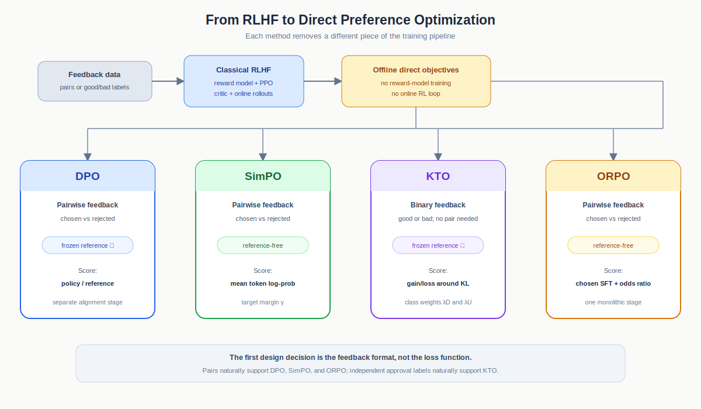
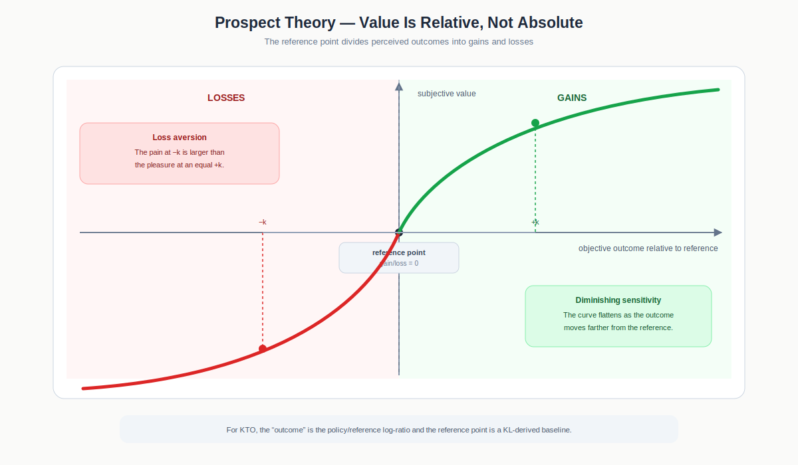
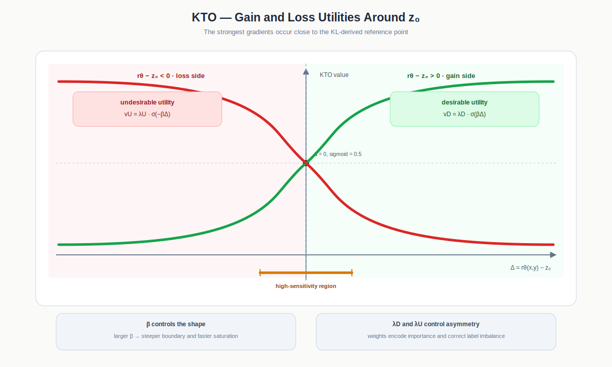
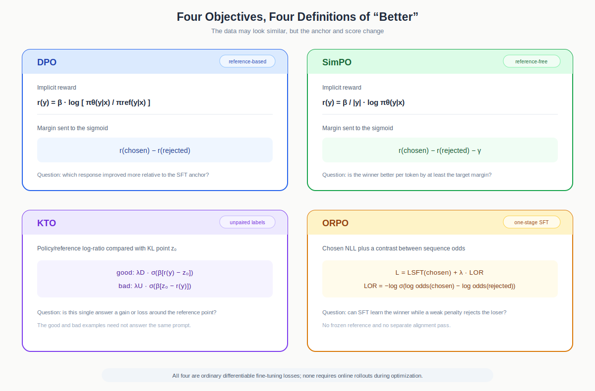
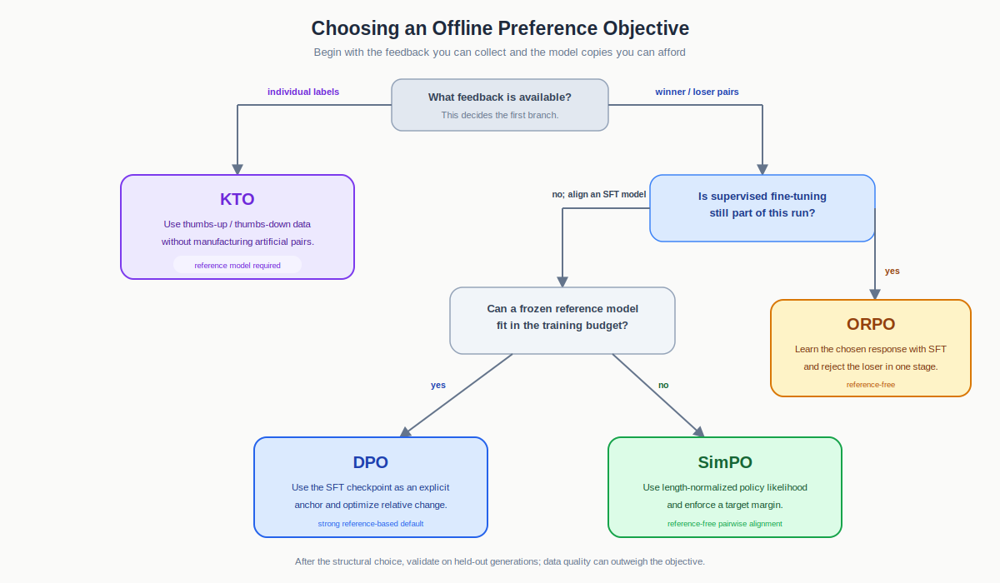

# Offline Preference Optimization: DPO, SimPO, KTO, and ORPO

> [!abstract]
> **The Elevator Pitch**
>
> PPO-style RLHF learns a reward model and then runs an online reinforcement-learning loop against it. DPO, SimPO, KTO, and ORPO take a shorter route: they train the language model directly from a fixed dataset of human feedback. They differ mainly in what feedback they accept, how they define the score of a response, whether they need a frozen reference model, and whether preference alignment is a separate stage or part of supervised fine-tuning itself.



Fig 1. The four algorithms remove different pieces of the classical RLHF pipeline. DPO retains a frozen reference; SimPO removes it; KTO changes paired preferences into individual good/bad labels; ORPO merges supervised fine-tuning and preference alignment into one stage.

## Contents

1. [[#The common problem]]
2. [[#Shared notation]]
3. [[#DPO — learn relative to a reference]]
4. [[#SimPO — use average likelihood as the reward]]
5. [[#KTO — learn from good and bad labels without pairs]]
6. [[#ORPO — combine SFT and alignment]]
7. [[#One batch, four interpretations]]
8. [[#Comparison at a glance]]
9. [[#Training blueprint]]
10. [[#How to choose]]
11. [[#Common failure modes]]
12. [[#Key takeaways]]
13. [[#Primary papers]]

---

## The common problem

Suppose a prompt $x$ has two candidate responses:

- $y_w$: the response a human prefers;
- $y_l$: the response a human rejects.

Classical RLHF first trains a reward model $r_\phi(x,y)$ so that

$$
r_\phi(x,y_w) > r_\phi(x,y_l),
$$

and then uses PPO to generate new responses and optimize the policy against that reward. The reward model, critic, reference model, and online rollout loop make the procedure expensive.

The four methods in this note are **offline preference-optimization methods**. They consume a fixed dataset and turn feedback directly into a language-model loss. There is no environment interaction and no need to sample fresh rollouts after every update.

> [!note]
> These methods are often grouped with RLHF algorithms because they solve the same alignment problem. Strictly speaking, however, they are direct optimization objectives rather than conventional online RL algorithms. The “action” is an entire response and the training data is fixed.

The shared idea is simple:

```text
feedback about an answer
          ↓
a scalar preference margin
          ↓
a sigmoid or odds-ratio loss
          ↓
raise desirable behaviour and suppress undesirable behaviour
```

The disagreement is over how the margin should be constructed.

---

## Shared notation

A decoder-only language model assigns a probability to a response by multiplying its token probabilities. In log space this becomes a sum:

$$
\log \pi_\theta(y\mid x)
=
\sum_{t=1}^{|y|}
\log \pi_\theta(y_t\mid x,y_{<t}).
$$

We will use:

| Symbol | Meaning |
|---|---|
| $\pi_\theta$ | trainable policy, or language model |
| $\pi_{\text{ref}}$ | frozen reference policy |
| $x$ | prompt |
| $y_w$ | chosen or preferred response |
| $y_l$ | rejected or dispreferred response |
| $\beta$ | scale or temperature parameter |
| $\sigma(z)$ | logistic sigmoid, $1/(1+e^{-z})$ |

The pairwise losses all have the rough form

$$
\mathcal L = -\log \sigma(\text{score of winner}-\text{score of loser}).
$$

If the winner already has a much higher score, the loss and gradient become small. If the pair is mis-ranked, the loss becomes large and the update pushes harder.

---

## DPO — learn relative to a reference

Direct Preference Optimization starts from the KL-regularized RLHF objective. Its key result is that the reward can be represented by a log-ratio between the trainable and reference policies:

$$
\hat r_\theta(x,y)
=
\beta
\log
\frac{\pi_\theta(y\mid x)}
{\pi_{\text{ref}}(y\mid x)}.
$$

This quantity asks:

> Has the trainable model made this response more or less likely than the frozen reference model did?

DPO inserts the implicit rewards of the chosen and rejected responses into a Bradley–Terry preference model:

$$
\mathcal L_{\text{DPO}}
=
-\mathbb E_{(x,y_w,y_l)}
\left[
\log \sigma
\left(
\beta \log\frac{\pi_\theta(y_w\mid x)}
{\pi_{\text{ref}}(y_w\mid x)}
-
\beta \log\frac{\pi_\theta(y_l\mid x)}
{\pi_{\text{ref}}(y_l\mid x)}
\right)
\right].
$$


The update is contrastive:

- increase the chosen response’s log-probability relative to the reference;
- decrease the rejected response’s log-probability relative to the reference;
- reduce the update once the pair has a comfortable positive margin.

### What the reference model does

The reference model is usually a frozen copy of the SFT checkpoint from which $\pi_\theta$ was initialized. It provides an anchor. DPO does not merely ask whether $y_w$ is more probable than $y_l$; it asks whether the **policy’s change from the reference** favours $y_w$ more than it favours $y_l$.

That distinction matters. DPO can lower the absolute probability of both responses and still improve the preference margin if it lowers the rejected response more. DPO is therefore a relative preference objective, not a guarantee that the likelihood of every chosen response rises.

### When DPO is a good fit

DPO is a strong default when:

- the dataset contains clean $(x,y_w,y_l)$ pairs;
- a good SFT model is available as the reference;
- one wants a well-understood, widely implemented objective;
- the memory and compute cost of an extra frozen model is acceptable.

Its main costs are the reference-model forward passes, sensitivity to preference-data quality, and sequence-length effects because the default objective uses summed log-probabilities.

---

## SimPO — use average likelihood as the reward

Simple Preference Optimization removes the reference model. It defines the implicit reward directly from the trainable policy:

$$
r_{\text{SimPO}}(x,y)
=
\frac{\beta}{|y|}
\log \pi_\theta(y\mid x).
$$

The division by $|y|$ turns the sequence log-probability into an **average per-token log-probability**. This is close to the score used during length-normalized generation and prevents response length from mechanically dominating the reward.

SimPO also asks the winner to beat the loser by a target margin $\gamma$:

$$
\mathcal L_{\text{SimPO}}
=
-\mathbb E
\left[
\log \sigma
\left(
\frac{\beta}{|y_w|}
\log \pi_\theta(y_w\mid x)
-
\frac{\beta}{|y_l|}
\log \pi_\theta(y_l\mid x)
-
\gamma
\right)
\right].
$$

The loss becomes small only when

$$
r_{\text{SimPO}}(x,y_w)
-
r_{\text{SimPO}}(x,y_l)
\gtrsim
\gamma.
$$

### What changed from DPO

SimPO makes two deliberate changes:

1. **No reference model.** The reward is computed only from $\pi_\theta$, reducing memory use and forward passes.
2. **A length-normalized target margin.** The average log-probability aligns the training score with generation, while $\gamma$ demands a non-trivial separation between winner and loser.

The simplicity comes with a trade-off. DPO has an explicit anchor to the SFT policy; SimPO relies on practical regularization such as a small learning rate, diverse preference data, and a strong starting checkpoint to prevent harmful drift.

### When SimPO is a good fit

SimPO is attractive when:

- pairwise preference data is available;
- reference-model memory is the main constraint;
- chosen and rejected responses have noticeably different lengths;
- the starting model is already strong and the dataset is broad enough to limit forgetting.

Do not copy DPO’s $\beta$ value into SimPO. The symbols look alike, but they scale different quantities and typically live on different numerical ranges.

---

## KTO — learn from good and bad labels without pairs

DPO and SimPO require a comparison: two responses to the same prompt and a decision about which is better. Kahneman–Tversky Optimization works with a weaker and often cheaper signal:

```text
(prompt, response, desirable)
(prompt, response, undesirable)
```

The desirable and undesirable examples do not need to form matched pairs.

KTO still measures a response relative to a frozen reference:

$$
r_\theta(x,y)
=
\log
\frac{\pi_\theta(y\mid x)}
{\pi_{\text{ref}}(y\mid x)}.
$$

It then compares this reward with a reference point

$$
z_0
=
D_{\mathrm{KL}}
\left(
\pi_\theta(\cdot\mid x)
\;\|\;
\pi_{\text{ref}}(\cdot\mid x)
\right).
$$

The value assigned to an example is

$$
v(x,y)
=
\begin{cases}
\lambda_D
\sigma\!\left(\beta(r_\theta(x,y)-z_0)\right),
& y \text{ is desirable},\\[4pt]
\lambda_U
\sigma\!\left(\beta(z_0-r_\theta(x,y))\right),
& y \text{ is undesirable}.
\end{cases}
$$

and the loss minimizes the gap between the maximum label-dependent value and the achieved value:

$$
\mathcal L_{\text{KTO}}
=
\mathbb E_{(x,y)}
\left[
\lambda_y-v(x,y)
\right].
$$

Here $\lambda_D$ and $\lambda_U$ control the relative importance of desirable and undesirable examples. They are useful when the two label classes are imbalanced.

### Prospect-theory intuition

Prospect theory was developed to describe how people evaluate uncertain outcomes. Its first move is to reject the idea that humans care only about absolute wealth or absolute score. People experience an outcome as a **gain or loss relative to a reference point**. Receiving ₹1,000 can feel like a gain if nothing was expected, but like a loss if ₹2,000 had been expected.

KTO applies the same structure to language-model alignment. The policy log-ratio

$$
r_\theta(x,y)
=
\log
\frac{\pi_\theta(y\mid x)}
{\pi_{\text{ref}}(y\mid x)}
$$

plays the role of an outcome, while $z_0$ plays the role of the expectation or status quo. The relevant quantity is not $r_\theta$ alone but

$$
\Delta(x,y)
=
r_\theta(x,y)-z_0.
$$

If $\Delta>0$, the response lies on the gain side of the reference point. If $\Delta<0$, it lies on the loss side. A desirable response should be moved toward positive $\Delta$; an undesirable response should be moved toward negative $\Delta$.



Fig 2. The canonical prospect-theory value curve. Outcomes are judged relative to a reference point. The curve flattens away from that point, while the loss branch is steeper than the gain branch.

### Important aspect 1 — diminishing sensitivity and risk attitude

The prospect-theory curve is steep near the reference point and flatter far away from it. This is **diminishing sensitivity**: the difference between ₹0 and ₹1,000 feels larger than the difference between ₹100,000 and ₹101,000, even though both changes equal ₹1,000.

The same shape produces a characteristic risk attitude:

- on the gain side, the curve is concave, which corresponds to **risk aversion**;
- on the loss side, the curve is convex, which corresponds to **risk-seeking behaviour**;
- in both regions, an additional change matters less once the outcome is already far from the reference point.

KTO uses a sigmoid instead of the original power-law curve because the sigmoid is bounded and numerically stable. Its parameter $\beta$ controls how quickly the value saturates:

$$
\sigma(\beta\Delta).
$$

A larger $\beta$ produces a steeper transition around $\Delta=0$ and faster saturation away from the reference point. The optimizer then concentrates on examples close to the decision boundary. A smaller $\beta$ produces a gentler curve, so examples farther from $z_0$ continue to receive meaningful gradients.

This is why $\beta$ is more than an arbitrary loss scale. It determines the width of the region in which the model remains sensitive to changes in implicit reward.

### Important aspect 2 — loss aversion

Prospect theory also says that a loss usually feels more important than an equal-sized gain. Losing ₹1,000 typically hurts more than gaining ₹1,000 pleases. In the canonical value curve, this appears as a loss branch that is steeper and larger in magnitude than the gain branch.

KTO represents this asymmetry with separate weights:

$$
\lambda_D
\quad\text{for desirable examples},
\qquad
\lambda_U
\quad\text{for undesirable examples}.
$$

If avoiding undesirable behaviour is more important than acquiring an equally sized desirable gain, $\lambda_U$ can be given more influence. The weights also correct class imbalance. For example, a feedback log containing many more thumbs-up than thumbs-down examples may need the smaller undesirable class to receive greater per-example weight.

Loss aversion should not be interpreted as “always choose $\lambda_U>\lambda_D$.” The appropriate ratio depends on the data distribution and the cost of each type of mistake. The important point is that KTO can make the two sides asymmetric instead of forcing every positive and negative label to have identical value.



Fig 3. KTO transforms the distance from its KL-derived reference point into two bounded utilities. Desirable examples gain value as their log-ratio rises above $z_0$; undesirable examples gain value when their log-ratio is pushed below $z_0$.

### Reading the KTO graph

At the reference point, $\Delta=0$, both unweighted sigmoids equal $0.5$. Moving right increases the value of a desirable example:

$$
v_D
=
\lambda_D\sigma(\beta\Delta).
$$

Moving left increases the value obtained from correctly suppressing an undesirable example:

$$
v_U
=
\lambda_U\sigma(-\beta\Delta).
$$

The gradients are largest near the crossing point and shrink toward both extremes. This gives KTO a natural stopping behaviour:

- a desirable response already far above the reference receives little additional pressure;
- an undesirable response already far below the reference also receives little additional pressure;
- ambiguous or incorrectly placed examples near the boundary receive the strongest correction.

The reference point is therefore not merely a centring constant. It decides what counts as a gain or loss and where the optimizer spends most of its gradient budget.

### How the reference point is estimated

The ideal baseline is

$$
z_0
=
D_{\mathrm{KL}}
\left(
\pi_\theta(\cdot\mid x)
\;\|\;
\pi_{\text{ref}}(\cdot\mid x)
\right),
$$

but computing it exactly would require sampling from the current policy. The paper uses a convenient biased estimate: responses are shifted within a microbatch to create mismatched prompt–response pairs, their policy/reference log-ratios are averaged, and the result is clamped at zero. KTO does not backpropagate through this estimate. It is treated as a detached reference point that controls which examples lie in the high-sensitivity region of the loss.

> [!important]
> The full prospect-theory mapping is: $z_0$ supplies **reference dependence**, $\beta$ controls **diminishing sensitivity and risk attitude**, and $\lambda_D,\lambda_U$ control the **gain/loss asymmetry** and class balance.

### When KTO is a good fit

KTO is the natural choice when:

- feedback is logged as thumbs-up/thumbs-down rather than pairwise rankings;
- constructing matched preference pairs would discard useful examples;
- desirable and undesirable labels are imbalanced and explicit weighting is useful;
- keeping a frozen reference model is acceptable.

Its biggest operational advantage is not a cheaper model architecture but a cheaper **data contract**. A product can often collect isolated approval signals much more easily than carefully controlled side-by-side comparisons.

---

## ORPO — combine SFT and alignment

Odds Ratio Preference Optimization asks whether SFT and preference alignment need to be separate stages at all. It trains on pairwise data while simultaneously:

- maximizing the likelihood of the chosen answer, as ordinary SFT would;
- penalizing the rejected answer through a preference term.

First define the exponentiated average log-likelihood

$$
P_\theta(y\mid x)
=
\exp
\left(
\frac{1}{|y|}
\log\pi_\theta(y\mid x)
\right),
$$

and its odds

$$
\operatorname{odds}_\theta(y\mid x)
=
\frac{P_\theta(y\mid x)}
{1-P_\theta(y\mid x)}.
$$

The odds-ratio preference loss is

$$
\mathcal L_{\text{OR}}
=
-\log\sigma
\left(
\log
\frac{
\operatorname{odds}_\theta(y_w\mid x)
}{
\operatorname{odds}_\theta(y_l\mid x)
}
\right).
$$

ORPO adds this to the chosen response’s SFT loss:

$$
\mathcal L_{\text{ORPO}}
=
\mathcal L_{\text{SFT}}(x,y_w)
+
\lambda
\mathcal L_{\text{OR}}(x,y_w,y_l).
$$

The two terms divide the work:

- $\mathcal L_{\text{SFT}}$ strongly teaches the desired response and adapts the model to the domain;
- $\mathcal L_{\text{OR}}$ provides a weaker contrastive signal that suppresses the rejected style.

### Why odds instead of a plain probability ratio

A plain ratio $P_\theta(y_w\mid x)/P_\theta(y_l\mid x)$ can over-suppress the rejected response when preference learning is mixed into SFT. The odds transform,

$$
\frac{P}{1-P},
$$

changes the sensitivity of the contrast and was chosen to make the monolithic update more stable.

### When ORPO is a good fit

ORPO is useful when:

- training begins from a base model or a checkpoint that still needs domain SFT;
- the same pairwise dataset should provide both instruction tuning and alignment;
- reference-model memory and a separate preference stage are undesirable.

If a mature SFT checkpoint already exists and only an alignment pass is needed, DPO or SimPO may map more naturally to the workflow. ORPO’s defining advantage is doing both jobs together.

---

## One batch, four interpretations



Fig 4. DPO, SimPO, and ORPO can consume the same chosen/rejected pair, but construct different margins. KTO instead decomposes feedback into individually labelled examples and judges each against a KL-derived reference point.

Consider one prompt with a helpful chosen answer and an unsafe rejected answer:

| Method | What counts as “better”? |
|---|---|
| DPO | The policy moved the chosen answer upward **relative to the frozen reference** more than it moved the rejected answer |
| SimPO | The chosen answer has a larger **average per-token log-probability**, exceeding the rejected answer by margin $\gamma$ |
| KTO | A desirable answer lies above the KL reference point, or an undesirable answer lies below it |
| ORPO | The chosen answer is learned through SFT while its **odds** exceed the rejected answer’s odds |

The methods therefore do not differ merely by constants around one universal loss. They encode different assumptions about what should anchor the policy and what form of feedback is available.

---

## Comparison at a glance

| Property | DPO | SimPO | KTO | ORPO |
|---|---|---|---|---|
| Feedback format | paired winner/loser | paired winner/loser | individual good/bad label | paired winner/loser |
| Frozen reference model | yes | no | yes, by default | no |
| Separate SFT stage | normally yes | normally yes | optional in the paper’s setups | no; SFT is in the objective |
| Response score | policy/reference log-ratio | average policy log-probability | log-ratio relative to KL baseline | average likelihood converted to odds |
| Explicit length normalization | no, in the base objective | yes | no, in the base objective | yes, for the odds term |
| Main extra knob | $\beta$ | $\beta,\gamma$ | $\beta,\lambda_D,\lambda_U$ | $\lambda$ |
| Main practical strength | established reference-anchored default | simple and reference-free | works with unpaired binary feedback | one-stage instruction tuning and alignment |
| Main caution | reference cost and relative-likelihood pathology | no explicit anchor | KL estimate and label-balance tuning | SFT and preference gradients must be balanced |

> [!important]
> “Reference-free” means the loss does not run a frozen reference model. It does **not** mean the method is free from a behavioural starting point: SimPO and ORPO are still initialized from a pretrained or instruction-tuned checkpoint, and their data and learning rate become the effective anchor.

---

## Training blueprint

All four methods can be implemented as ordinary gradient-based fine-tuning. The data loader and scoring pass are more important than RL infrastructure.

### Pairwise batch: DPO, SimPO, or ORPO

```text
for (prompt, chosen, rejected) in preference_data:
    score chosen and rejected under the trainable model

    if DPO:
        score both responses under the frozen reference
        margin = β × [(policy − reference)chosen
                    − (policy − reference)rejected]

    if SimPO:
        margin = β × [mean_logp(chosen) − mean_logp(rejected)] − γ

    if ORPO:
        preference_loss = −log σ(log_odds(chosen) − log_odds(rejected))
        loss = chosen_SFT_loss + λ × preference_loss

    update the trainable model
```

### Binary-labelled batch: KTO

```text
for (prompt, response, good_or_bad) in feedback_data:
    compute policy/reference log-ratio
    estimate the detached KL reference point z₀ for the batch

    if good:
        value = λD × σ(β × (log_ratio − z₀))
    if bad:
        value = λU × σ(β × (z₀ − log_ratio))

    maximize value
```

In every method, response-only masking is essential: prompt tokens provide context but should normally not contribute to the response loss. Padding must also be excluded from token counts and sequence scores.

---

## How to choose



Fig 5. The data format makes the first decision. Pairwise data supports DPO, SimPO, or ORPO; independent thumbs-up/down feedback points naturally toward KTO.

A compact selection rule:

1. **Only independent good/bad labels are available:** use KTO.
2. **Pairwise data is available and SFT must also be performed:** use ORPO.
3. **Pairwise data is available, SFT is complete, and a frozen reference fits in memory:** start with DPO.
4. **Pairwise data is available but reference cost is prohibitive or length normalization is especially important:** try SimPO.

This is a starting point, not a leaderboard claim. Dataset construction, judge quality, response length, checkpoint strength, and hyperparameter tuning can matter more than the name of the loss.

---

## Common failure modes

### Preference data can teach the wrong shortcut

If chosen answers are consistently longer, more formal, or filled with headings, the model may learn those superficial traits instead of correctness. Deduplicate prompts, inspect length distributions, and evaluate factual quality separately from style.

### Offline data has a coverage boundary

None of these methods explores during training. They cannot request new comparisons in regions where the current policy is uncertain. If the dataset was produced by a much weaker or very different model, the aligned policy may move outside the support of the data.

### Relative improvement is not absolute improvement

DPO optimizes a relative margin. A chosen response’s likelihood can fall as long as the rejected response falls further. Monitor chosen and rejected log-probabilities separately rather than only tracking the preference loss.

### Reference-free training can drift

SimPO and ORPO save memory by removing $\pi_{\text{ref}}$, but the missing anchor must be replaced by conservative optimization: a strong initialization, a small learning rate, broad data, short training, and careful held-out evaluation.

### The same symbol does not mean the same hyperparameter

$\beta$ in DPO scales a reference log-ratio. In SimPO it scales average sequence log-probability. In KTO it controls saturation around a reference point. Numerical values are not portable across these objectives.

### Length handling is part of the algorithm

DPO and the base KTO objective use sequence log-probability ratios; SimPO and ORPO explicitly use average log-likelihood in their scoring terms. Accidentally switching between sums and means silently changes the objective.

### KTO needs attention to class balance

Production feedback is rarely balanced. If 95% of logged interactions are positive, equal per-example weighting may let the desirable class dominate. Use $\lambda_D$ and $\lambda_U$ deliberately and report per-class metrics.

### Evaluation must test more than preference accuracy

A falling training loss can coexist with worse generations. Evaluate:

- held-out preference win rate;
- chosen and rejected response likelihoods;
- average response length;
- KL drift from the starting model;
- factuality, safety, and task-specific capability;
- diversity and signs of mode collapse.

---

## Key takeaways

DPO, SimPO, KTO, and ORPO all bypass the expensive online RL loop, but they remove different assumptions.

- **DPO** is reference-anchored pairwise learning. It asks whether the policy changed in the preferred direction relative to an SFT model.
- **SimPO** is reference-free pairwise learning. It uses average per-token log-probability as the reward and enforces a target margin.
- **KTO** is pointwise learning. It can train from isolated desirable/undesirable labels by comparing each response with a KL-derived reference point.
- **ORPO** is monolithic learning. It combines chosen-response SFT with an odds-ratio penalty against the rejected response.

The best first question is not “Which loss won a benchmark?” It is:

> What feedback do I actually have, what model copies can I afford, and is supervised fine-tuning already complete?

Once those constraints are explicit, the choice between the four methods becomes much less mysterious.

---

## Primary papers

1. Rafailov et al., [Direct Preference Optimization: Your Language Model is Secretly a Reward Model](https://arxiv.org/abs/2305.18290), 2023.
2. Meng, Xia, and Chen, [SimPO: Simple Preference Optimization with a Reference-Free Reward](https://arxiv.org/abs/2405.14734), NeurIPS 2024.
3. Ethayarajh et al., [KTO: Model Alignment as Prospect Theoretic Optimization](https://arxiv.org/abs/2402.01306), ICML 2024.
4. Hong, Lee, and Thorne, [ORPO: Monolithic Preference Optimization without Reference Model](https://aclanthology.org/2024.emnlp-main.626/), EMNLP 2024.
