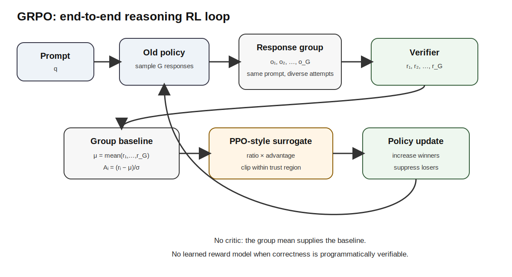
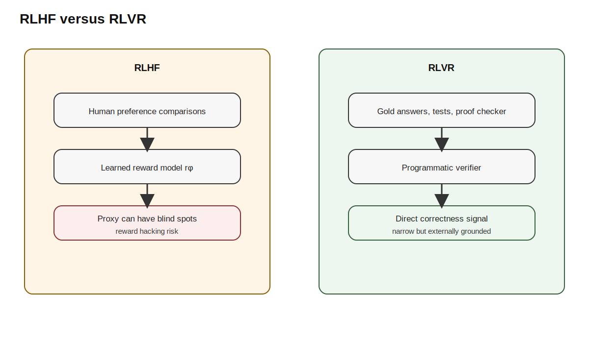
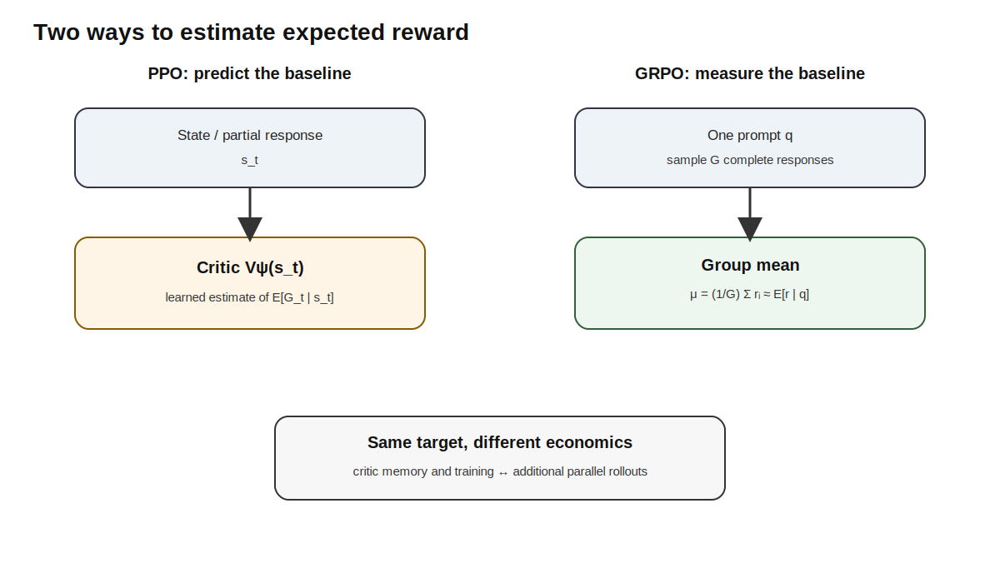
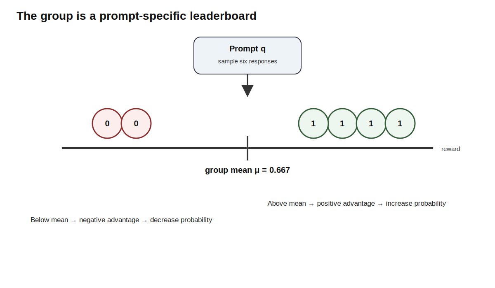
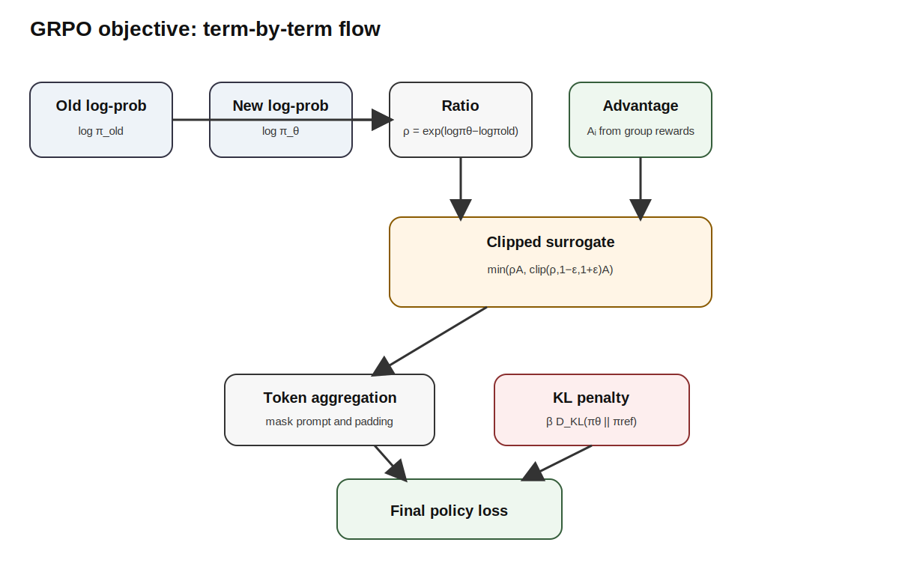
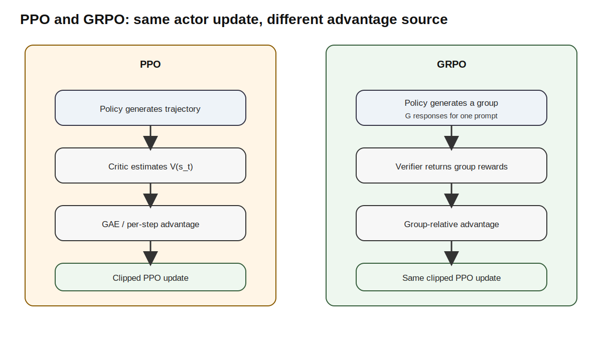
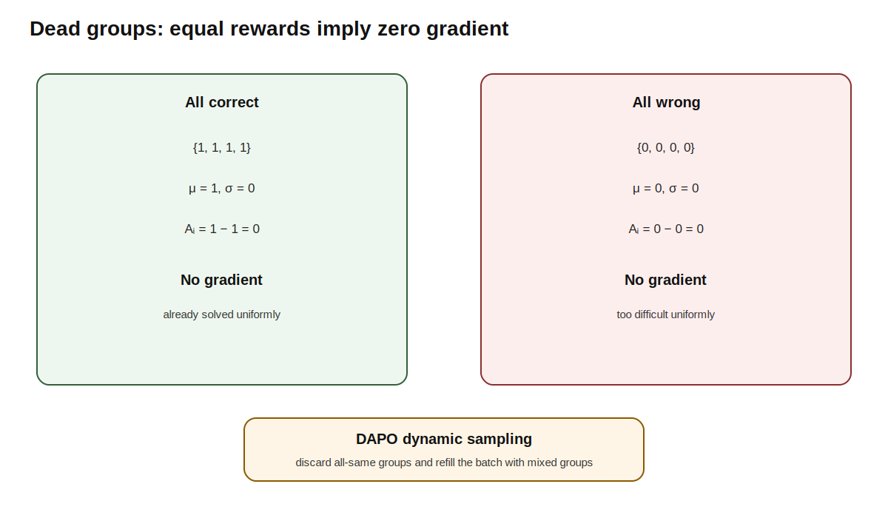
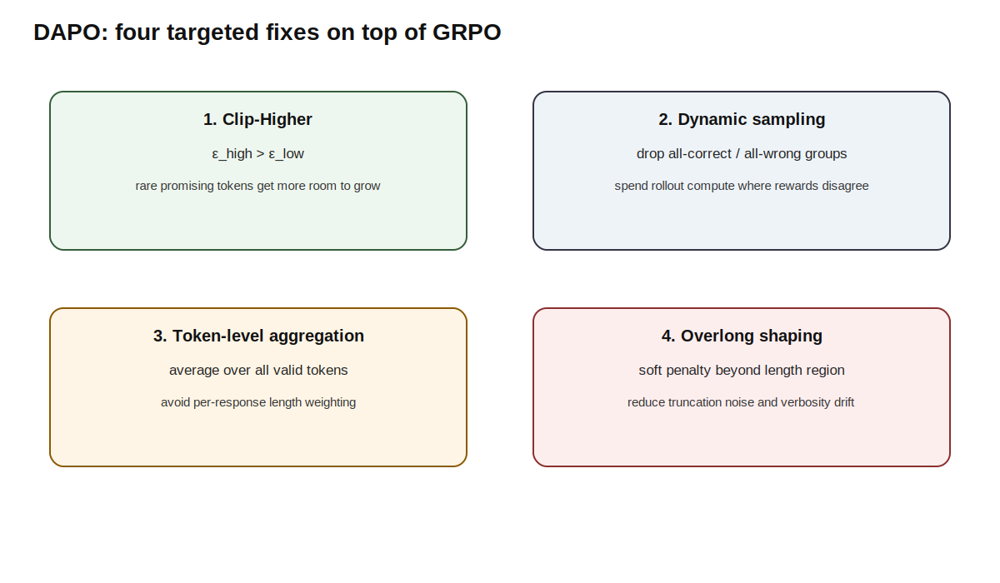
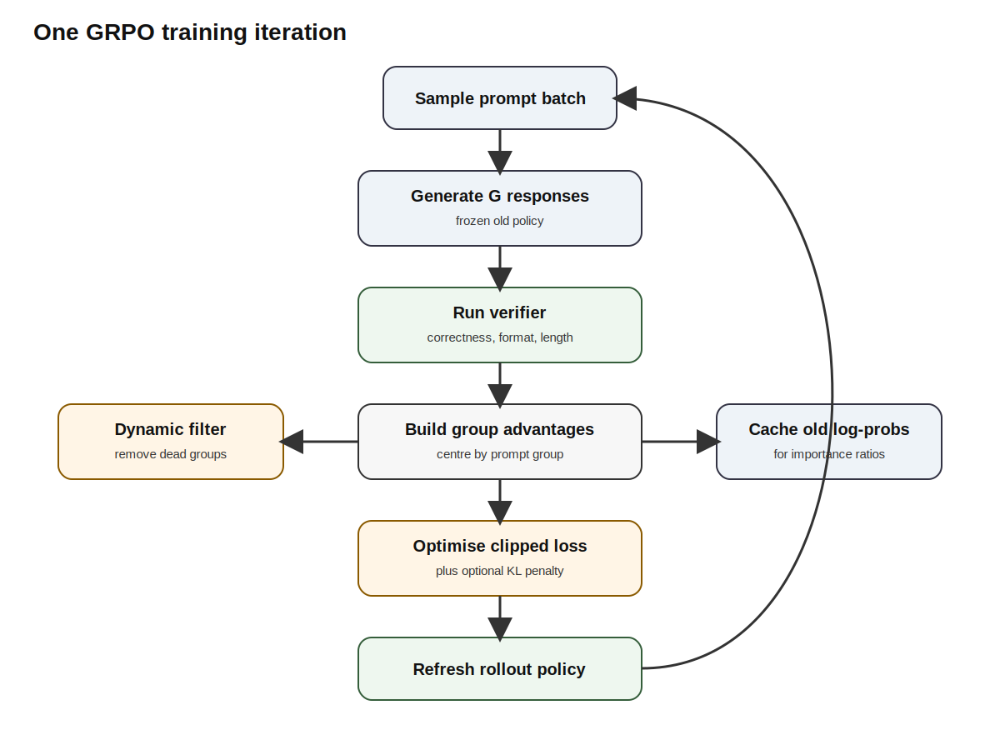
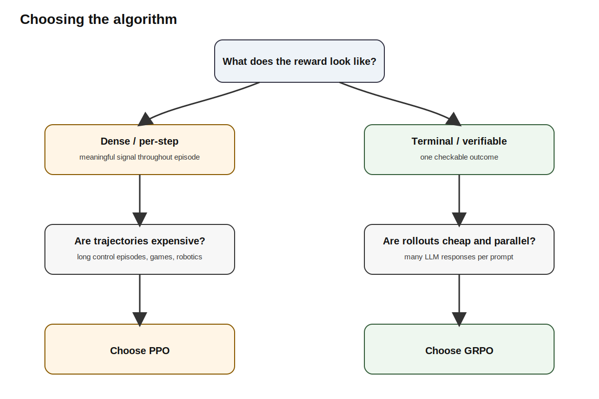

# Group Relative Policy Optimization: Training Reasoning Models Without a Critic

> [!abstract]
> **The Elevator Pitch**
>
> This note explains why modern reasoning-model training could remove two expensive learned components from the classical RLHF stack: the reward model and the critic. The reward model can disappear when correctness is directly verifiable, and the critic can disappear when a group of sampled responses provides a prompt-specific baseline. GRPO is therefore not a new policy-gradient law. It is a careful reorganisation of where the reward and the baseline come from.



## Contents

1. [[#Time before time]]
2. [[#The two substitutions that define GRPO]]
3. [[#From RLHF to RLVR]]
4. [[#Why the critic existed]]
5. [[#How the group replaces the critic]]
6. [[#Deriving the GRPO objective]]
7. [[#A complete worked example]]
8. [[#What GRPO keeps from PPO]]
9. [[#Why GRPO is cheaper—and what it pays instead]]
10. [[#Failure modes of vanilla GRPO]]
11. [[#DAPO]]
12. [[#Dr. GRPO]]
13. [[#GRPO, DAPO, and Dr. GRPO side by side]]
14. [[#Implementation blueprint]]
15. [[#When to choose GRPO and when to choose PPO]]
16. [[#Limitations and open questions]]
17. [[#Questions and answers]]
18. [[#Key takeaways]]

---

## Time before time

By the time large language models began to exhibit strong reasoning behaviour, reinforcement learning had already accumulated several layers of machinery. REINFORCE supplied the basic policy-gradient identity. Actor–critic methods added a learned value function to reduce variance. PPO wrapped the policy gradient in a clipped importance-ratio objective so that repeated optimisation on the same batch would not push the policy too far. RLHF then placed this machinery inside a language-model training loop: a policy generated responses, a reward model scored them, a critic estimated expected return, and a reference model constrained drift through a KL penalty.

That architecture worked, but it was expensive and fragile. At training time, one might need a trainable policy, a frozen reference model, a learned reward model, and a trainable critic. The reward model could be exploited because it was only a proxy for human judgement. The critic was difficult to train on long reasoning chains because it had to estimate, token by token, the expected final reward of a partially generated solution. The further a token was from the end, the more uncertain that estimate could become.

Reasoning tasks revealed a different structure. In mathematics, code, formal logic, and many puzzle environments, the final answer can often be checked by a program. A symbolic verifier can compare a boxed result with the gold answer. A unit-test harness can execute generated code. A theorem checker can validate a proof object. A simulator can test whether a plan succeeds. Once correctness can be verified directly, the learned reward model is no longer mandatory.

A second observation follows. If several answers are sampled for the same prompt, their average reward estimates how well the current policy usually performs on that prompt. That average can serve as the baseline that PPO previously learned through a critic. Rather than asking a value network to predict the expected reward, the algorithm can estimate it directly from the group.

These two substitutions define the modern reasoning-RL recipe:

$$
\text{learned reward model}
\quad\longrightarrow\quad
\text{verifier},
$$

$$
\text{learned critic}
\quad\longrightarrow\quad
\text{group-relative baseline}.
$$

The policy-gradient core remains recognisable. The algorithm still increases the probability of actions with positive advantage, decreases the probability of actions with negative advantage, and constrains each update using PPO-style clipping. What changes is the source of the signal.

> [!info]
> GRPO should not be understood as “PPO replaced by an unrelated algorithm.” A better mental model is: **PPO’s clipped actor update, with the critic removed and the advantage reconstructed from a group of responses to the same prompt.**

---

## The two substitutions that define GRPO

The classical policy-gradient update has the form

$$
\nabla_\theta J(\theta)
=
\mathbb{E}
\left[
A(s,a)\nabla_\theta \log \pi_\theta(a\mid s)
\right].
$$

The advantage is always a comparison:

$$
A = \text{observed outcome} - \text{expected outcome}.
$$

PPO usually obtains that expected outcome from a critic:

$$
A_t^{\text{PPO}}
\approx
G_t - V_\psi(s_t),
$$

possibly with Generalised Advantage Estimation rather than a simple Monte Carlo return. GRPO instead samples a group of $G$ outputs $o_1,\ldots,o_G$ for the same prompt $q$, evaluates their rewards $r_1,\ldots,r_G$, and computes

$$
\hat A_i
=
\frac{
r_i - \mu_r
}{
\sigma_r + \epsilon_{\text{num}}
},
$$

where

$$
\mu_r
=
\frac{1}{G}\sum_{j=1}^{G}r_j,
\qquad
\sigma_r
=
\sqrt{
\frac{1}{G}
\sum_{j=1}^{G}
(r_j-\mu_r)^2
}.
$$

The numerator is the essential idea:

$$
r_i - \mu_r.
$$

It asks whether response $i$ performed better or worse than the model’s other attempts on the same prompt. The standard-deviation division is a scaling choice used in vanilla GRPO, not the conceptual core. Later variants question whether it should be present.

The second substitution concerns the reward. In RLHF, a learned reward model $r_\phi(q,o)$ approximates human preference. In reinforcement learning from verifiable rewards, or RLVR, a programmatic verifier computes the reward directly:

$$
r(q,o)
=
\mathbf{1}
[
\operatorname{answer}(o)
=
\operatorname{gold}(q)
].
$$

For code, the reward may be fractional:

$$
r_{\text{code}}(q,o)
=
\frac{
\text{number of passed tests}
}{
\text{number of tests}
}.
$$

A small formatting component may be added:

$$
r(q,o)
=
r_{\text{correct}}(q,o)
+
\lambda r_{\text{format}}(q,o),
\qquad
0 < \lambda \ll 1.
$$

The small coefficient matters. Formatting should help the parser and encourage consistent structure, but it should never outweigh correctness.



---

## From RLHF to RLVR

In open-ended tasks, quality has no exact executable definition. “Helpful,” “harmless,” “well-written,” and “appropriate” are judgement-laden concepts. RLHF addresses this by collecting comparisons and fitting a reward model such that

$$
r_\phi(q,o_{\text{preferred}})
>
r_\phi(q,o_{\text{rejected}}).
$$

The reward model is useful precisely because it generalises beyond the finite preference dataset. That same generalisation creates its weakness. The optimiser can discover outputs that the reward model scores highly even though humans would not genuinely prefer them. Verbosity, sycophancy, canned structure, confident nonsense, or peculiar formatting can become shortcuts.

RLVR changes the nature of the objective. When the final outcome is checkable, the reward is not a learned approximation of quality but an executable rule. The policy cannot turn a mathematically incorrect answer into a correct one merely by being eloquent. A failed test remains failed. A wrong symbolic result remains wrong.

This does not make the entire training loop impossible to game. A weak parser can be exploited. An incomplete unit-test suite can be bypassed. A model may occasionally reach the correct final answer through invalid reasoning. A reward can therefore be robust without being perfect. The key difference is that the core correctness signal is anchored in an external criterion rather than in the latent preferences of a learned model.

> [!info]
> RLHF’s learned reward is broad but approximate. RLVR’s verifier is narrow but exact within its domain. The first can score almost anything but may be hacked. The second only applies where a check exists, but a positive reward corresponds to an externally validated outcome.

A pure answer verifier also creates sparse credit. A 2,000-token proof may receive only one scalar at the end. The reward says that the result was correct or incorrect, but not where the reasoning succeeded or failed. GRPO accepts this coarseness and compensates with repeated sampling. By drawing multiple responses to the same prompt, it creates contrast: some responses may succeed, others may fail, and the policy can reinforce the successful trajectories relative to the unsuccessful ones.

---

## Why the critic existed

The critic is not arbitrary overhead. It solves a real statistical problem.

Without a baseline, a policy-gradient estimator can have high variance:

$$
\nabla_\theta J(\theta)
=
\mathbb{E}
\left[
G_t \nabla_\theta \log \pi_\theta(a_t\mid s_t)
\right].
$$

Subtracting an action-independent baseline does not change the expected gradient:

$$
\mathbb{E}
\left[
b(s_t)\nabla_\theta\log\pi_\theta(a_t\mid s_t)
\right]
=
0,
$$

but it can reduce variance substantially. Actor–critic methods learn

$$
V_\psi(s_t)
\approx
\mathbb{E}[G_t\mid s_t],
$$

and use

$$
A_t
=
G_t - V_\psi(s_t).
$$

In long, expensive environments, this is a sensible bargain. If each trajectory is costly, one would rather learn a reusable predictor of expected return than sample many trajectories from the same state. The critic amortises the estimation problem.

Language-model reasoning changes the economics. Many responses can be generated for the same prompt in parallel. Rollout engines such as vLLM or SGLang can batch decoding efficiently. If eight, sixteen, or more attempts are already available, their empirical mean supplies a direct Monte Carlo estimate of expected reward for that prompt.

The critic predicts the baseline:

$$
V_\psi(q)
\approx
\mathbb{E}_{o\sim\pi}[r(q,o)].
$$

The group measures it:

$$
\frac{1}{G}\sum_{i=1}^{G}r(q,o_i)
\approx
\mathbb{E}_{o\sim\pi}[r(q,o)].
$$

The target is the same. The method of obtaining it differs.



---

## How the group replaces the critic

For a prompt $q$, sample

$$
o_1,\ldots,o_G
\sim
\pi_{\theta_{\text{old}}}(\cdot\mid q).
$$

Score each response:

$$
r_i = r(q,o_i).
$$

Compute the group mean:

$$
\mu_r
=
\frac{1}{G}
\sum_{i=1}^{G}r_i.
$$

Then define the centred advantage:

$$
\tilde A_i
=
r_i-\mu_r.
$$

Responses above the mean receive $\tilde A_i>0$; responses below the mean receive $\tilde A_i<0$. The advantages satisfy

$$
\frac{1}{G}
\sum_{i=1}^{G}
\tilde A_i
=
0.
$$

Zero mean does not imply that every advantage is zero. It means positive and negative deviations balance across the group. The learning signal comes from the differences.

Consider rewards

$$
\{1,0,1,1,0,1\}.
$$

The mean is

$$
\mu_r
=
\frac{4}{6}
=
0.667.
$$

Correct answers receive

$$
1-0.667
=
+0.333,
$$

while wrong answers receive

$$
0-0.667
=
-0.667.
$$

The negative magnitude is larger because wrong responses are rarer in this particular group. The group-relative comparison says that a failure is unusually bad relative to what the model typically achieved on that prompt.

With vanilla standardisation, the advantage becomes

$$
\hat A_i
=
\frac{\tilde A_i}{\sigma_r}.
$$

For binary rewards with success probability $p$ inside the group,

$$
\sigma_r
=
\sqrt{p(1-p)}.
$$

The standardisation changes scale but not sign. Dr. GRPO later argues that this rescaling introduces a prompt-difficulty bias and should be removed.



---

## Deriving the GRPO objective

### Step 1: generate with the old policy

The sampled tokens come from a frozen rollout policy:

$$
o_i
\sim
\pi_{\theta_{\text{old}}}(\cdot\mid q).
$$

During optimisation, the current policy $\pi_\theta$ changes. Because the batch was generated by $\pi_{\theta_{\text{old}}}$, the objective uses an importance ratio for each token:

$$
\rho_{i,t}(\theta)
=
\frac{
\pi_\theta(o_{i,t}\mid q,o_{i,<t})
}{
\pi_{\theta_{\text{old}}}(o_{i,t}\mid q,o_{i,<t})
}.
$$

When $\rho_{i,t}>1$, the current policy assigns greater probability to the sampled token than the rollout policy did. When $\rho_{i,t}<1$, it assigns less.

### Step 2: attach the response-level advantage

A terminal verifier usually produces one reward for the entire response. GRPO therefore gives every token in response $i$ the same advantage $\hat A_i$. The unclipped surrogate for token $t$ is

$$
\rho_{i,t}\hat A_i.
$$

For $\hat A_i>0$, increasing the token probability increases the objective. For $\hat A_i<0$, decreasing the token probability improves the objective.

### Step 3: clip the probability ratio

As in PPO, repeated gradient steps on the same batch can make the current policy drift too far from the rollout policy. GRPO uses the clipped surrogate

$$
\min
\left(
\rho_{i,t}\hat A_i,\,
\operatorname{clip}
(
\rho_{i,t},
1-\epsilon,
1+\epsilon
)
\hat A_i
\right).
$$

The outer minimum must be interpreted together with the sign of the advantage.

For a positive advantage, the objective stops rewarding probability increases once

$$
\rho_{i,t} > 1+\epsilon.
$$

For a negative advantage, the objective stops rewarding probability decreases once

$$
\rho_{i,t} < 1-\epsilon.
$$

The clipping does not prohibit the policy ratio from leaving the interval. It removes the incentive to push further in the beneficial direction after the boundary has been reached.

### Step 4: aggregate over tokens and responses

A common vanilla GRPO objective averages within each response and then across the group:

$$
J_{\text{policy}}(\theta)
=
\frac{1}{G}
\sum_{i=1}^{G}
\frac{1}{|o_i|}
\sum_{t=1}^{|o_i|}
\min
\left(
\rho_{i,t}\hat A_i,\,
\operatorname{clip}
(
\rho_{i,t},
1-\epsilon,
1+\epsilon
)
\hat A_i
\right).
$$

The response-length normalisation $1/|o_i|$ makes every response contribute roughly equal total weight regardless of length. This appears innocuous, but later analysis argues that it creates undesirable length effects.

### Step 5: constrain drift from a reference model

GRPO may include a KL penalty against a frozen reference policy:

$$
J(\theta)
=
J_{\text{policy}}(\theta)
-
\beta
D_{\mathrm{KL}}
(
\pi_\theta\|
\pi_{\text{ref}}
).
$$

Some implementations use a sampled KL estimator. The coefficient $\beta$ controls the strength of the anchor. In strongly verifiable domains, recipes sometimes set $\beta=0$, but that is a design choice rather than a defining property of GRPO.

The complete maximisation objective is therefore

$$
J_{\text{GRPO}}(\theta)
=
\frac{1}{G}
\sum_{i=1}^{G}
\frac{1}{|o_i|}
\sum_{t=1}^{|o_i|}
\min
\left(
\rho_{i,t}\hat A_i,\,
\operatorname{clip}
(
\rho_{i,t},
1-\epsilon,
1+\epsilon
)
\hat A_i
\right)
-
\beta
D_{\mathrm{KL}}
(
\pi_\theta\|
\pi_{\text{ref}}
).
$$

Libraries often minimise the negative of this expression.



> [!info]
> There is no critic loss because there is no critic. There is no GAE because there are no learned per-token value estimates. The actor update remains a PPO-style clipped policy-gradient objective.

---

## A complete worked example

Consider the prompt:

> Compute $2+2\times3$.

The correct answer is $8$. Suppose a group of four responses receives rewards

$$
\{1,0,1,0\}.
$$

The group mean is

$$
\mu_r
=
\frac{1+0+1+0}{4}
=
0.5.
$$

The population standard deviation is

$$
\sigma_r
=
\sqrt{
\frac{
(1-0.5)^2+
(0-0.5)^2+
(1-0.5)^2+
(0-0.5)^2
}{4}
}
=
0.5.
$$

Therefore,

$$
\hat A_1=\hat A_3
=
\frac{1-0.5}{0.5}
=
+1,
$$

and

$$
\hat A_2=\hat A_4
=
\frac{0-0.5}{0.5}
=
-1.
$$

Now inspect one token in a correct answer. Suppose

$$
\rho_{i,t}=1.1,
\qquad
\epsilon=0.2.
$$

The clipping interval is $[0.8,1.2]$, so

$$
\operatorname{clip}(1.1,0.8,1.2)
=
1.1.
$$

The surrogate is

$$
\min(1.1\times 1,1.1\times 1)
=
1.1.
$$

The token receives a positive update.

If later optimisation produces

$$
\rho_{i,t}=1.5,
$$

then

$$
\operatorname{clip}(1.5,0.8,1.2)
=
1.2,
$$

and

$$
\min(1.5\times1,1.2\times1)
=
1.2.
$$

The objective no longer improves by raising that token’s probability beyond the upper clip boundary.

Now inspect a token in a wrong answer, where $\hat A_i=-1$. If

$$
\rho_{i,t}=0.9,
$$

then both the unclipped and clipped terms equal

$$
0.9\times(-1)
=
-0.9.
$$

Reducing the token probability improves the objective. But if the ratio falls to $0.5$,

$$
\rho_{i,t}\hat A_i
=
-0.5,
$$

while

$$
\operatorname{clip}(0.5,0.8,1.2)\hat A_i
=
0.8\times(-1)
=
-0.8.
$$

The minimum is $-0.8$, so the objective refuses to reward an excessively large probability decrease.

This is exactly the PPO clipping logic. GRPO’s novelty lies in the group-relative $\hat A_i$, not in the clipping rule.

---

## What GRPO keeps from PPO

GRPO preserves the most important stabilising components of PPO:

1. **A frozen rollout policy.** Samples are generated by $\pi_{\theta_{\text{old}}}$.
2. **Per-token importance ratios.** The current and rollout policies are compared through $\rho_{i,t}$.
3. **A clipped surrogate.** Updates are prevented from becoming excessively aggressive on the same batch.
4. **An optional KL anchor.** The live policy may be constrained relative to a reference model.
5. **Multiple optimisation epochs.** The same batch can be reused because importance ratios correct for moderate policy drift.

What disappears is the value model and the machinery attached to it. PPO often forms token-level advantages through GAE:

$$
\hat A_t^{\text{GAE}}
=
\sum_{l=0}^{\infty}
(\gamma\lambda)^l\delta_{t+l},
$$

with

$$
\delta_t
=
r_t+\gamma V(s_{t+1})-V(s_t).
$$

GRPO does not estimate $V(s_t)$. Every token in a response inherits the same response-level outcome advantage.

That simplification is well matched to tasks with terminal, verifiable rewards. It is less attractive when the environment provides meaningful dense feedback at every step.



---

## Why GRPO is cheaper—and what it pays instead

A conventional RLHF setup may require:

- a trainable policy,
- a frozen reference policy,
- a learned reward model,
- a trainable critic,
- optimiser states for the policy and critic,
- activations and gradients for both trainable models.

GRPO with a programmatic verifier can remove the critic and the learned reward model. Depending on whether KL regularisation is used, the training loop may need only the policy, the reference model, and a lightweight verifier.

The memory saving is substantial, but not free. GRPO pays in rollout compute. PPO may use one response per prompt and rely on a critic to estimate expected return. GRPO uses $G$ responses to estimate that expectation empirically. A larger group gives a more stable mean and more opportunities for within-group contrast, but increases decoding cost.

The trade can be summarised as

$$
\text{critic memory and training}
\quad\longleftrightarrow\quad
\text{additional sampling}.
$$

This trade favours GRPO when generation is cheap, parallel, and accelerated by a dedicated inference engine. It favours PPO when trajectories are long, expensive, or impossible to duplicate many times from the same starting condition.

> [!warning]
> “No critic” does not mean “no baseline.” GRPO still needs a baseline to reduce variance. It obtains the baseline by measurement rather than prediction.

---

## Failure modes of vanilla GRPO

### Dead groups

If every response receives the same reward, then

$$
r_1=\cdots=r_G=c,
\qquad
\mu_r=c.
$$

Therefore,

$$
r_i-\mu_r=0
$$

for every response. The standard deviation is also zero. Implementations usually add a small numerical constant, but the centred numerator remains zero, so every advantage is zero.

The prompt contributes no policy gradient.

This happens for all-correct groups and all-wrong groups. The first may indicate that the prompt is already solved. The second may indicate that the prompt is too difficult for the current policy. In either case, the rollout budget produces no immediate learning signal.



### Entropy collapse

A symmetric clip treats upward and downward ratio changes with the same width. Rare but promising tokens with positive advantage can hit the upper boundary quickly. Once clipped, the objective provides no further incentive to increase their probability during that update. Over time, probability mass can concentrate on a narrow set of reasoning patterns, reducing exploration.

### Length-related bias

Vanilla sequence-level averaging uses

$$
\frac{1}{|o_i|}
\sum_t(\cdots).
$$

This changes how gradients are distributed across short and long responses. Long incorrect responses can receive a smaller per-token penalty, allowing the policy to drift toward verbosity.

### Prompt-difficulty distortion

Standardising by the group reward deviation

$$
\hat A_i
=
\frac{r_i-\mu_r}{\sigma_r}
$$

can amplify groups with small variance. Consequently, prompts whose rewards differ only slightly can receive unexpectedly large normalised advantages. Dr. GRPO argues that this biases training toward certain prompt regimes.

### Coarse credit assignment

Every token in a response shares one scalar advantage. A correct response may contain irrelevant or erroneous intermediate steps. A wrong response may contain many useful steps before a final arithmetic mistake. Outcome-level training reinforces or suppresses the entire trajectory.

---

## DAPO

DAPO modifies GRPO without changing the policy-gradient skeleton. Its changes target exploration, wasted groups, token aggregation, and excessively long outputs.

### Clip-Higher

DAPO decouples the lower and upper clip bounds:

$$
\operatorname{clip}
(
\rho,
1-\epsilon_{\text{low}},
1+\epsilon_{\text{high}}
),
\qquad
\epsilon_{\text{high}}
>
\epsilon_{\text{low}}.
$$

The larger upper bound gives low-probability tokens with positive advantage more room to grow. The lower bound remains conservative, protecting against excessive suppression.

### Dynamic sampling

Rather than accepting every sampled prompt group, DAPO filters out groups where all rewards are identical. It continues sampling until the training batch contains enough groups with reward variation.

This is not discarding useful gradient information. Identical-reward groups already produce zero advantage. Dynamic sampling reallocates rollout compute toward prompts near the model’s competence boundary, where some attempts succeed and others fail.

### Token-level loss aggregation

Instead of giving each response equal aggregate weight through a per-response average,

$$
\frac{1}{G}
\sum_i
\frac{1}{|o_i|}
\sum_t\ell_{i,t},
$$

DAPO averages over all valid tokens:

$$
\frac{
\sum_i\sum_t\ell_{i,t}
}{
\sum_i|o_i|
}.
$$

Each token receives equal weight regardless of the response length from which it came.

### Overlong reward shaping

DAPO applies a soft penalty to responses that approach or exceed an undesirable length threshold. A soft penalty avoids the discontinuity of a hard cutoff while discouraging uncontrolled growth and reducing noisy truncation effects.



---

## Dr. GRPO

Dr. GRPO, or “GRPO Done Right,” focuses on two normalisers that can distort the estimator.

### Remove length normalisation

Vanilla GRPO contains

$$
\frac{1}{|o_i|}
\sum_t\ell_{i,t}.
$$

Suppose two responses have the same advantage $+0.5$, but one has 20 tokens and the other has 200 tokens. Under a simple per-response division, the effective advantage allocation per token scales as

$$
\frac{0.5}{20}=0.025
$$

versus

$$
\frac{0.5}{200}=0.0025.
$$

The long response receives a ten-times smaller per-token push. For a negative advantage, the long response is penalised ten times less per token. Over repeated updates, this can under-discourage long mistakes.

Dr. GRPO removes the response-length division.

### Remove standard-deviation scaling

Vanilla GRPO computes

$$
\hat A_i
=
\frac{r_i-\mu_r}{\sigma_r}.
$$

Dr. GRPO uses

$$
\hat A_i^{\text{Dr}}
=
r_i-\mu_r.
$$

The mean remains the baseline. Only the scale normaliser disappears. The goal is to preserve the raw reward gap rather than amplify low-variance groups.

> [!info]
> Dr. GRPO does not reject the group baseline. It rejects two surrounding normalisation choices: division by response length and division by group reward standard deviation.

---

## GRPO, DAPO, and Dr. GRPO side by side

| Component | GRPO | DAPO | Dr. GRPO |
|---|---|---|---|
| Baseline | Group mean | Group mean | Group mean |
| Advantage scale | Divide by group standard deviation | Usually retains standardisation | Mean-centred only |
| Clip | Symmetric | Higher upper clip bound | Typically GRPO-style |
| Sampling | Fixed groups | Discard all-same groups and resample | Fixed groups |
| Loss aggregation | Per-response average | Token-level batch average | Removes length division |
| Length control | Implicit | Soft overlong penalty | Removes length bias in objective |
| Critic | None | None | None |
| Reward model | Usually verifier | Usually verifier | Usually verifier |
| KL term | Optional | Often reduced or omitted in pure reasoning | Often omitted |

The common structure is unchanged:

$$
\text{group-relative signal}
+
\text{importance ratio}
+
\text{clipped policy update}.
$$

The variants alter the edges of the estimator rather than inventing a different optimisation principle.

---

## Implementation blueprint



A practical training loop can be organised into five systems:

### 1. Prompt sampler

The prompt sampler selects training questions, often with curriculum or difficulty balancing. Prompt diversity matters because groups with all-zero rewards produce no signal, while groups with all-one rewards may waste compute on already-solved tasks.

### 2. Rollout engine

The rollout engine generates $G$ responses per prompt using a frozen snapshot of the current policy. Efficient production systems separate decoding from gradient computation. The rollout engine may use tensor parallelism, continuous batching, prefix caching, and high-throughput inference kernels.

### 3. Verifier

The verifier must be deterministic, isolated, and auditable. For mathematics, it should robustly parse equivalent numeric or symbolic forms. For code, generated programs should execute in a sandbox with resource limits. For formal reasoning, the checker should reject malformed proofs rather than guessing intent.

A combined reward might be

$$
r_i
=
r_{\text{correct},i}
+
0.05r_{\text{format},i}
-
0.02r_{\text{overlong},i}.
$$

The exact weights should ensure that correctness dominates.

### 4. Advantage builder

For vanilla GRPO:

$$
\hat A_i
=
\frac{
r_i-\mu_r
}{
\sigma_r+\epsilon_{\text{num}}
}.
$$

For Dr. GRPO:

$$
\hat A_i
=
r_i-\mu_r.
$$

Masks must exclude prompt tokens, padding tokens, and any invalid continuation positions.

### 5. Policy optimiser

The optimiser recomputes current-policy log-probabilities for sampled tokens, reconstructs

$$
\rho_{i,t}
=
\exp
\left(
\log\pi_\theta(o_{i,t}\mid\cdot)
-
\log\pi_{\theta_{\text{old}}}(o_{i,t}\mid\cdot)
\right),
$$

applies the clipped surrogate, adds KL or entropy terms if required, and updates the policy.

A compact pseudocode version is:

```python
for prompts in dataloader:
    with torch.no_grad():
        outputs, old_logprobs = rollout_policy.generate(
            prompts,
            num_return_sequences=group_size,
        )

        rewards = verifier(prompts, outputs)
        advantages = build_group_advantages(rewards)

    for _ in range(update_epochs):
        new_logprobs = policy.logprobs(prompts, outputs)
        ratio = torch.exp(new_logprobs - old_logprobs)

        unclipped = ratio * advantages[..., None]
        clipped = torch.clamp(
            ratio,
            1.0 - eps_low,
            1.0 + eps_high,
        ) * advantages[..., None]

        policy_gain = torch.minimum(unclipped, clipped)
        policy_gain = masked_token_average(policy_gain, output_mask)

        kl = sampled_kl(policy, reference, prompts, outputs)
        loss = -policy_gain + beta * kl

        optimizer.zero_grad(set_to_none=True)
        loss.backward()
        torch.nn.utils.clip_grad_norm_(policy.parameters(), max_grad_norm)
        optimizer.step()

    rollout_policy.load_state_dict(policy.state_dict())
```

Production code must additionally handle distributed rollout collection, stale-policy limits, sequence packing, reward timeouts, verifier failures, logging by prompt difficulty, and checkpoint recovery.

---

## When to choose GRPO and when to choose PPO

Use GRPO when:

- the reward is primarily terminal;
- correctness can be checked by a program;
- multiple responses can be sampled cheaply in parallel;
- critic memory and instability are major constraints;
- outcome-level credit is acceptable.

Use PPO when:

- rewards are dense and meaningful at many timesteps;
- episodes are long or expensive;
- repeated rollouts from the same initial state are costly;
- per-step credit assignment is valuable;
- a learned value function can substantially reduce variance.



A useful decision rule is:

$$
\text{verifiable terminal reward}
+
\text{cheap parallel rollouts}
\Rightarrow
\text{GRPO}.
$$

$$
\text{dense reward}
+
\text{expensive long trajectories}
\Rightarrow
\text{PPO}.
$$

---

## Limitations and open questions

GRPO does not solve credit assignment. It shifts the burden from a learned critic to repeated sampling. The resulting signal is still trajectory-level. Process rewards, step verifiers, and outcome decomposition remain active research directions.

The group mean is only a finite-sample estimate. With small $G$, the baseline is noisy. With large $G$, rollout cost dominates. The optimal group size depends on task difficulty, reward sparsity, decoding length, and hardware utilisation.

Verifiers can encode the wrong specification. A perfect optimiser of an incomplete test suite may still produce undesirable behaviour. Verifier quality therefore becomes part of the alignment problem.

Dynamic sampling improves efficiency but changes the prompt distribution seen by the optimiser. Over-emphasising boundary prompts may distort calibration or reduce retention on very easy and very hard examples.

Dropping the KL term can accelerate task optimisation, but it may also increase distributional drift, reduce general language quality, or damage capabilities not represented by the verifier.

Finally, reasoning traces trained only through outcome rewards may become longer without becoming more faithful. A correct answer does not prove that the visible reasoning caused the answer. Faithfulness and correctness are related but distinct objectives.

---

# Questions & Answers

## 1. Why does an all-correct or all-wrong group produce no learning signal?

> [!success]- Answer
> Suppose every response in the group receives the same reward $c$:
>
> $$
> r_1=r_2=\cdots=r_G=c.
> $$
>
> The group mean is therefore
>
> $$
> \mu_r
> =
> \frac{1}{G}
> \sum_{i=1}^{G} r_i
> =
> c.
> $$
>
> Every response therefore has the same centred reward:
>
> $$
> r_i-\mu_r
> =
> c-c
> =
> 0.
> $$
>
> In vanilla GRPO, the group standard deviation is also zero. Implementations add a small numerical constant to avoid division by zero, but the numerator is still zero. Hence every advantage remains
>
> $$
> \hat A_i
> =
> \frac{0}
> {\epsilon_{\mathrm{num}}}
> =
> 0.
> $$
>
> The policy-gradient contribution from every token becomes
>
> $$
> \hat A_i
> \nabla_\theta
> \log
> \pi_\theta(o_{i,t}\mid q,o_{i,<t})
> =
> 0.
> $$
>
> Consequently, this prompt contributes **no gradient** to the optimisation. An all-correct group tells the model nothing because every sampled response is already equally good. An all-wrong group is equally uninformative because every response fails in the same way.
>
> DAPO addresses this inefficiency through **dynamic sampling**. Instead of wasting rollout compute on groups with identical rewards, it discards them and continues sampling until the batch contains groups with both successful and unsuccessful responses. Those mixed groups generate meaningful positive and negative advantages, allowing the policy to learn.

---

## 2. How should a reward be designed for grade-school mathematics?

> [!success]- Answer
> A practical reward should strongly prioritise correctness while using formatting only as a weak shaping signal:
>
> $$
> r(x,y)
> =
> r_{\mathrm{correct}}(x,y)
> +
> \lambda
> r_{\mathrm{format}}(x,y),
> \qquad
> \lambda \ll 1.
> $$
>
> The final answer should be extracted from the last boxed answer in the generated solution. Correctness should then be evaluated symbolically whenever possible:
>
> $$
> r_{\mathrm{correct}}
> =
> \mathbf{1}
> \left[
> \operatorname{simplify}
> \left(\hat{a}-a^\star\right)
> =
> 0
> \right].
> $$
>
> For numerical problems, a tolerance-based comparison may be used instead.
>
> The formatting reward should verify that the reasoning follows the expected structure and that exactly one final boxed answer is produced. The coefficient $\lambda$ must remain small so that formatting never outweighs correctness.
>
> If a bug accidentally removes the correctness reward and only formatting is rewarded, the policy quickly converges to producing perfectly formatted but potentially incorrect answers. Once every sampled response earns the same formatting score, the group mean equals the individual rewards, every advantage becomes zero, and learning stalls. The group baseline cannot recover from an incorrectly designed reward because it only compares the rewards it receives.
>
> An answer-only verifier may occasionally reward a correct final answer produced through invalid intermediate reasoning. This is still preferable to classical reward-model hacking because the final outcome is objectively correct. A simple improvement is to extend the verifier so that it also validates important intermediate reasoning steps.

---

## 3. Why can GRPO remove the critic?

> [!success]- Answer
> The critic exists only to estimate the expected return:
>
> $$
> A_t
> =
> G_t
> -
> V_\psi(s_t).
> $$
>
> For a single prompt, GRPO samples multiple responses and measures that expectation directly:
>
> $$
> \mu_r
> =
> \frac{1}{G}
> \sum_{i=1}^{G}
> r_i
> \approx
> \mathbb{E}[r\mid q].
> $$
>
> The group-relative advantage therefore becomes
>
> $$
> A_i
> =
> r_i-\mu_r.
> $$
>
> The critic and the group mean estimate the same quantity: the expected reward under the current policy. PPO predicts this expectation using a neural network. GRPO estimates it using Monte Carlo sampling from the current policy.
>
> This substitution is practical because language-model responses are cheap to sample in parallel. The algorithm trades critic memory and training instability for additional rollout computation.

---

## 4. A controller has dense per-step rewards and expensive long episodes. Should it use PPO or GRPO?

> [!success]- Answer
> PPO is the appropriate choice.
>
> Dense rewards provide useful feedback throughout the episode, allowing the critic to estimate low-variance per-step advantages using Generalised Advantage Estimation:
>
> $$
> \hat A_t^{\mathrm{GAE}}
> =
> \sum_{l=0}^{\infty}
> (\gamma\lambda)^l
> \delta_{t+l}.
> $$
>
> GRPO would instead assign a single response-level advantage to the entire trajectory, discarding much of the available temporal information.
>
> Furthermore, if trajectories are expensive, repeatedly sampling groups of complete episodes becomes computationally inefficient. PPO's learned critic extracts more learning signal from each trajectory, making it the better algorithm whenever rewards are dense and rollouts are costly.

---

## 5. Outputs keep getting longer without becoming more accurate. Which fixes address this?

> [!success]- Answer
> Two complementary changes address this behaviour.
>
> **DAPO** introduces **overlong reward shaping**, which applies a gradually increasing penalty once responses exceed a desired length. This discourages unnecessary verbosity without introducing a discontinuous hard cutoff.
>
> **Dr. GRPO** removes the sequence-length normalisation:
>
> $$
> \frac{1}{|o_i|}
> \sum_t
> \ell_{i,t}.
> $$
>
> Under vanilla GRPO, long responses distribute their advantage across many tokens, reducing the per-token update magnitude. Consequently, long incorrect responses are penalised less aggressively than shorter incorrect responses with the same sequence-level reward.
>
> Removing this normalisation restores equal per-token weighting, reducing the incentive to generate unnecessarily long responses. Holding all other factors constant, the average completion length should stabilise and generally decrease toward a task-appropriate value.

---

## 6. What happens if only formatting is rewarded?

> [!success]- Answer
> Initially, the policy increases the probability of producing responses with the desired structure because formatting is the only feature correlated with reward.
>
> Once every sampled response receives the same maximum formatting reward $c$,
>
> $$
> r_1
> =
> r_2
> =
> \cdots
> =
> r_G
> =
> c.
> $$
>
> Every response therefore receives zero centred advantage:
>
> $$
> A_i
> =
> c-c
> =
> 0.
> $$
>
> Since every advantage is zero, the policy gradient also becomes zero and optimisation stops. The group baseline has no notion of mathematical correctness—it merely compares responses using the supplied reward function. If formatting is the only rewarded behaviour, then formatting is exactly what the policy will optimise.

---

# Key takeaways

GRPO is best understood as a restructuring of PPO for a specific class of problems. It replaces a learned critic with a prompt-specific Monte Carlo baseline computed from a group of responses. In verifiable domains, it also replaces the reward model with a deterministic checker.

The algorithm preserves PPO’s clipped importance-ratio update. Its defining advantage is

$$
A_i
=
r_i-\operatorname{mean}(r_1,\ldots,r_G),
$$

optionally standardised in vanilla GRPO.

The removal of the critic reduces memory and training complexity, but the method spends more compute on rollouts. It works best when multiple generations are cheap and the reward is terminal and checkable.

Vanilla GRPO has identifiable weaknesses: dead groups, entropy collapse, length-related effects, prompt-difficulty distortion, and coarse credit assignment. DAPO and Dr. GRPO target these weaknesses without changing the underlying policy-gradient skeleton.

The most important practical lesson is not that GRPO is universally superior to PPO. It is that the right baseline depends on the economics of sampling. When trajectories are expensive, predict the expectation with a critic. When responses are cheap and parallel, measure the expectation from a group.
