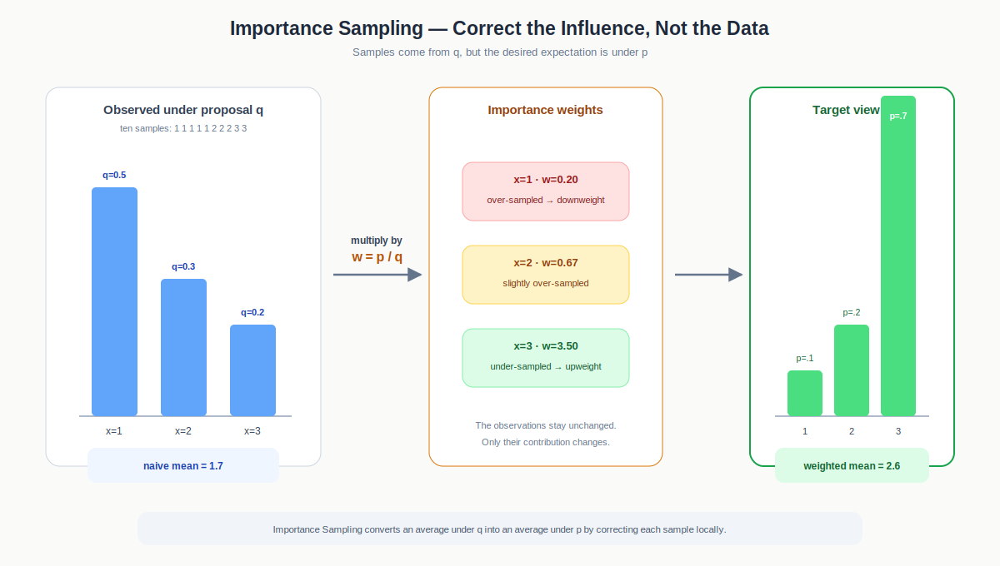
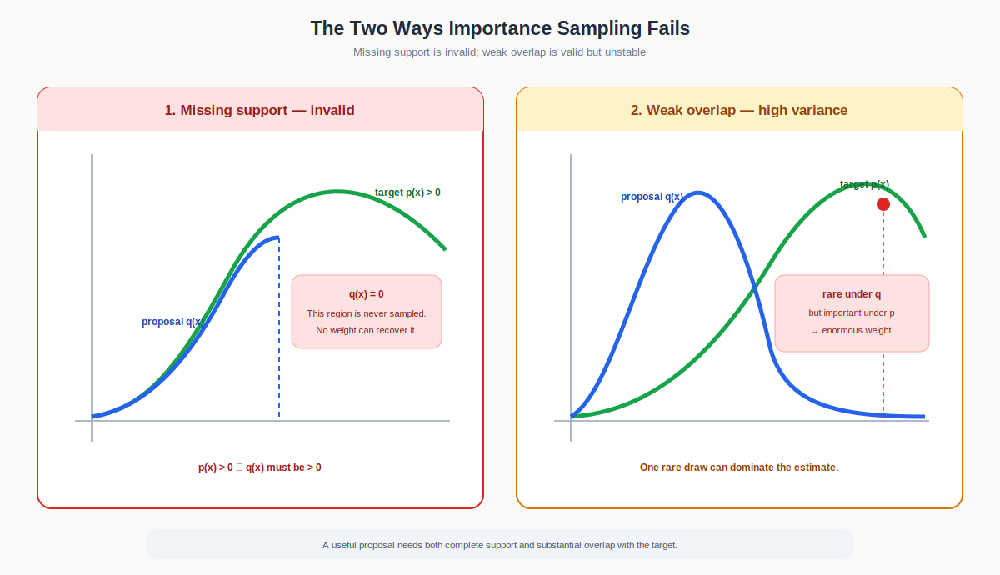
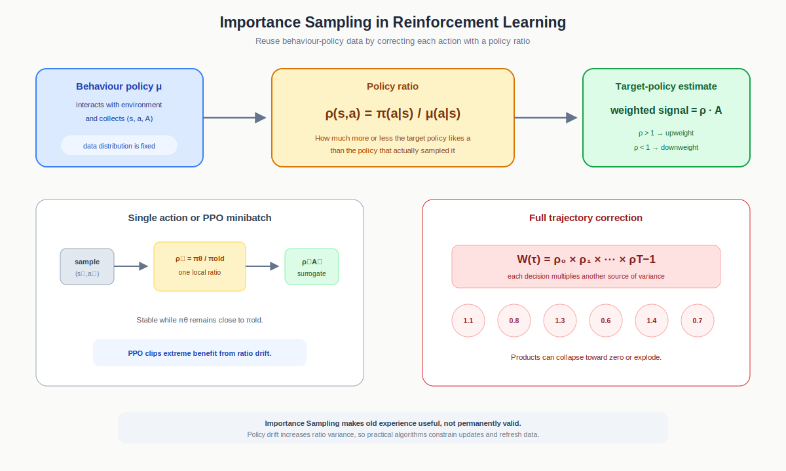

# Importance Sampling

> [!abstract]
> **The Elevator Pitch**
>
> Importance Sampling estimates an expectation under a target distribution using samples drawn from a different distribution. It does this by multiplying every sample by a probability ratio. In reinforcement learning, that ratio lets us reuse actions or trajectories collected by an older behaviour policy while reasoning about a newer target policy.

Fig 1. Samples remain unchanged. The ratio $p(x)/q(x)$ downweights outcomes overrepresented by the proposal and upweights outcomes underrepresented relative to the target.

## Contents

1. [[#The problem]]
2. [[#The importance-sampling identity]]
3. [[#Reading the weight]]
4. [[#A worked example]]
5. [[#When importance sampling works]]
6. [[#Variance and effective sample size]]
7. [[#Self-normalized importance sampling]]
8. [[#Importance sampling in reinforcement learning]]
9. [[#From importance sampling to PPO]]
10. [[#Key takeaways]]

---

## The problem

Many quantities in machine learning are expectations:

$$
\mu
=
\mathbb E_{x\sim p}[f(x)]
=
\int p(x)f(x)\,dx.
$$

Here $p$ is the **target distribution**: the distribution under which the answer is required. If samples

$$
x_1,\ldots,x_N\sim p
$$

are available, ordinary Monte Carlo estimation uses

$$
\hat\mu_{\text{MC}}
=
\frac{1}{N}
\sum_{i=1}^{N} f(x_i).
$$

The difficulty is that the available samples may come from another distribution $q$. This happens when:

- data was collected by an older policy;
- a new experiment or rollout is expensive;
- historical data already exists;
- the target distribution is difficult to sample directly.

A naive average of samples from $q$ estimates

$$
\mathbb E_q[f(x)],
$$

not $\mathbb E_p[f(x)]$. Importance Sampling corrects this mismatch without changing the observations themselves.

---

## The importance-sampling identity

Start with the target expectation and multiply the integrand by $q(x)/q(x)$:

$$
\begin{aligned}
\mathbb E_p[f(x)]
&=
\int p(x)f(x)\,dx\\
&=
\int q(x)
\frac{p(x)}{q(x)}
f(x)\,dx\\
&=
\mathbb E_{x\sim q}
\left[
\frac{p(x)}{q(x)}
f(x)
\right].
\end{aligned}
$$

Define the **importance weight**

$$
w(x)
=
\frac{p(x)}{q(x)}.
$$

Then

$$
\boxed{
\mathbb E_p[f(x)]
=
\mathbb E_q[w(x)f(x)]
}
$$

and the ordinary Importance Sampling estimator is

$$
\boxed{
\hat\mu_{\text{IS}}
=
\frac{1}{N}
\sum_{i=1}^{N}
w(x_i)f(x_i),
\qquad
x_i\sim q.
}
$$

This is an exact change of measure followed by an ordinary Monte Carlo approximation. Under the usual support and integrability conditions, the estimator is unbiased:

$$
\mathbb E_q[\hat\mu_{\text{IS}}]
=
\mathbb E_p[f(x)].
$$

Unbiased does not mean that every finite-sample estimate is close to the truth. It means that repeated estimates are centred on the truth.

---

## Reading the weight

The ratio tells us how the proposal $q$ misrepresented a sample:

| Weight | Interpretation | Correction |
|---|---|---|
| $w(x)>1$ | $x$ is more common under the target than under the proposal | upweight it |
| $w(x)<1$ | $x$ is overrepresented by the proposal | downweight it |
| $w(x)=1$ | both distributions agree at $x$ | leave it unchanged |

If $w(x)=4$, the target assigns four times as much probability to $x$ as the proposal does. The sample must count four times. If $w(x)=0.2$, the proposal has over-sampled that outcome by a factor of five, so its contribution is reduced to one fifth.

A useful consistency check is

$$
\mathbb E_q[w(x)]
=
\int q(x)\frac{p(x)}{q(x)}\,dx
=
1.
$$

The weights redistribute influence; in expectation they do not create or destroy probability mass.

---

## A worked example

Let $x\in\{1,2,3\}$ and suppose

| $x$ | $p(x)$: target | $q(x)$: proposal | $w(x)=p/q$ |
|---:|---:|---:|---:|
| 1 | 0.1 | 0.5 | 0.20 |
| 2 | 0.2 | 0.3 | 0.67 |
| 3 | 0.7 | 0.2 | 3.50 |

We want

$$
\mathbb E_p[x]
=
0.1(1)+0.2(2)+0.7(3)
=
2.6.
$$

Suppose ten draws from $q$ contain five $1$s, three $2$s, and two $3$s. The naive average is

$$
\frac{5(1)+3(2)+2(3)}{10}
=
1.7.
$$

It is low because $q$ over-sampled $1$ and under-sampled $3$. Reweighting gives

$$
\hat\mu_{\text{IS}}
=
\frac{
5(0.2)(1)
+
3(0.67)(2)
+
2(3.5)(3)
}{10}
\approx
2.6.
$$

The two occurrences of $3$ receive large weights because $3$ is rare under $q$ but dominant under $p$. The exact match in this small example occurs because the observed counts match the proposal probabilities exactly; a typical finite sample will still contain Monte Carlo error.

---

## When importance sampling works

### The support condition

The proposal must assign non-zero probability wherever the target does:

$$
p(x)>0
\quad\Longrightarrow\quad
q(x)>0.
$$

If $p(x)>0$ but $q(x)=0$, the proposal can never produce $x$ and the ratio $p(x)/q(x)$ is undefined. Weighting can correct the wrong frequency, but it cannot recover an outcome that is completely absent.

In measure-theoretic language, the target must be absolutely continuous with respect to the proposal:

$$
p\ll q.
$$

### The proposal must overlap well

Non-zero support is necessary but not sufficient for a useful estimator. If $q(x)$ is merely tiny where $p(x)f(x)$ is important, a rare sample can receive an enormous weight and dominate the estimate.

A good proposal therefore:

- covers every important region of the target;
- does not assign extremely small probability where the target is large;
- ideally samples frequently where $|p(x)f(x)|$ is large.

Fig 2. Missing support makes the estimator invalid. Weak overlap keeps it mathematically valid but can make the estimate depend on one rare, extremely large weight.

---

## Variance and effective sample size

Importance Sampling can be unbiased and still be unreliable. Its variance is

$$
\operatorname{Var}_q
\left[
\hat\mu_{\text{IS}}
\right]
=
\frac{1}{N}
\operatorname{Var}_q
\left[
w(x)f(x)
\right].
$$

Large or highly uneven weights make this variance large. This problem becomes more severe in high dimensions and over long RL trajectories, where several ratios are multiplied together.

To diagnose weight concentration, normalize the observed weights:

$$
\tilde w_i
=
\frac{w_i}{\sum_j w_j}.
$$

The commonly used **effective sample size** is

$$
\boxed{
\operatorname{ESS}
\approx
\frac{1}
{\sum_{i=1}^{N}\tilde w_i^2}
}
$$

or equivalently

$$
\operatorname{ESS}
\approx
\frac{(\sum_i w_i)^2}
{\sum_i w_i^2}.
$$

If all weights are equal, $\operatorname{ESS}=N$. If one weight contains almost all the mass, $\operatorname{ESS}\approx1$. ESS is a diagnostic, not a guarantee, but it quickly reveals whether the estimate uses the whole dataset or effectively depends on only a few samples.

> [!warning]
> More collected samples do not necessarily mean more useful samples. A batch of 10,000 observations can have an ESS close to 1 if one importance weight dominates.

---

## Self-normalized importance sampling

Sometimes the target density is known only up to a constant:

$$
p(x)
=
\frac{\bar p(x)}{Z},
$$

where $Z$ is unknown. Ordinary weights cannot be computed exactly, but the constant cancels after normalization:

$$
\tilde w_i
=
\frac{\bar p(x_i)/q(x_i)}
{\sum_j \bar p(x_j)/q(x_j)}.
$$

The **self-normalized estimator** is

$$
\boxed{
\hat\mu_{\text{SNIS}}
=
\sum_{i=1}^{N}
\tilde w_i f(x_i).
}
$$

Ordinary IS is unbiased when its conditions hold. SNIS is generally biased for finite $N$, but it is consistent and is often more practical when the target normalizer is unavailable. The trade-off is therefore explicit: convenient normalized weights in exchange for a small finite-sample bias.

---

## Importance sampling in reinforcement learning

In reinforcement learning, the two distributions are policies:

- $\mu(a\mid s)$ is the **behaviour policy** that collected the data;
- $\pi(a\mid s)$ is the **target policy** we want to evaluate or improve.

For a fixed state,

$$
\mathbb E_{a\sim\pi(\cdot\mid s)}
[f(s,a)]
=
\mathbb E_{a\sim\mu(\cdot\mid s)}
\left[
\rho(s,a)f(s,a)
\right],
$$

where

$$
\boxed{
\rho(s,a)
=
\frac{\pi(a\mid s)}
{\mu(a\mid s)}.
}
$$

The interpretation is unchanged:

- $\rho>1$: the target policy likes the sampled action more than the behaviour policy did;
- $\rho<1$: the target policy likes it less;
- $\rho=1$: the policies agree on that action.

For a complete trajectory

$$
\tau=(s_0,a_0,r_0,\ldots,s_T),
$$

the environment-transition terms cancel when the environment is unchanged, leaving the trajectory ratio

$$
\frac{P_\pi(\tau)}
{P_\mu(\tau)}
=
\prod_{t=0}^{T-1}
\frac{\pi(a_t\mid s_t)}
{\mu(a_t\mid s_t)}.
$$

This product is exact, but it is often unstable. Ratios slightly above or below one compound over time. A long trajectory may receive a weight extremely close to zero or an enormous weight. Per-decision Importance Sampling reduces variance by applying only the ratios needed up to each reward rather than one full-trajectory product to everything.

Fig 3. An old policy supplies the data; the policy ratio converts each sampled action’s contribution to the scale of the new policy. Full trajectory correction multiplies ratios and can rapidly become unstable.

---

## From importance sampling to PPO

PPO collects a rollout with a frozen behaviour policy $\pi_{\text{old}}$ and then performs several optimization epochs with a changing policy $\pi_\theta$. For each sampled action it computes

$$
\rho_t(\theta)
=
\frac{
\pi_\theta(a_t\mid s_t)
}{
\pi_{\text{old}}(a_t\mid s_t)
}.
$$

The basic surrogate actor objective is

$$
L^{\text{IS}}(\theta)
=
\mathbb E_t
\left[
\rho_t(\theta)\hat A_t
\right].
$$

The advantage $\hat A_t$ says whether the sampled action was better or worse than expected. The ratio says how much the new policy’s probability of that action has changed since collection.

Importance Sampling makes limited batch reuse possible, but it does not make old data valid forever. As $\pi_\theta$ moves away from $\pi_{\text{old}}$, the ratios become more variable and the observed state distribution becomes less representative of the new policy. PPO therefore clips the ratio and returns to the environment after a small number of epochs:

$$
L^{\text{clip}}(\theta)
=
\mathbb E_t
\left[
\min
\left(
\rho_t\hat A_t,
\operatorname{clip}
(\rho_t,1-\epsilon,1+\epsilon)
\hat A_t
\right)
\right].
$$

The ratio enables reuse; clipping limits how much the optimizer can profit from policy drift. The next note, [[Surrogate Objective, KL Divergence and Trust Region Optimization]], develops why this remains only a local approximation, and [[The PPO Training Loop]] shows how it is used in practice.

---

## Key takeaways

1. Importance Sampling estimates an expectation under $p$ using samples from $q$ by multiplying each sample by $p(x)/q(x)$.
2. A weight above one upweights an outcome underrepresented by the proposal; a weight below one downweights an overrepresented outcome.
3. The proposal must cover the target’s support. Missing outcomes cannot be recovered by weighting.
4. Uneven weights produce high variance. Effective sample size measures how many samples materially contribute.
5. Self-normalization removes an unknown target normalizer but introduces finite-sample bias.
6. In RL, the importance ratio is the target-policy probability divided by the behaviour-policy probability.
7. PPO uses this ratio to reuse rollout data briefly, then clips large policy changes and refreshes the batch.
