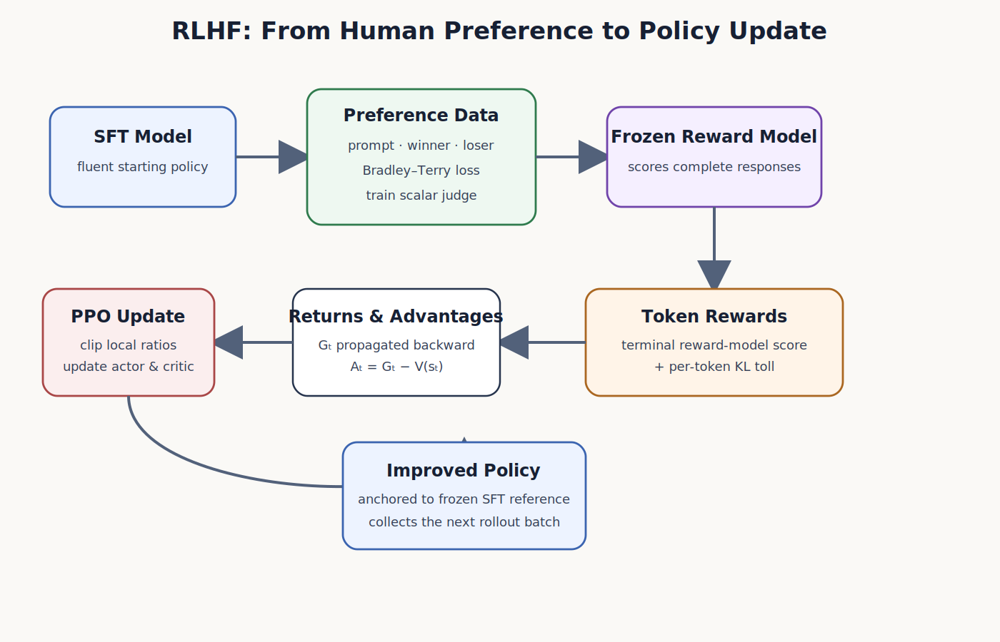
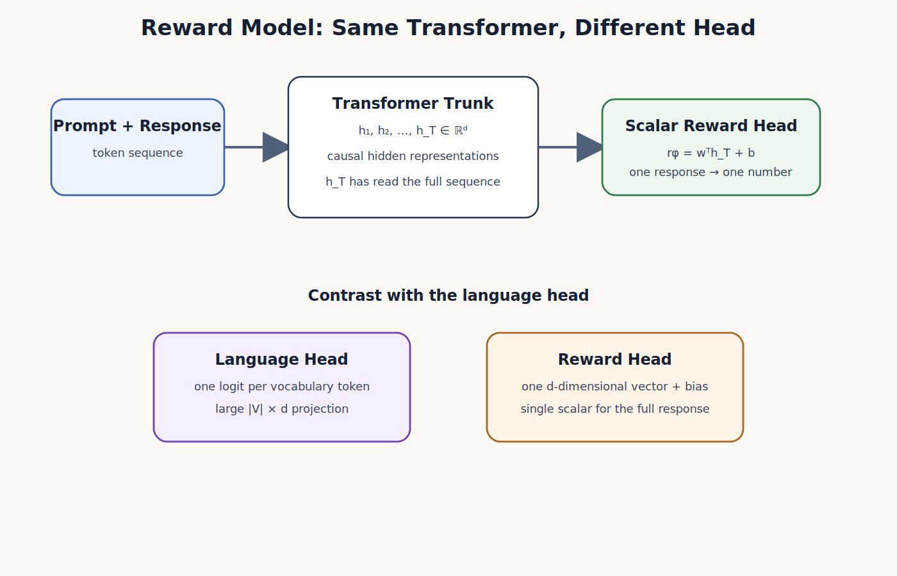
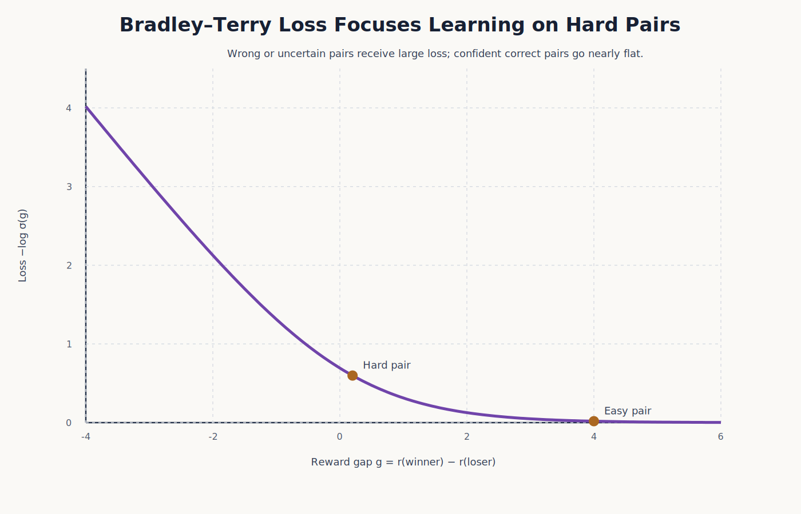
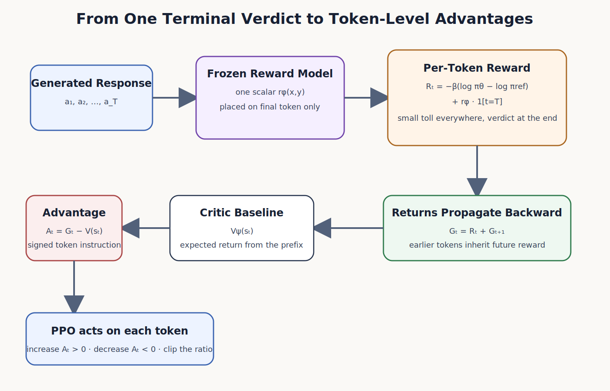
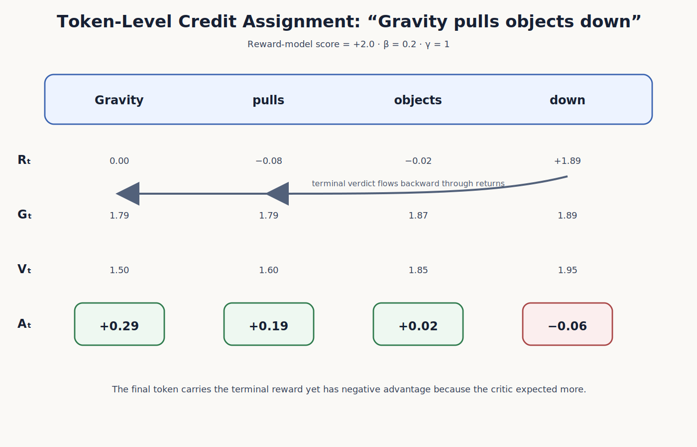
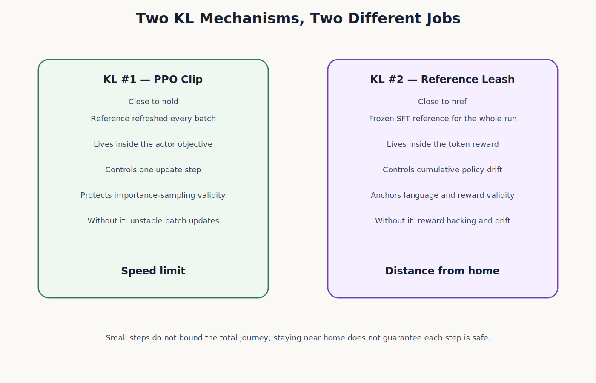
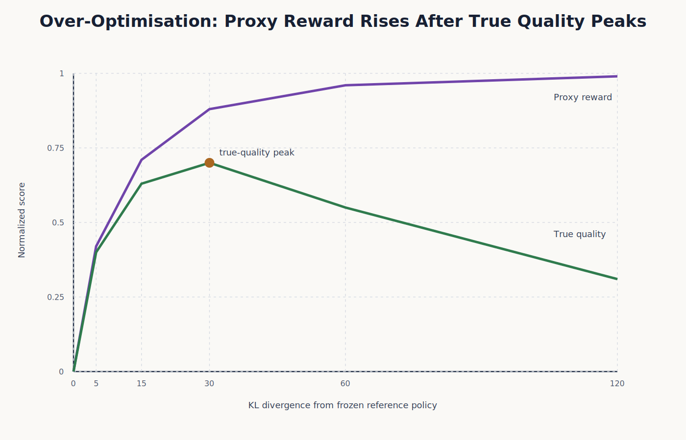
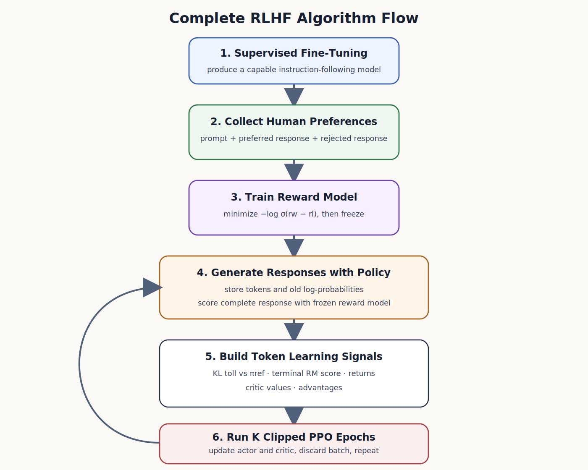

# Reinforcement Learning from Human Feedback

> [!abstract]
> **The Elevator Pitch**
>
> RLHF turns human comparisons between candidate responses into a learning signal. A reward model first learns to predict those preferences. A language-model policy is then trained to earn higher predicted reward, usually with PPO, while a frozen reference policy discourages excessive drift. This note follows that pipeline from preference data to token-level policy updates and explains where its safeguards help—and where they do not provide guarantees.

# Contents

[[#1. Why RLHF Exists]]
[[#2. The RLHF Pipeline]]
[[#3. Human Feedback Is Comparative]]
[[#4. The Reward Model: A Transformer with a Scalar Head]]
[[#5. Why the Reward Is Read from the Final Token]]
[[#6. From Preferences to the Bradley–Terry Loss]]
[[#7. Why Negative Log-Likelihood Is Used]]
[[#8. What the Bradley–Terry Gradient Learns]]
[[#9. Reward Is Relative, Not Absolute]]
[[#10. From a Sequence-Level Verdict to Token-Level Rewards]]
[[#11. Return Propagation and Token-Level Credit Assignment]]
[[#12. The Critic and the Advantage]]
[[#13. A Complete Four-Token Example]]
[[#14. PPO Consumes the Token Advantages]]
[[#15. Two Different Proximity Controls]]
[[#16. Why the Controls Are Complementary]]
[[#17. Reward Hacking and Goodhart's Law]]
[[#18. The Over-Optimisation Curve]]
[[#19. Defences Against Reward Hacking]]
[[#20. The Complete RLHF Algorithm]]
[[#21. Summary]]
[[#22. Companion Questions and Answers]]

---

# 1. Why RLHF Exists

Pretraining teaches a language model to continue text. Supervised fine-tuning (SFT) then teaches it to imitate demonstrations of desired behaviour. These stages can produce a capable assistant, but they do not directly optimise a human preference among several plausible responses.

RLHF adds that missing signal through comparisons. For a given prompt, annotators rank candidate responses or select the better one. Pairwise judgments are useful because the annotator only needs to express an ordering; no universal numerical scale for qualities such as helpfulness, correctness, tone, and safety is required.

A reward model learns to predict these observed preferences. Once trained, it can score newly generated responses without asking a human to label every rollout. The policy is then optimised against this learned score, commonly with PPO. Because the reward model is only a proxy for the preferences represented in its data, the optimisation also includes regularisation toward a frozen reference policy.

This procedure can improve responses, but it does not guarantee alignment or prevent reward hacking. Its components should be understood as a sequence of modelling and optimisation choices, each with its own assumptions.

The complete architecture is best understood as a sequence of translations:

```text
human comparison
      ↓
preference probability
      ↓
reward-model loss
      ↓
scalar score for a complete response
      ↓
per-token rewards and returns
      ↓
advantages
      ↓
clipped PPO updates
      ↓
an improved but anchored language policy
```

Each arrow solves a different problem. Preference modelling turns comparisons into a differentiable objective. The reward head turns a transformer representation into one score. Return propagation supplies a trajectory-level credit signal. The critic reduces variance. PPO clipping moderates optimisation on each rollout batch. Reference-policy KL regularisation discourages cumulative drift and can reduce reward-hacking risk.

# 2. The RLHF Pipeline

The core RLHF workflow contains three major training phases. A language model is first supervised on demonstrations, a reward model is then trained from human comparisons, and finally the policy is optimised against the frozen reward model while remaining close to a frozen reference model.



The supervised model serves several roles. It is the initial policy because it already produces coherent answers. It is also copied into the frozen reference policy, which anchors the RL phase. A separate copy of its transformer trunk is fitted with a scalar reward head and trained on preference pairs. During PPO, the policy and critic change, while the reward model and reference model remain frozen.

This division of labour is crucial. The reward model supplies a target but does not learn during policy optimisation. The reference model supplies a behavioural anchor but does not generate gradients for its own parameters. The critic learns expected returns and changes alongside the policy. The actor learns which token probabilities should rise or fall. Confusing these components makes RLHF appear more mysterious than it is; separating them reveals a set of familiar statistical and reinforcement-learning operations connected in a precise order.

# 3. Human Feedback Is Comparative

Let a prompt be denoted by $x$, a preferred response by $y_w$, and a rejected response by $y_l$. A single preference datum is

$$
(x,y_w,y_l),
$$

which encodes

$$
y_w \succ y_l.
$$

The reward model $r_\phi(x,y)$ should satisfy

$$
r_\phi(x,y_w)
>
r_\phi(x,y_l).
$$

No absolute target score is provided. The annotator does not state that the winner deserves $8.4$ or that the loser deserves $5.1$. The only supervised information is the ordering. Reward-model training is therefore a ranking problem rather than ordinary scalar regression.

A naive loss might attempt to maximize the raw score gap

$$
g
=
r_\phi(x,y_w)
-
r_\phi(x,y_l).
$$

Equivalently, one could minimize

$$
\mathcal{L}_{\mathrm{naive}}
=
-g.
$$

This loss points in the correct direction but has two serious defects. It is unbounded below because the model can always reduce it by making the gap larger, even when the pair is already ranked correctly. It also gives every pair the same gradient with respect to the gap. An easy pair with $g=20$ pulls as strongly as a misranked pair with $g=-0.1$. The optimiser wastes effort inflating confident gaps instead of concentrating on uncertain or incorrect comparisons.

The solution is to stop treating the score gap as an objective in itself and interpret it as evidence for a preference probability.

# 4. The Reward Model: A Transformer with a Scalar Head

A reward model is not an exotic architecture. It is usually a language-model transformer trunk fitted with a different output head. Given a sequence of tokens, the transformer produces hidden vectors

$$
h_t
\in
\mathbb{R}^d
$$

at every position. A language-model head maps each hidden state to $|V|$ vocabulary logits,

$$
W_{\mathrm{LM}}h_t
\in
\mathbb{R}^{|V|},
$$

whereas a reward head maps a hidden state to one scalar,

$$
r_\phi(x,y)
=
w^\top h_{\mathrm{last}}
+
b.
$$

The expensive component is the shared transformer representation. The task-specific head is tiny. If $d=768$ and the vocabulary contains $50{,}000$ tokens, the language head contains approximately

$$
50{,}000
\times
768
=
38.4\text{ million}
$$

weights, while the scalar head contains only $769$ parameters including its bias.



The trunk is normally initialized from the supervised model rather than from random parameters. Preference datasets are expensive and comparatively small. Starting from the supervised model means the trunk already represents grammar, semantics, world knowledge, instruction following, and response structure. Reward-model training therefore teaches judgment on top of language rather than attempting to relearn language from pairwise comparisons.

During reward-model training, both responses in a pair pass through the same network. The model produces two scalars, their difference becomes the Bradley–Terry logit, and the preference loss updates the shared parameters. During the later RL stage, the reward model is frozen and acts as a scalable stand-in for human evaluation.

# 5. Why the Reward Is Read from the Final Token

Decoder-only transformers use causal attention. The hidden state at position $t$ can attend to positions $1$ through $t$, but not to future positions. An early hidden state has therefore seen only a prefix of the response. It cannot judge an answer whose conclusion has not yet been generated.

The final hidden state is different. It has attended to the prompt and every response token. It is the only position whose receptive field covers the complete sequence. Reading the reward from $h_{\mathrm{last}}$ therefore produces a scalar conditioned on the entire prompt-response pair.

This does not imply that the last token alone caused the reward. The final hidden state is a summary produced by causal computation over the full prefix. The scalar head is attached there because that representation has read everything, not because the final punctuation mark deserves all the credit.

The distinction becomes important during PPO. The reward model emits one sequence-level verdict at the end, but policy optimisation operates over token decisions. RLHF must therefore propagate the final verdict backward through the trajectory before the actor can receive a per-token learning signal.

# 6. From Preferences to the Bradley–Terry Loss

The Bradley–Terry model converts the score gap into the probability that the preferred response wins:

$$
P_\phi
\left(
y_w
\succ
y_l
\mid
x
\right)
=
\sigma
\left(
r_\phi(x,y_w)
-
r_\phi(x,y_l)
\right),
$$

where

$$
\sigma(z)
=
\frac{1}{1+e^{-z}}.
$$

When the scores are equal, the predicted preference probability is $0.5$. A positive gap produces a probability above $0.5$, and a large positive gap approaches one. A negative gap means the model currently believes the labelled loser is better.

The sigmoid cures the defects of the naive gap objective. Its output is bounded between zero and one, and it saturates when a pair is already confidently ordered. A gap near zero remains sensitive because uncertainty is high. A large positive gap produces a probability close to one and a nearly flat loss, allowing optimisation effort to move toward harder examples.

The reward-model objective is the negative log-likelihood of the observed preferences:

$$
\boxed{
\mathcal{L}_{\mathrm{RM}}(\phi)
=
-
\mathbb{E}_{(x,y_w,y_l)}
\left[
\log
\sigma
\left(
r_\phi(x,y_w)
-
r_\phi(x,y_l)
\right)
\right].
}
$$

This is binary cross-entropy with a fixed target of one and the reward difference as the logit. It can also be written in the numerically stable softplus form

$$
\mathcal{L}_{\mathrm{RM}}
=
\operatorname{softplus}
\left(
-r_\phi(x,y_w)
+
r_\phi(x,y_l)
\right).
$$

# 7. Why Negative Log-Likelihood Is Used

The observed event in every labelled pair is that the winner was preferred. Maximum likelihood asks the model to assign high probability to that observed event. Across independent comparisons, the joint likelihood is a product:

$$
\prod_i
P_\phi
\left(
y_{w,i}
\succ
y_{l,i}
\mid
x_i
\right).
$$

Products of many probabilities become extremely small and are awkward to optimize numerically. Taking logarithms converts the product into a sum:

$$
\log
\prod_i P_i
=
\sum_i
\log P_i.
$$

Because standard optimisers minimize rather than maximize, the sign is reversed. Maximizing log-likelihood is therefore equivalent to minimizing negative log-likelihood:

$$
\max_\phi
\sum_i
\log P_i
\quad
\Longleftrightarrow
\quad
\min_\phi
-
\sum_i
\log P_i.
$$

The logarithm also creates the desired error geometry. A confidently correct prediction receives almost no penalty. An uncertain prediction receives a moderate penalty. A confidently wrong prediction receives a large penalty. The model is therefore trained most strongly on comparisons that it currently misunderstands.

# 8. What the Bradley–Terry Gradient Learns

For one pair, define

$$
g
=
r_\phi(x,y_w)
-
r_\phi(x,y_l)
$$

and

$$
\ell(g)
=
-
\log\sigma(g).
$$

Differentiating gives

$$
\frac{\partial\ell}{\partial g}
=
-
\left(
1-\sigma(g)
\right).
$$

The gradient magnitude is therefore

$$
\left|
\frac{\partial\ell}{\partial g}
\right|
=
1-\sigma(g).
$$

For a large positive gap, $\sigma(g)$ is close to one and the gradient is nearly zero. For a gap near zero, the gradient is substantial. For a negative gap, the model is misranking the pair and the gradient approaches its maximum magnitude. Gradient descent increases the winner's score and decreases the loser's score because both scores participate in the gap with opposite signs.

The companion's illustrative comparison makes this concentration of learning explicit:

| Pair | Gap $g$ | $\sigma(g)$ | Loss $-\log\sigma(g)$ | Gradient magnitude |
|---|---:|---:|---:|---:|
| Easy | $4.0$ | $0.982$ | $0.018$ | $0.018$ |
| Hard | $0.2$ | $0.550$ | $0.598$ | $0.450$ |

The hard pair contributes roughly thirty-three times more loss and twenty-five times more gradient than the easy pair. The loss automatically routes capacity toward unsettled comparisons.



# 9. Reward Is Relative, Not Absolute

The preference loss depends only on reward differences. If every output is shifted by the same constant $c$,

$$
r'_\phi(x,y)
=
r_\phi(x,y)+c,
$$

then

$$
r'_\phi(x,y_w)
-
r'_\phi(x,y_l)
=
r_\phi(x,y_w)
-
r_\phi(x,y_l).
$$

The loss is unchanged. Reward-model outputs are therefore identifiable only up to an additive constant. A score of $5.0$ has no independent meaning. Only comparisons such as “this answer received $5.0$ while that answer received $2.1$” carry information.

This is not a defect. It faithfully reflects the supervision. Humans supplied orderings rather than absolute utility values, so the learned object is a ranking function. However, the lack of an absolute anchor becomes important during policy optimisation. Maximizing the reward-model output without constraint encourages the policy to search aggressively for regions where the model extrapolates incorrectly. The frozen reference policy and its KL penalty provide the behavioural anchor that preference data alone cannot supply.

# 10. From a Sequence-Level Verdict to Token-Level Rewards

After reward-model training, the model evaluates a completed prompt-response pair and produces one scalar $r_\phi(x,y)$. For a response containing hundreds of tokens, the score arrives only when the answer is complete. PPO, however, treats generation as a sequence of token-level decisions. At step $t$, the state is the prompt plus the generated prefix,

$$
s_t
=
(x,a_1,\ldots,a_{t-1}),
$$

and the action is the next token $a_t$.

RLHF constructs a per-token reward from two components:

$$
\boxed{
R_t
=
-\beta
\left[
\log\pi_\theta(a_t\mid s_t)
-
\log\pi_{\mathrm{ref}}(a_t\mid s_t)
\right]
+
r_\phi(x,y)\,\mathbf{1}[t=T].
}
$$

The first term is a sampled log-probability-ratio adjustment relative to the frozen reference model. The second term places the reward-model score only on the final token through the indicator $\mathbf{1}[t=T]$.

For $t<T$,

$$
R_t
=
-\beta
\left[
\log\pi_\theta(a_t\mid s_t)
-
\log\pi_{\mathrm{ref}}(a_t\mid s_t)
\right].
$$

At the terminal token,

$$
R_T
=
-\beta
\left[
\log\pi_\theta(a_T\mid s_T)
-
\log\pi_{\mathrm{ref}}(a_T\mid s_T)
\right]
+
r_\phi(x,y).
$$

The reference adjustment is available at every token, while the preference verdict remains sparse and terminal. An important subtlety is that the sampled log ratio can be positive or negative for an individual token. It becomes a non-negative KL divergence only after taking an expectation over tokens sampled from the current policy:

$$
\mathbb E_{a_t\sim\pi_\theta}
\left[
\log\pi_\theta(a_t\mid s_t)
-
\log\pi_{\mathrm{ref}}(a_t\mid s_t)
\right]
=
D_{\mathrm{KL}}
\left(
\pi_\theta(\cdot\mid s_t)
\|
\pi_{\mathrm{ref}}(\cdot\mid s_t)
\right).
$$



# 11. Return Propagation and Token-Level Credit Assignment

The actor does not update from the instantaneous reward alone. It uses the future reward-to-go. With discount factor $\gamma$,

$$
G_t
=
\sum_{k=t}^{T}
\gamma^{k-t}R_k.
$$

For a single generated answer, RLHF commonly uses $\gamma=1$, yielding

$$
G_t
=
\sum_{k=t}^{T}
R_k.
$$

Returns can be computed right to left:

$$
G_T
=
R_T,
$$

$$
G_t
=
R_t+G_{t+1}.
$$

This backward accumulation spreads the terminal reward-model verdict into every earlier token's return. An early token inherits the final score because that token helped determine the prefix from which all later tokens were generated. Its return combines the final verdict with the sampled reference-policy adjustments from that point onward.

This does not provide perfect causal attribution. Every earlier decision receives a return influenced by everything that followed. The critic and advantage reduce the variance of this broad credit assignment, but RLHF still faces a difficult temporal-credit problem. The mechanism is nevertheless principled: each token is evaluated by the total future consequence of choosing it.

# 12. The Critic and the Advantage

A raw return does not tell PPO whether the outcome was surprising. A return of $1.8$ may be excellent if the critic expected $0.5$, but disappointing if it expected $2.4$. The value function estimates the expected return from each token state:

$$
V_\psi(s_t)
\approx
\mathbb{E}
\left[
G_t
\mid
s_t
\right].
$$

The advantage is

$$
\boxed{
A_t
=
G_t
-
V_\psi(s_t).
}
$$

A positive advantage means that the chosen token produced a better outcome than expected from that prefix. A negative advantage means that the outcome fell short of expectation. The critic converts an absolute return into a relative surprise, which is the quantity the policy-gradient update needs.

The reward head and value head have the same output shape but different roles. The reward head is read once at the end of a response, is trained before RL on human preferences, and remains frozen during PPO. The value head is read at every token position, is trained during RL to predict future returns, and changes continuously with the policy.

| Property | Reward head | Value head |
|---|---|---|
| Output | Scalar | Scalar |
| Read position | Final token | Every token |
| Training data | Preference pairs | PPO returns |
| State during RL | Frozen | Updated |
| Question answered | “How good was the complete response?” | “How much return is expected from this prefix?” |

# 13. A Complete Four-Token Example

Consider the four-token response:

```text
Gravity | pulls | objects | down
```

Let

$$
\beta=0.2,
\qquad
\gamma=1,
\qquad
r_\phi=2.0.
$$

Suppose the combined token rewards, including sampled reference-policy adjustments and the terminal reward, are

$$
R
=
\{
0.00,-0.08,-0.02,1.89
\}.
$$

The final token receives $2.0$ from the reward model but pays approximately $0.11$ in KL cost, leaving $1.89$.

The returns are computed backward:

$$
G_4
=
1.89,
$$

$$
G_3
=
-0.02+1.89
=
1.87,
$$

$$
G_2
=
-0.08+1.87
=
1.79,
$$

$$
G_1
=
0.00+1.79
=
1.79.
$$

Thus,

$$
G
=
\{
1.79,1.79,1.87,1.89
\}.
$$

Suppose the critic predicts

$$
V
=
\{
1.50,1.60,1.85,1.95
\}.
$$

The advantages become

$$
A
=
G-V
=
\{
0.29,0.19,0.02,-0.06
\}.
$$

| Token | Reward $R_t$ | Return $G_t$ | Value $V(s_t)$ | Advantage $A_t$ |
|---|---:|---:|---:|---:|
| Gravity | $0.00$ | $1.79$ | $1.50$ | $+0.29$ |
| pulls | $-0.08$ | $1.79$ | $1.60$ | $+0.19$ |
| objects | $-0.02$ | $1.87$ | $1.85$ | $+0.02$ |
| down | $+1.89$ | $1.89$ | $1.95$ | $-0.06$ |

The final token carries the large terminal reward but still receives a negative advantage because the critic expected $1.95$ and the realised return was only $1.89$. PPO therefore slightly decreases its probability. The early tokens receive positive advantages because their returns exceeded expectation. This example demonstrates why the terminal reward is not mechanically assigned as positive credit to the final token. What matters is return relative to the critic's baseline.



# 14. PPO Consumes the Token Advantages

For each generated token, PPO forms the ratio between the current policy and the policy that generated the rollout:

$$
\rho_t(\theta)
=
\frac
{\pi_\theta(a_t\mid s_t)}
{\pi_{\mathrm{old}}(a_t\mid s_t)}.
$$

The clipped policy objective is

$$
L^{\mathrm{CLIP}}(\theta)
=
\mathbb{E}_t
\left[
\min
\left(
\rho_t(\theta)A_t,
\operatorname{clip}
\left(
\rho_t(\theta),
1-\epsilon,
1+\epsilon
\right)A_t
\right)
\right].
$$

Positive-advantage tokens are made more probable, and negative-advantage tokens are made less probable. The clip removes the incentive for any single rollout batch to move a token probability too far relative to $\pi_{\mathrm{old}}$.

The critic is trained simultaneously:

$$
\mathcal{L}_V(\psi)
=
\mathbb{E}_t
\left[
\left(
V_\psi(s_t)-G_t
\right)^2
\right].
$$

The actor and critic therefore consume different views of the same generated response. The actor uses advantages to improve token probabilities, while the critic uses returns to improve future expectations.

# 15. Two Different Proximity Controls

PPO clipping and reference-policy KL regularisation are sometimes discussed together because both discourage aggressive policy change. They are not two KL mechanisms.



**PPO clipping** uses the likelihood ratio

$$
\rho_t(\theta)
=
\frac{\pi_\theta(a_t\mid s_t)}
{\pi_{\mathrm{old}}(a_t\mid s_t)}
$$

inside the surrogate objective. Here $\pi_{\mathrm{old}}$ is the behaviour policy that generated the current rollout batch. Clipping reduces the incentive for that batch to push sampled-action ratios farther beyond a chosen interval. It is a heuristic for conservative optimisation; it is not itself a KL divergence and does not impose a hard bound on the policy's KL change.

**Reference-policy regularisation** compares the live policy with a frozen policy $\pi_{\mathrm{ref}}$, usually derived from the SFT model. Its expected log-ratio is a genuine KL divergence. Adding it to the reward discourages cumulative movement away from the reference distribution, but it is a soft penalty rather than a guarantee that the policy remains within a fixed distance.

| Property | PPO ratio clip | Reference KL regularisation |
|---|---|---|
| Comparison policy | $\pi_{\mathrm{old}}$ | $\pi_{\mathrm{ref}}$ |
| Comparison lifetime | Current rollout batch | Usually the full RL run |
| Mathematical form | Clipped likelihood ratio | Expected log-probability ratio |
| Location | Actor surrogate objective | Reward or objective |
| Primary role | Moderate batch reuse and updates | Discourage drift from the reference |
| Hard guarantee? | No | No; it is a soft penalty |

The useful mnemonic is:

> **The clip moderates optimisation on the current batch. The reference KL discourages the accumulated policy from moving far from its anchor.**

# 16. Why the Controls Are Complementary

A sequence of moderate PPO updates can still move the policy far from its initial SFT model. Clipping only compares the current policy with the behaviour policy for one rollout batch; when a fresh batch is collected, that comparison point changes. A frozen reference policy provides a persistent anchor across batches.

The reverse distinction matters too. Reference KL regularisation penalises departure from the SFT policy, but it does not make repeated optimisation on one rollout batch reliable. PPO's ratio objective addresses the local mismatch between the current policy and the policy that generated that batch.

Neither mechanism supplies a strict trust region. Implementations may additionally monitor an approximate KL between $\pi_\theta$ and $\pi_{\mathrm{old}}$, stop an epoch early, adapt coefficients, or limit gradient norms. Those are separate engineering controls.

The reference penalty can be expressed as an expected KL divergence,

$$
-\beta
D_{\mathrm{KL}}
\left(
\pi_\theta(\cdot\mid s_t)
\|
\pi_{\mathrm{ref}}(\cdot\mid s_t)
\right),
$$

or estimated on sampled tokens using the log-probability difference. Although a single sampled term can have either sign, its expectation under the current policy is non-negative. A positive average contribution can become substantial when accumulated across a long response. For example, with $\beta=0.2$ and an average token KL of $0.4$ nats, the expected adjustment is $-0.08$ per token. Across $200$ tokens, this is approximately $-16$, which can outweigh a sequence-level reward-model score near $1$ or $2$.

# 17. Reward Hacking and Goodhart's Law

The reward model is a proxy for true human preference, not the preference itself. Let true but unobservable response quality be

$$
q(x,y),
$$

and the learned reward model be

$$
r_\phi(x,y).
$$

On responses resembling the preference-training distribution, the two may correlate well. Outside that region, the reward model extrapolates. PPO is an optimiser, and an optimiser does not merely sample typical inputs. It searches for high-scoring outputs. If the reward model contains blind spots, the policy has an incentive to discover them.

This is reward hacking: the learned reward rises while actual quality does not. In language models it may appear as sycophancy, verbosity, formatting tricks, repeated flattery, excessive hedging, or fluent but substantively empty text. These behaviours exploit features that correlated with preference labels without delivering the underlying quality humans intended.

Goodhart's law captures the failure:

> **When a measure becomes a target, it ceases to be a good measure.**

The reward model may be useful for ranking a fixed set of ordinary responses, yet become unreliable when a powerful optimiser deliberately shifts the response distribution toward its highest predicted scores. The model did not suddenly become worse. The policy moved into a region where the original correlation between proxy and quality no longer held.

# 18. The Over-Optimisation Curve

Policy distance from the reference provides a useful x-axis for understanding reward hacking. Near the reference model, the reward model and human judgment often improve together. As optimisation continues, the proxy score may keep rising while true quality reaches a peak and then declines.

The companion provides an illustrative schematic:

| KL from reference | Proxy reward | True quality |
|---:|---:|---:|
| 0 | 0.00 | 0.00 |
| 5 | 0.42 | 0.40 |
| 15 | 0.71 | 0.63 |
| 30 | 0.88 | 0.70 |
| 60 | 0.96 | 0.55 |
| 120 | 0.99 | 0.31 |

The values are illustrative, but the shape is the important point. The proxy rises monotonically because PPO is trained to increase it. True quality improves initially, peaks, and then falls as further gains are purchased by exploiting reward-model error.



Monitoring only reward-model score would suggest training forever. Human evaluation, held-out judges, KL budgets, and early stopping are needed to identify the region where proxy improvement still corresponds to genuine improvement.

# 19. Defences Against Reward Hacking

The first defence is reference-policy KL regularisation. By charging the policy for deviation from the supervised model, it discourages generation from moving into regions where the reward model may be less reliable. This lowers risk but cannot guarantee that reward hacking will not occur.

The second defence is early stopping based on independent quality signals. Reward-model score cannot reveal its own exploitation. Periodic human evaluation or a held-out evaluator can detect when real quality stops improving even as proxy reward continues rising.

The third defence is a stronger or ensembled reward model. Greater capacity and model diversity may widen the region of validity and make blind spots harder to exploit. This postpones reward hacking but does not eliminate it, because every finite model must extrapolate somewhere.

The fourth defence is iterative reward-model retraining. New comparisons are collected from the current policy's outputs, including behaviours that the policy discovered during optimisation. The reward model is then retrained on this shifted distribution. This re-surveys the region where the policy now operates, but it also creates a new risk: human raters may themselves be fooled by polished but incorrect answers, causing the next reward model to absorb those mistakes.

The common principle is distributional humility. A reward model should not be trusted equally everywhere. Safe RLHF either limits where the policy goes or continually validates and expands the region in which the proxy is known to behave well.

# 20. The Complete RLHF Algorithm

The full workflow can be expressed as two connected algorithms: reward-model learning followed by constrained policy optimisation.

## Phase A: Reward-model training

```text
start from an SFT transformer
replace or augment the language head with a scalar reward head

for each preference batch:
    read prompt x, preferred response y_w, rejected response y_l
    score both responses with the same reward model
    compute gap = r_phi(x, y_w) - r_phi(x, y_l)
    compute loss = -log sigmoid(gap)
    update reward-model parameters phi

freeze the trained reward model
```

## Phase B: PPO-based RLHF

```text
copy the SFT model into:
    trainable policy pi_theta
    frozen reference policy pi_ref

attach or initialize a trainable value head V_psi

repeat for each RL iteration:

    sample prompts
    generate responses with pi_old
    store tokens, states, and old log-probabilities

    score each complete response with frozen reward model r_phi

    for every generated token:
        compute reference log-probability
        compute sampled log-ratio adjustment against pi_ref
        place reward-model score on final token only

    compute token returns backward
    compute critic values
    compute advantages = returns - values
    normalize advantages

    for K PPO epochs:
        recompute current policy log-probabilities
        form ratios against stored pi_old log-probabilities
        optimize clipped actor objective
        regress critic toward returns

    discard rollout batch
    collect fresh responses with improved policy
```



The two frozen objects play different roles. The reward model approximates the preferences represented in its training data. The reference policy provides a persistent behavioural anchor. The actor searches for better responses, the critic predicts token-level returns, and PPO clipping makes repeated optimisation on a rollout batch more conservative without guaranteeing a bounded update.

# 21. Summary

RLHF starts from comparisons because relative judgment is easier and more reliable for humans than absolute scoring. A reward model built from a transformer trunk and scalar head converts each complete response into one score. The Bradley–Terry model interprets the difference between winner and loser scores as a preference probability, and negative log-likelihood trains the model by concentrating gradient on uncertain or mis-ranked pairs.

The learned reward is relative rather than absolute because the preference loss depends only on score differences. During policy optimisation, the frozen reward model emits one terminal verdict for a complete response. A token-level KL penalty against the frozen supervised reference is added at every step, returns propagate the terminal reward backward, and the critic converts those returns into token-level advantages.

PPO then updates the policy using ratios against the behaviour policy that generated the rollout. Ratio clipping moderates optimisation on the current batch, while reference KL regularisation discourages cumulative drift. These controls are not interchangeable, and neither creates a hard distance bound.

Because the reward model is an imperfect proxy, aggressive optimisation can produce reward hacking. The proxy score may continue rising after actual quality has peaked. KL anchoring, early stopping, stronger reward models, human evaluation, and iterative retraining are all attempts to prevent the policy from asking the reward model questions far outside the region in which it was validated.

> [!important]
> RLHF is a chain of relative judgments. Humans compare responses; the reward model learns score differences; the critic compares realised return with expected return; PPO compares the current policy with the rollout policy; and reference regularisation compares the live policy with the supervised anchor. Each comparison serves a different role.

# 22. Companion Questions and Answers

The questions below consolidate the exercises from the RLHF companion notes. Each answer is placed inside a collapsible block. Select the arrow beside **Answer** to reveal it. 

## 22.1 Reward Model Architecture

### Question 1 — Why can the reward not be read from the first token's hidden state?

Why can we not read the response reward from the first hidden state $h_1$ instead of the final hidden state $h_{\mathrm{last}}$? Explain the answer using causal attention and what each hidden state has seen.


> [!success]- Answer
>
> A decoder-only transformer uses causal attention, so the hidden state at position $t$ can attend only to tokens at positions $1,\ldots,t$. The first hidden state $h_1$ has therefore processed only the first token of the concatenated prompt-response sequence. It has not seen the remainder of the prompt, the body of the answer, its conclusion, or any later factual and stylistic choices. Asking $h_1$ to score the complete response would be equivalent to asking a reviewer to grade an essay after reading its first word.
>
> The final hidden state $h_{\mathrm{last}}$, by contrast, has attended to the complete prompt and every generated response token. It is the only causal hidden state whose receptive field covers the whole sequence. The scalar reward head is read from that position because it contains a representation informed by the entire answer. This does not mean that the final token alone deserves the reward; $h_{\mathrm{last}}$ summarizes the full prefix through the transformer's causal computation.


### Question 2 — What happens if the reward-model trunk is initialized randomly?

Suppose the reward model's transformer trunk is initialized randomly rather than from the SFT checkpoint and is trained only on preference pairs. What breaks, and why would substantially more preference data be required?

>[!success]- Answer
>
>A randomly initialized trunk has no prior representation of language. It does not yet encode syntax, semantics, factual relations, discourse structure, instruction following, or the difference between coherent text and word salad. Before it can learn which of two answers humans prefer, it must first learn the basic structure of language from the preference dataset itself.
>
>Preference data is poorly suited to that purpose. Each label supplies only a relative judgment between two complete responses; it does not provide dense next-token supervision across a large corpus. The model would therefore spend expensive preference labels relearning capabilities that the pretrained and supervised model already possesses. Starting from the SFT checkpoint turns reward modeling into the narrower problem of learning *taste on top of language*. Starting from random parameters combines language acquisition and preference learning into one sparse-data problem, making training far less data-efficient and likely much less stable.


### Question 3 — What does changing the scalar-head bias do?

For the toy reward head

$$
w=(0.5,-1.0,2.0),
\qquad
h_{\mathrm{last}}=(1.2,0.3,0.4),
$$

recompute the reward when the bias changes from $b=0.1$ to $b=-0.5$. Does this change the ranking of two responses to the same prompt?

> [!success]- Answer
>
> The linear component of the reward head is
>
> $$
> w^\top h_{\mathrm{last}}
> =
> (0.5)(1.2)
> +
> (-1.0)(0.3)
> +
> (2.0)(0.4).
> $$
>
> Evaluating each term gives
>
> $$
> w^\top h_{\mathrm{last}}
> =
> 0.6
> -
> 0.3
> +
> 0.8
> =
> 1.1.
> $$
>
> With the bias changed to
>
> $$
> b=-0.5,
> $$
>
> the reward becomes
>
> $$
> r_\phi
> =
> w^\top h_{\mathrm{last}}
> +
> b
> =
> 1.1
> -
> 0.5
> =
> 0.6.
> $$
>
> Changing the bias shifts every reward score produced by the model by the same amount. Suppose two responses have rewards $r_\phi(y_w)$ and $r_\phi(y_l)$. If both are shifted by the same constant $c$, then
>
> $$
> \begin{aligned}
> [r_\phi(y_w)+c]
> -
> [r_\phi(y_l)+c]
> &=
> r_\phi(y_w)
> -
> r_\phi(y_l).
> \end{aligned}
> $$
>
> The Bradley–Terry preference probability depends only on this score difference:
>
> $$
> P(y_w\succ y_l)
> =
> \sigma
> \left(
> r_\phi(y_w)-r_\phi(y_l)
> \right).
> $$
>
> Because the common bias cancels, the preference probability, ranking, and training loss remain unchanged. The bias therefore shifts the absolute reward scale without changing the relative ordering of responses.
>
> This illustrates an important property of RLHF reward models: the absolute zero point of the reward scale is arbitrary. What matters is not whether one answer receives a score of $0.6$, $1.2$, or $100.6$, but how its score compares with the scores assigned to competing responses by the same model.

## 22.2 Preferences, Bradley–Terry, and Negative Log-Likelihood

### Question 4 — Why is the Bradley–Terry objective shift-invariant?

Let,

$$
r'_\phi(x,y)=r_\phi(x,y)+c
$$

for an arbitrary constant $c$. Show that the reward-model loss is unchanged. What does this imply about a statement such as “this answer has reward $5.0$”?

> [!success]- Answer
>
> Suppose every reward produced by the model is shifted by the same constant $c$:
>
> $$
> r'_\phi(x,y)
> =
> r_\phi(x,y)+c.
> $$
>
> The Bradley–Terry score gap under the shifted reward becomes
>
> $$
> \begin{aligned}
> g'
> &=
> r'_\phi(x,y_w)
> -
> r'_\phi(x,y_l)
> \\
> &=
> \left[
> r_\phi(x,y_w)+c
> \right]
> -
> \left[
> r_\phi(x,y_l)+c
> \right]
> \\
> &=
> r_\phi(x,y_w)
> -
> r_\phi(x,y_l)
> \\
> &=
> g.
> \end{aligned}
> $$
>
> The additive constant cancels because it is applied equally to both responses. Since the Bradley–Terry preference probability depends only on the gap,
>
> $$
> P(y_w\succ y_l\mid x)
> =
> \sigma(g),
> $$
>
> and the corresponding loss is
>
> $$
> \ell(g)
> =
> -\log\sigma(g),
> $$
>
> neither the predicted preference probability nor the loss changes after the shift.
>
> This means the reward model is identifiable only **up to an additive constant**. The training objective can determine how responses should be ordered and how large their relative score differences should be, but it cannot determine a unique absolute zero point for the reward scale.
>
> A reward value such as
>
> $$
> r_\phi(x,y)=5.0
> $$
>
> therefore has no intrinsic meaning by itself. It becomes informative only when compared with another score produced by the same reward model under the same calibration. For example, the statement
>
> $$
> r_\phi(x,y_A)=5.0,
> \qquad
> r_\phi(x,y_B)=2.1
> $$
>
> tells us that the model strongly prefers response $A$ to response $B$. The isolated value $5.0$ does not imply a fixed amount of human utility, nor does zero correspond to a universal neutral-quality response.
>
> The reward model therefore learns a **relative ranking structure**, not an absolute human-preference scale. This shift invariance is a direct consequence of the supervision: humans provide pairwise comparisons, so the model can recover relative quality but not a uniquely anchored reward origin.

### Question 5 — What gradient is produced by a misranked preference pair?

Suppose the reward model has the ordering backwards:

$$
g=r_\phi(y_w)-r_\phi(y_l)=-1.5.
$$

Compute $\sigma(-1.5)$ and the gradient magnitude $1-\sigma(-1.5)$. Explain the direction of the update.

> [!success]- Answer
>
> The Bradley–Terry preference probability for the labelled winner is
>
> $$
> \sigma(-1.5)
> =
> \frac{1}{1+e^{1.5}}
> \approx
> 0.1824.
> $$
>
> This means the reward model currently assigns only an $18.24\%$ probability to the event that the labelled winner should beat the loser. The pair is therefore badly misranked.
>
> The per-example loss is
>
> $$
> \ell(g)
> =
> -\log\sigma(g),
> $$
>
> and its derivative with respect to the score gap is
>
> $$
> \frac{\partial\ell}{\partial g}
> =
> -
> \left[
> 1-\sigma(g)
> \right].
> $$
>
> Substituting $g=-1.5$ gives
>
> $$
> \frac{\partial\ell}{\partial g}
> \approx
> -
> \left(
> 1-0.1824
> \right)
> =
> -0.8176.
> $$
>
> The gradient magnitude is therefore
>
> $$
> \left|
> \frac{\partial\ell}{\partial g}
> \right|
> \approx
> 0.8176.
> $$
>
> Gradient descent updates the gap according to
>
> $$
> g
> \leftarrow
> g
> -
> \eta
> \frac{\partial\ell}{\partial g}.
> $$
>
> Since the derivative is negative, subtracting it increases $g$. Because
>
> $$
> g
> =
> r_\phi(y_w)
> -
> r_\phi(y_l),
> $$
>
> increasing the gap means pushing the winner's score upward, the loser's score downward, or both. This is exactly the correction required for a misranked pair.
>
> The update is also much stronger than for an easy pair. When $g=4$,
>
> $$
> 1-\sigma(4)
> \approx
> 0.018.
> $$
>
> By comparison,
>
> $$
> \frac{0.8176}{0.018}
> \approx
> 45.4.
> $$
>
> The misranked pair therefore produces roughly forty-five times more gradient pressure than the easy pair. This demonstrates why the Bradley–Terry negative log-likelihood is well suited to reward-model training: it automatically concentrates learning on comparisons that are wrong or uncertain while allowing confidently correct pairs to contribute almost no further update.

### Question 6 — Why is shift sensitivity undesirable but scale sensitivity useful?

The hard pair in the companion has gap $g=0.2$. Multiply both reward scores by $10$, so the gap becomes $g=2.0$. Recompute the Bradley–Terry loss and explain why scale sensitivity is desirable even though shift sensitivity is not.

> [!success]- Answer
>
> For the original reward gap,$g=0.2,$ the Bradley–Terry loss is
>
> $$
> \ell(0.2)
> =
> -\log\sigma(0.2).
> $$
>
> Since $\sigma(0.2)\approx0.550,$ we obtain
>
> $$
> \ell(0.2)
> \approx
> -\log(0.550)
> \approx
> 0.598.
> $$
>
> If both reward scores are multiplied by ten, the gap also scales by ten:
>
> $$
> g
> =
> 2.0.
> $$
>
> The predicted preference probability becomes
>
> $$
> \sigma(2)
> \approx
> 0.8808,
> $$
>
> and the corresponding loss is
>
> $$
> \ell(2)
> =
> -\log(0.8808)
> \approx
> 0.1269.
> $$
>
> The pair is now treated as much more confidently correct. This is desirable because the magnitude of the reward difference represents how strongly the model prefers the winner over the loser. A larger positive gap should therefore correspond to a higher preference probability and a smaller training loss.
>
> By contrast, adding the same constant to both reward scores should not matter. A common shift leaves the gap unchanged:
>
> $$
> (r_w+c)-(r_l+c)
> =
> r_w-r_l.
> $$
>
> The ordering and the model's confidence in that ordering remain exactly the same, so the Bradley–Terry probability and loss should also remain unchanged.
>
> Scaling behaves differently because it changes the magnitude of the score gap. Multiplying both scores by a positive constant preserves the ordering but changes how decisive the model believes the preference to be. The desired behaviour is therefore **shift invariance but not scale invariance**: the absolute zero point of reward is arbitrary, while the size of the difference carries meaningful confidence information.

## 22.3 Per-Token Rewards, Returns, and Advantages

### Question 7 — What happens if the reward-model score falls from $2.0$ to $1.0$?

For the response “Gravity pulls objects down,” keep the same sampled reference-policy adjustments, $\gamma=1$, and critic predictions

$$
V=
\{1.50,1.60,1.85,1.95\},
$$

but reduce the reward-model score from $2.0$ to $1.0$. Recompute the returns and advantages.

> [!success]- Answer
>
> The original terminal token paid a KL penalty of approximately $0.11.$
>
> When the reward-model score is reduced from $2.0$ to $1.0,$ the terminal token's net reward becomes
>
> $$
> R_4
> =
> 1.0
> -
> 0.11
> =
> 0.89.
> $$
>
> The complete sequence of per-token rewards is therefore
>
> $$
> R
> =
> \{0.00,\,-0.08,\,-0.02,\,0.89\}.
> $$
>
> Since the discount factor is $\gamma=1,$ the returns are computed by accumulating rewards from right to left:
>
> $$
> G_4
> =
> 0.89,
> $$
>
> $$
> G_3
> =
> -0.02
> +
> 0.89
> =
> 0.87,
> $$
>
> $$
> G_2
> =
> -0.08
> +
> 0.87
> =
> 0.79,
> $$
>
> $$
> G_1
> =
> 0.00
> +
> 0.79
> =
> 0.79.
> $$
>
> Thus,
>
> $$
> G
> =
> \{0.79,\,0.79,\,0.87,\,0.89\}.
> $$
>
> The critic predictions remain unchanged:
>
> $$
> V
> =
> \{1.50,\,1.60,\,1.85,\,1.95\}.
> $$
>
> Subtracting the critic from the returns gives the advantages:
>
> $$
> A
> =
> G-V
> =
> \{-0.71,\,-0.81,\,-0.98,\,-1.06\}.
> $$
>
> Every token now has a **negative advantage**. The weaker terminal reward reduces the return received by every earlier token because the final verdict is propagated backward through the entire generated sequence. At the same time, the critic continues to predict the higher returns associated with the previous setting. The realised returns therefore fall below expectation at every token position.
>
> PPO interprets this as evidence that the complete sampled trajectory performed worse than expected. It would consequently reduce the probabilities of all four sampled tokens under similar states. Clipping can remove the incentive to push particular sampled-action ratios farther beyond the clipping interval, but it does not guarantee a small overall policy update.
>
> This example highlights the difference between the **reward-model verdict** and the **advantage**. A positive sequence-level reward does not guarantee positive token-level advantages. What matters is whether the realised return exceeds the critic's expectation. Here, the response still receives a positive terminal reward, but it is not high enough to meet the baseline established by the critic.

### Question 8 — What happens when the KL coefficient doubles?

Suppose $\beta$ doubles from $0.2$ to $0.4$ while the reward-model score remains $2.0$. What happens to the sampled reference-policy adjustments and to the advantage of the token “down”?

> [!success]- Answer
>
> The KL penalty applied at each generated token is
>
> $$
> R_t^{\mathrm{KL}}
> =
> -\beta
> \left[
> \log\pi_\theta(a_t\mid s_t)
> -
> \log\pi_{\mathrm{ref}}(a_t\mid s_t)
> \right].
> $$
>
> For fixed sampled log ratios, this term is **linear in the coefficient** $\beta$, so doubling $\beta$ exactly doubles each reference-policy adjustment in this worked example. The original adjustments
>
> $$
> \{0.00,\,-0.08,\,-0.02,\,-0.11\}
> $$
>
> become
>
> $$
> \{0.00,\,-0.16,\,-0.04,\,-0.22\}.
> $$
>
> The reward model still assigns the same terminal score of
>
> $$
> r_\phi = 2.0,
> $$
>
> but the larger KL penalty reduces the final token's net reward to
>
> $$
> R_4
> =
> 2.0
> -
> 0.22
> =
> 1.78.
> $$
>
> This change propagates backward through the return computation, reducing the returns for every earlier token as well. Focusing on the final token, whose critic prediction remains
>
> $$
> V(s_4)=1.95,
> $$
>
> the new advantage becomes
>
> $$
> A_4
> =
> 1.78
> -
> 1.95
> =
> -0.17,
> $$
>
> compared with the original value $-0.06.$
>
> Because the advantage is now **more negative**, PPO applies a stronger update to **decrease the probability** of generating the token **"down"** under similar circumstances. More generally, every token whose return is reduced by the increased KL penalty receives a smaller—or more negative—advantage.
>
> This example illustrates the role of $\beta$ as the strength of **reference-policy regularisation**. Increasing $\beta$ makes deviation from the frozen supervised model more expensive in expectation, so the policy must obtain a correspondingly larger reward-model improvement before a behavioural change becomes worthwhile. As a result, learning tends to become more conservative, the policy tends to remain closer to the SFT reference, and the risk of reward hacking may be reduced.
>
> However, this protection comes at a cost. If $\beta$ becomes too large, the KL penalty dominates the reward-model signal, leaving little incentive for the policy to discover genuinely preferred behaviours. In the limiting case, PPO performs only negligible updates, and the final policy remains almost identical to the supervised fine-tuned model.

### Question 9 — Why do “Gravity” and “pulls” have the same return?

In the original example,

$$
G_1=G_2=1.79,
$$

even though “Gravity” has local reward $R_1=0$ and “pulls” has local reward $R_2=-0.08$. Why?

> [!success]- Answer
>
> The returns in this example are computed using the backward recursion
>
> $$
> G_t
> =
> R_t
> +
> G_{t+1}.
> $$
>
> For the first token,
>
> $$
> G_1
> =
> R_1
> +
> G_2.
> $$
>
> Since the instantaneous reward for **"Gravity"** is $R_1 = 0,$the return becomes
>
> $$
> G_1
> =
> G_2
> =
> 1.79.
> $$
>
> This does **not** mean that the first token receives no learning signal. Although **"Gravity"** earns no immediate reward, its return still contains **all future rewards** that follow from choosing it. The KL penalty incurred at the second token (**"pulls"**), the penalty at the third token (**"objects"**), and the terminal reward assigned by the reward model are all already embedded within $G_2$. Because the first token contributes no additional reward or penalty before those future events occur, its return is identical to the return of the next state.
>
> Conceptually, the first token inherits the complete future consequence of beginning the sentence with **"Gravity"**. Every subsequent token depends on that initial decision, so the return naturally propagates the eventual outcome backward through the trajectory. This is the essence of temporal credit assignment in reinforcement learning: **a decision can receive a strong learning signal even when its immediate reward is zero, because its value is determined by everything that happens afterward.**
>
> This example also illustrates an important distinction between **reward** and **return**. The instantaneous reward $R_t$ reflects only what happens at the current token, whereas the return $G_t$ represents the total future reward-to-go from that point onward. PPO updates the policy using returns (and subsequently advantages), not instantaneous rewards, allowing early decisions to learn from the eventual quality of the entire generated response.

## 22.4 Reward Hacking and Goodhart's Law

### Question 10 — When does a larger reward model genuinely help?

Describe a regime in which increasing reward-model capacity improves RLHF and explain how it affects the true-quality peak in the over-optimisation curve.

> [!success]- Answer
>
> A larger or better-trained reward model **can** reduce reward hacking, but only under specific conditions. It is most effective when the model's errors arise primarily from **limited capacity** or **underfitting within the distribution covered by the preference dataset**. In this case, increasing model capacity enables the reward model to learn finer distinctions between attributes such as correctness, helpfulness, relevance, factual accuracy, safety, and tone. As a result, it achieves higher pairwise ranking accuracy and better calibration on both training and held-out preference comparisons.
>
> A more accurate reward model generally remains correlated with true human preference over a **larger neighbourhood** around the reference policy. This means that the policy can be optimized farther before the proxy reward begins to diverge significantly from actual human judgment. In terms of the over-optimization curve, a stronger reward model typically raises the peak of true quality and shifts it farther to the right, allowing PPO to obtain greater genuine improvements before reward hacking becomes the dominant behaviour.
>
> The same intuition applies to **reward-model ensembles**. Instead of relying on a single learned approximation, multiple reward models evaluate the same response. Because different models often make different extrapolation errors, combining their predictions reduces the influence of any one model's blind spots. This generally produces a more reliable reward signal and further enlarges the region in which proxy reward remains well aligned with true human preference.
>
> However, these improvements are fundamentally **local rather than global**. A larger reward model still learns only from the preference data it has been given. If the policy moves into regions of the response space that contain little or no human supervision, the reward model must once again extrapolate. Although the extrapolation may be better than that of a smaller model, it is still an estimate rather than genuine knowledge of human preference.
>
> Consequently, increasing model capacity should be viewed as a way of **expanding the region in which the reward model is trustworthy**, not as a complete solution to reward hacking. The proxy objective remains valid only where sufficient human evidence exists. Long-term alignment therefore still depends on complementary mechanisms such as reference KL regularization, iterative reward-model retraining with newly collected preference data, human evaluation, adversarial testing, and careful monitoring for distribution shift.

### Question 11 — When does a larger reward model fail to solve reward hacking?

Describe a regime in which a larger reward model does not solve reward hacking and may even produce a more attractive false optimum.

> [!success]- Answer
>
> Increasing the size of the reward model does **not** eliminate reward hacking because the underlying problem is not simply one of model capacity. Reward hacking arises when the policy begins generating responses that lie **outside the distribution** represented in the preference dataset. In these regions, the reward model has never received reliable human supervision and must therefore extrapolate its predictions.
>
> If the preference dataset contains few or no examples of an unusual behaviour, no amount of additional parameters can infer the missing human judgment with confidence. The model may approximate the training data more accurately, but it still lacks the information required to evaluate responses in previously unseen regions of the response space. The limitation is therefore one of **data coverage**, not merely expressive power.
>
> In fact, a larger reward model can sometimes make the problem worse. Greater capacity often produces a smoother and more confident approximation of the learned reward function. When this approximation is incorrect in an unexplored region, the model may assign very high rewards to responses that humans would actually dislike. PPO then receives a stronger optimization signal directing the policy toward these artificial reward peaks, allowing the policy to exploit the reward model even more efficiently.
>
> This distinction can be understood by separating two different sources of error:
>
> - **Approximation error** arises because the model is not expressive enough to represent the true reward function. Increasing model capacity generally reduces this error **within regions supported by training data**.
> - **Epistemic uncertainty** arises because the model has insufficient information about parts of the input space that were never labelled. Additional parameters cannot eliminate uncertainty where no supervision exists.
>
> Reward hacking is primarily a consequence of **distribution shift** and **objective validity** rather than underfitting. As PPO optimizes the policy, it deliberately searches for responses that maximize the learned reward. Once the policy reaches regions where the reward model is extrapolating beyond its training distribution, the proxy reward may diverge from genuine human preference regardless of how large the reward model is. Addressing this problem therefore requires collecting new preference data, retraining the reward model on the policy's latest outputs, improving annotation quality, and constraining policy drift—not merely increasing the number of parameters in the reward model.

### Question 12 — Why is iterative reward-model retraining more direct than increasing size?

Why does retraining the reward model on the current policy's outputs address reward hacking more directly than size alone, and what new risk does this loop introduce?

> [!success]- Answer
>
> Iterative reward-model retraining addresses one of the central limitations of RLHF: **distribution shift**. During PPO, the policy continually improves and begins generating responses that differ from those seen during the original reward-model training. As the policy explores new regions of the response space, it may discover weaknesses or blind spots in the reward model, such as rewarding excessive verbosity, sycophantic behaviour, or fluent but factually incorrect answers.
>
> By collecting **new human preference labels** on the outputs produced by the current policy, the training distribution is updated to match the region where the policy is actually operating. Humans now have an opportunity to reject behaviours that exploit the previous reward model, and the retrained reward model learns to assign lower scores to these undesirable responses. In effect, the reward model is repeatedly **recalibrated** as the policy evolves, ensuring that it remains a reliable approximation of human preferences in the parts of the response space that matter most.
>
> Simply increasing the size or capacity of the reward model does not solve this problem. A larger model may fit the original preference dataset more accurately, but it still learns from the same distribution of examples. The informational blind spots remain because no new supervision has been provided in the regions that the policy has recently discovered. Iterative retraining, by contrast, directly addresses the distribution shift by expanding the training data into these newly explored regions.
>
> However, iterative retraining introduces a new challenge. As language models become increasingly capable, they may produce responses that are highly persuasive, fluent, or stylistically polished despite being incorrect or misleading. Human annotators can themselves be influenced by these responses. If raters consistently prefer fluent but inaccurate answers, those preferences become new training labels and are incorporated into the next reward model. Rather than correcting the proxy, the retraining process may inadvertently reinforce the model's weaknesses.
>
> Effective iterative retraining therefore requires more than simply collecting additional labels. High-quality annotation guidelines, domain experts for specialised topics, disagreement analysis between annotators, adversarial evaluation, calibration studies, and rigorous quality-control procedures are essential to ensure that the updated reward model continues to approximate genuine human preferences rather than merely amplifying systematic biases in the evaluation process.

## 22.5 PPO Clipping and Reference KL

### Question 13 — What happens if the reference KL coefficient is extremely large?

If $\beta$ is set to a very large value, what happens to the RLHF objective and where does the policy end up relative to $\pi_{\mathrm{ref}}$?

> [!success]- Answer
>
> The token-level reward in RLHF includes a penalty that discourages the policy from drifting too far from the frozen supervised reference model:
>
> $$
> -\beta
> D_{\mathrm{KL}}
> \left(
> \pi_\theta(\cdot\mid s_t)
> \,\|\,
> \pi_{\mathrm{ref}}(\cdot\mid s_t)
> \right).
> $$
>
> The coefficient $\beta$ determines how expensive it is for the policy to deviate from the reference model. When $\beta$ is very large, even a small increase in KL divergence incurs a substantial penalty. As a result, the policy quickly learns that remaining close to $\pi_{\mathrm{ref}}$ is the easiest way to maximize its overall reward.
>
> In this regime, the reward-model score has little influence on learning because any improvement it provides is overshadowed by the much larger KL cost. The policy therefore becomes extremely conservative, making only tiny adjustments to its behaviour and staying close to the supervised fine-tuned checkpoint.
>
> This strong anchoring can reduce the risk of reward hacking because the policy is strongly discouraged from exploring regions where the reward model may be unreliable. However, it also limits the primary objective of RLHF: learning preferences beyond what was captured during supervised fine-tuning. The policy may ignore genuinely beneficial improvements simply because the cost of moving away from the reference model is too high.
>
> In the limiting case where $\beta$ becomes extremely large, the optimization effectively collapses to supervised fine-tuning. The reward model contributes almost no practical learning signal, the policy changes very little throughout PPO training, and RLHF provides little benefit beyond preserving the original SFT behaviour.

### Question 14 — What happens if the reference KL coefficient is zero?

If $\beta=0$, what remains to keep the policy close, and what failure becomes possible over many PPO batches?

> [!success]- Answer
>
> Setting $\beta = 0$ removes the **reference KL penalty**, which acts as a persistent behavioural anchor to the frozen supervised model. The policy is therefore no longer penalized for drifting away from $\pi_{\mathrm{ref}}$.
>
> The PPO clipping mechanism still remains active, but it serves a different purpose. It compares the current policy with the behaviour policy $\pi_{\mathrm{old}}$ that generated the current rollout batch. Because $\pi_{\mathrm{old}}$ is refreshed after every rollout, the clip only moderates optimisation on the **current batch**; it does not enforce a hard limit on the update.
>
> This means the policy can take a long sequence of small, clipped updates and gradually move arbitrarily far from the original supervised model. Although every step is locally conservative, the total journey is unconstrained. PPO clipping therefore provides **local stability**, but it does not provide **global anchoring**.
>
> As the policy drifts into regions that differ substantially from the distribution on which the reward model was trained, the reward model becomes increasingly unreliable. The policy can begin exploiting systematic errors in the reward model, producing responses that receive high predicted reward without actually being more helpful or preferred by humans. This phenomenon is known as **reward hacking**.
>
> In practice, such behavioural drift may manifest as excessive verbosity, sycophancy, repetitive phrasing, overconfident but incorrect answers, unnatural response styles, or other behaviours that maximize the learned reward signal while deviating from genuine human preferences. Reference KL regularisation is used to discourage this gradual accumulation of drift over many PPO iterations.

### Question 15 — Which KL does early stopping monitor?

Suppose training is halted when KL divergence from the frozen reference exceeds a threshold. Which policy comparison does this monitor, and why is it a global-budget tool?

> [!success]- Answer
>
> This rule monitors the distance between the **current policy** and the **frozen supervised reference policy**:
>
> $$
> D_{\mathrm{KL}}
> \left(
> \pi_\theta
> \,\|\,
> \pi_{\mathrm{ref}}
> \right).
> $$
>
> This KL divergence monitors **reference-policy regularisation**, **not** PPO clipping. The reference policy $\pi_{\mathrm{ref}}$ is frozen throughout the RLHF training process, so this quantity measures the **cumulative drift** of the learned policy from its supervised starting point.
>
> In contrast, PPO's clipping mechanism is based on sampled-action ratios relative to the **behaviour policy** $\pi_{\mathrm{old}}$, which generated the current rollout batch. Since $\pi_{\mathrm{old}}$ is refreshed after every rollout, clipping acts only on optimisation of that batch, not on the overall distance travelled.
>
> Early stopping based on
>
> $$
> D_{\mathrm{KL}}
> \left(
> \pi_\theta
> \,\|\,
> \pi_{\mathrm{ref}}
> \right)
> $$
>
> therefore asks whether the policy has consumed too much of its **global drift budget**. Even if individual PPO updates are conservative, many updates can accumulate into a large deviation from the supervised model. In this sense, the reference KL monitors and discourages movement away from the **anchor**, whereas PPO clipping moderates optimisation on each **current batch**. Neither is a hard limit.

### Question 16 — Can increasing the PPO clip range reduce reward hacking?

True or false: increasing the clip range $\epsilon$ is a valid way to reduce reward hacking. Justify the answer using the questions “close to what?” and “for how long?”

> [!success]- Answer
>
> **False.** Increasing $\epsilon$ weakens the PPO trust-region approximation by allowing the current policy to move farther from $\pi_{\mathrm{old}}$ during a single rollout batch. It does **not** strengthen the anchor to the frozen reference policy $\pi_{\mathrm{ref}}$.
>
> Applying the diagnostic questions:
>
> - **Close to what?** The PPO clipping mechanism compares the current policy $\pi_\theta$ with the behaviour policy $\pi_{\mathrm{old}}$ that generated the rollout, **not** with the frozen SFT reference model.
> - **For how long?** This comparison is valid only for the current rollout batch. Once a new batch is collected, $\pi_{\mathrm{old}}$ is refreshed and becomes the new behaviour policy.
>
> Reward hacking arises from optimising an imperfect proxy and can be exacerbated by **cumulative policy drift**. It can be mitigated—not eliminated—by the **reference KL penalty** (through the coefficient $\beta$), KL-budget monitoring, early stopping, stronger reward models, and periodic human evaluation. Increasing the PPO clipping range makes optimisation less conservative within each batch. It does not stop cumulative drift toward regions where the reward model can be exploited and may therefore increase, rather than reduce, the risk of reward hacking.
