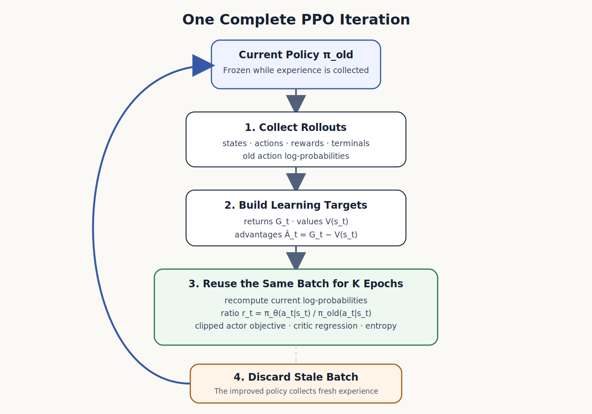
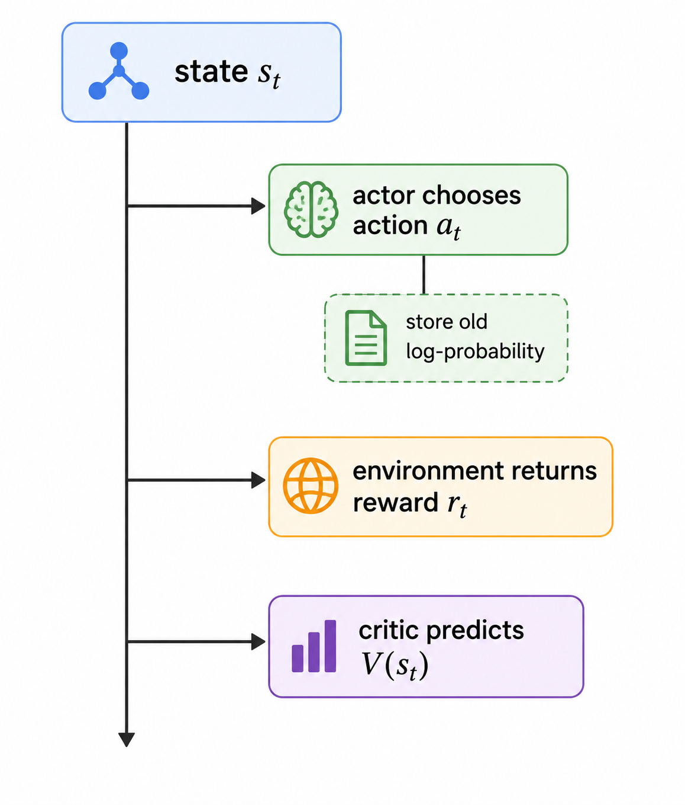
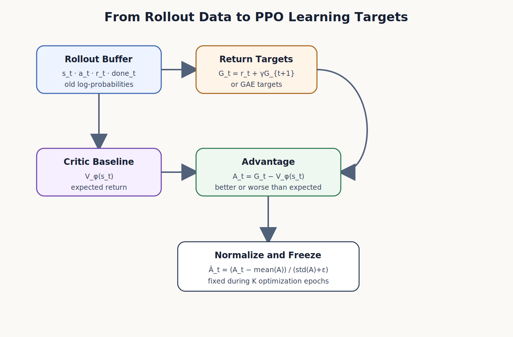
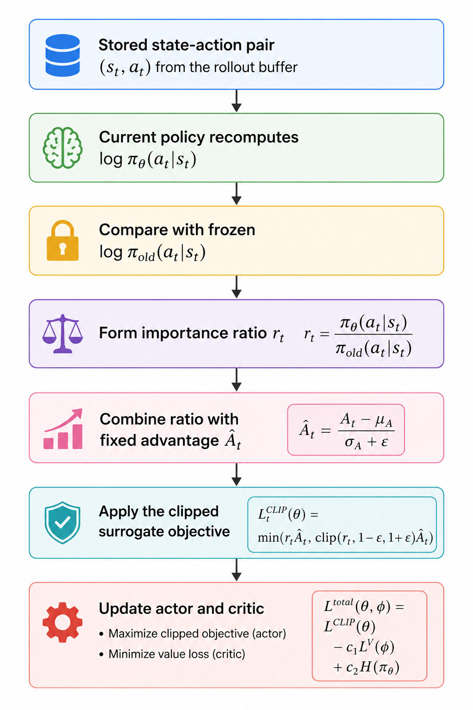
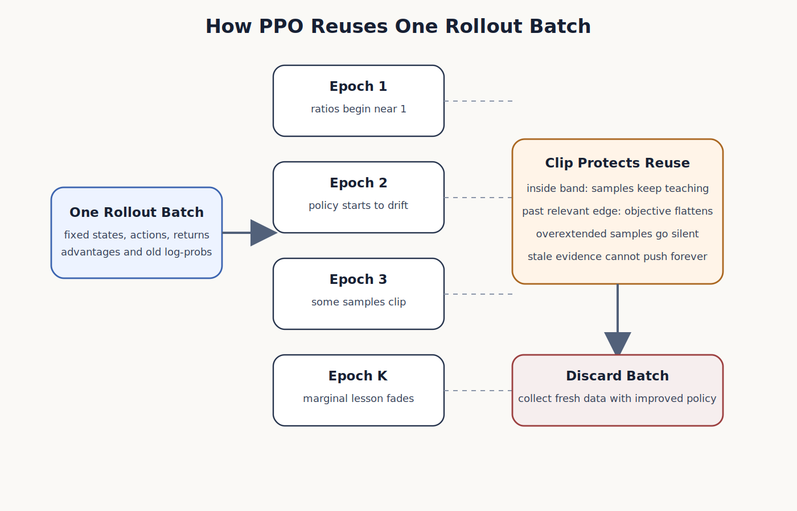
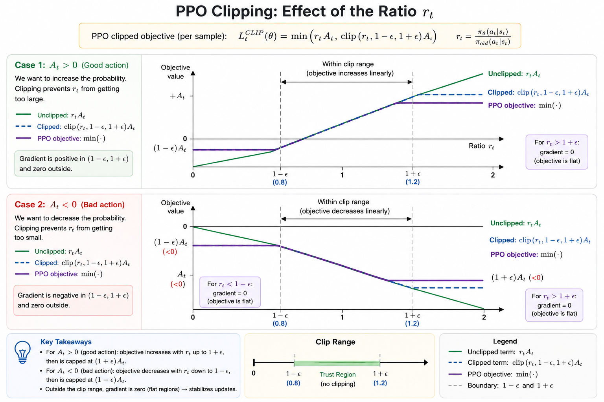
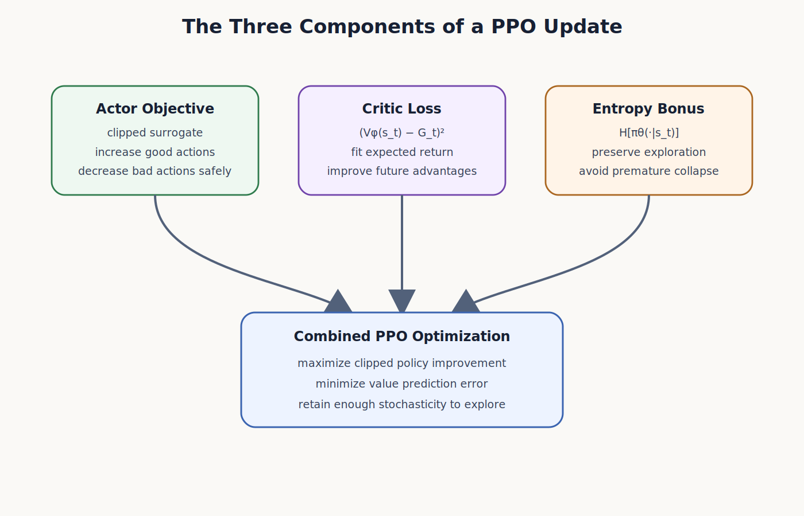
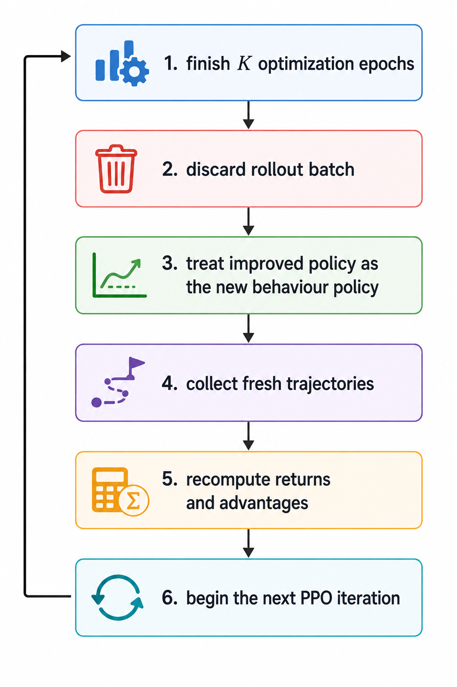

# The PPO Training Loop

> [!abstract]
> **Mission Statement**
>
> PPO is often introduced through one equation—the clipped surrogate objective—but the equation makes sense only when placed inside the complete training loop. This note follows one full PPO iteration from data collection to policy improvement and shows how returns, the critic, the advantage, importance sampling, clipping, minibatch optimization, and fresh rollouts fit together as parts of one coherent algorithm.

# Contents

[[#1. PPO Is a Training Loop, Not Just a Loss Function]]

[[#2. The Entire Loop at a Glance]]

[[#3. Why PPO Needs Clipping]]

[[#4. Stage One: Collect Experience]]

[[#5. What the Rollout Buffer Must Preserve]]

[[#6. Stage Two: Convert Experience into Learning Targets]]

[[#7. Stage Three: Reuse the Batch for Several Epochs]]

[[#8. The Clipped Surrogate Objective]]

[[#9. Actor, Critic, and Entropy Terms]]

[[#10. Stage Four: Discard the Batch and Repeat]]

[[#11. One Transition Moving Through PPO]]

[[#12. PPO as an Algorithm]]

[[#13. Why the Loop Is Sample Efficient]]

[[#14. Failure Modes and Diagnostics]]

[[#15. Summary]]

---

# 1. PPO Is a Training Loop, Not Just a Loss Function

Proximal Policy Optimization is frequently summarised by the clipped objective

$$
L^{\mathrm{CLIP}}(\theta)
=
\mathbb{E}_t
\left[
\min
\left(
r_t(\theta)\hat{A}_t,
\operatorname{clip}
\left(
r_t(\theta),
1-\epsilon,
1+\epsilon
\right)
\hat{A}_t
\right)
\right],
$$

where the probability ratio is

$$
r_t(\theta)
=
\frac
{\pi_\theta(a_t\mid s_t)}
{\pi_{\mathrm{old}}(a_t\mid s_t)}.
$$

This equation is central to PPO, but it is not the algorithm by itself. PPO is a repeated interaction between a policy, an environment, a critic, and an optimization procedure. The policy first generates trajectories. Those trajectories are converted into returns and advantages. The same batch is then reused for several epochs, during which the current policy is repeatedly compared with the frozen policy that generated the batch. The clip limits how much additional reward the optimiser can obtain by moving the probability ratio too far away from one. After the batch has been used for as many updates as can be justified safely, it is discarded and the improved policy collects new experience.

The defining idea is therefore not merely that PPO clips a ratio. The deeper idea is that PPO creates a temporary window during which an old batch remains useful. Importance sampling corrects the mismatch between the current policy and the data-generating policy, while clipping prevents that correction from becoming unreliable as the policy drifts. The entire method is built around extracting several inexpensive gradient updates from one expensive round of environment interaction without allowing stale data to dictate an arbitrarily large policy change.

PPO can be understood as a rhythm:

> **collect, evaluate, improve cautiously, refresh the data, and repeat.**

That rhythm is more important than any individual line of the objective.

---

# 2. The Entire Loop at a Glance

The complete PPO loop can be represented as a cycle in which each stage produces the inputs required by the next.



The loop begins with a current policy, which is temporarily treated as the behaviour policy $\pi_{\mathrm{old}}$. This policy interacts with the environment and fills a rollout buffer containing states, actions, rewards, termination signals, value predictions, and the old log-probabilities of the sampled actions. The collected rewards are then converted into return targets, while the critic supplies a baseline used to compute advantages. Those advantages are normalized and held fixed while the policy and critic are optimized over shuffled minibatches for several epochs.

During each policy update, PPO recomputes the action log-probability under the current parameters and compares it with the frozen log-probability stored at collection time. Their difference produces the importance ratio. The ratio enters the clipped surrogate objective, which allows ordinary policy-gradient learning while the update remains close to the behaviour policy, but removes the incentive for a sample to push the policy farther once its ratio has crossed the relevant clipping boundary. In parallel, the critic is trained toward the return target, and an optional entropy term discourages the policy from becoming prematurely deterministic.

After several epochs, the batch has become increasingly stale because the current policy is no longer the policy that generated it. PPO does not preserve that batch indefinitely. It discards the data, treats the improved policy as the next behaviour policy, and returns to the environment. Training therefore alternates between two distinct phases: expensive data collection and comparatively cheap data reuse.

---

# 3. Why PPO Needs Clipping

To understand the clip function, begin with the unclipped importance-sampled surrogate

$$
L^{\mathrm{PG}}(\theta)
=
\mathbb{E}_t
\left[
r_t(\theta)\hat{A}_t
\right].
$$

If $\hat{A}_t>0$, the sampled action performed better than expected, so increasing its probability raises the objective. If $\hat{A}_t<0$, the action performed worse than expected, so decreasing its probability raises the objective. At the beginning of optimization, the current policy and the frozen behaviour policy are identical, so $r_t(\theta)=1$. As gradient updates accumulate, the ratio moves away from one.

The problem is that the unclipped objective continues rewarding movement even after the policy has changed enough that the old batch is no longer a reliable description of the current policy. A positive-advantage sample may keep increasing its ratio from $1.1$ to $1.5$, $2$, or beyond, even though the evidence for doing so comes from a trajectory generated by the old policy. A negative-advantage sample may similarly push its ratio toward zero. In both cases, the optimiser is exploiting the surrogate in a region where the underlying data provides increasingly weak support.

PPO limits this incentive through

$$
\operatorname{clip}
\left(
r_t(\theta),
1-\epsilon,
1+\epsilon
\right).
$$

For a common choice of $\epsilon=0.2$, the trusted band is

$$
[0.8,1.2].
$$

The clipping operation itself simply caps the numerical ratio inside this interval. The full PPO objective then takes the minimum of the unclipped and clipped terms,

$$
L_t^{\mathrm{CLIP}}(\theta)
=
\min
\left(
r_t(\theta)\hat{A}_t,
\operatorname{clip}
\left(
r_t(\theta),
1-\epsilon,
1+\epsilon
\right)\hat{A}_t
\right).
$$

The minimum creates a pessimistic objective. PPO accepts the ordinary surrogate whenever it gives the more conservative value, but refuses to reward an update merely because the ratio moved beyond the trusted interval in the direction that improves the sampled objective. For a positive advantage, the gain stops increasing once $r_t>1+\epsilon$. For a negative advantage, the gain stops improving once $r_t<1-\epsilon$. The clip is therefore not a general prohibition on ratios outside the interval; it is a mechanism that removes the incentive to continue moving farther in the beneficial but dangerous direction.

This distinction matters. PPO does not guarantee that every ratio remains inside the clipping band, nor does clipping impose an exact KL-divergence constraint. Instead, it reshapes the objective so that overcommitted samples stop producing useful gradient pressure. The algorithm thereby approximates the conservative policy updates of a trust-region method while remaining compatible with standard first-order optimizers such as Adam.

---

# 4. Stage One: Collect Experience

Each PPO iteration begins by freezing the current policy conceptually and using it to generate a batch of trajectories. During this stage, the policy is not being updated. It acts only as the behaviour policy that determines which states are visited and which actions are sampled. The resulting dataset is therefore on-policy with respect to $\pi_{\mathrm{old}}$ at the moment of collection.

At each time step, the agent observes a state $s_t$, samples an action $a_t\sim\pi_{\mathrm{old}}(\cdot\mid s_t)$, receives a reward $r_t$, and transitions to the next state. In addition to the obvious transition data, PPO stores the log-probability

$$
\log \pi_{\mathrm{old}}(a_t\mid s_t).
$$

This stored quantity is essential because it preserves the probability assigned to the sampled action by the exact policy that generated the batch. Later, after the policy has changed, PPO evaluates the same action under the current policy and forms

$$
r_t(\theta)
=
\exp
\left(
\log \pi_\theta(a_t\mid s_t)
-
\log \pi_{\mathrm{old}}(a_t\mid s_t)
\right).
$$

The old log-probability must remain frozen throughout all optimization epochs. If it were recomputed after every policy update, the denominator would move with the numerator, the ratio would remain close to one for the wrong reason, and PPO would lose its ability to measure how far the policy had changed relative to the data-generating policy.

Rollout collection is usually the most expensive part of PPO. A simulation may be slow, a robot may need to act in real time, or a language model may need to auto-regressively generate thousands of tokens before a trajectory can be scored. PPO's sample-efficiency advantage comes from paying this collection cost once and then learning from the resulting batch repeatedly, but only within the temporary protection provided by the clipping mechanism.

---

# 5. What the Rollout Buffer Must Preserve

A PPO rollout buffer is not merely a collection of rewards. It preserves the evidence required to reconstruct the learning problem after the policy begins to change. At minimum, the buffer stores the states $s_t$, actions $a_t$, rewards $r_t$, episode boundaries or termination indicators, and old log-probabilities $\log\pi_{\mathrm{old}}(a_t\mid s_t)$. Many implementations also store the value estimate $V_{\mathrm{old}}(s_t)$ computed during collection, because it is useful when constructing advantages or applying value-function clipping.

The conceptual relationship between these stored quantities is as follows:



The buffer must also preserve episode structure. Returns and generalised advantages depend on where trajectories terminate, so transitions from separate episodes cannot be treated as one uninterrupted sequence. If a trajectory ends because the environment reaches a terminal state, future rewards beyond that state contribute nothing. If a rollout is truncated only because the collection horizon was reached, the value of the final state may be used for bootstrapping. These details affect the numerical targets used to train both actor and critic, even though they do not change the high-level structure of the PPO loop.

Once the rollout buffer is full, PPO stops interacting with the environment. The next phase converts the raw sequence of states, actions, and rewards into learning targets that can be reused throughout optimization.

---
# 6. Stage Two: Convert Experience into Learning Targets

Once the rollout buffer has been filled, PPO temporarily stops interacting with the environment and begins converting raw experience into quantities that can guide learning. The collected rewards are useful, but they are not yet suitable as direct optimization targets because a reward describes only what happened at one step. The actor and critic need a longer-horizon signal that reflects the consequences of each decision over the remainder of the trajectory.

For each time step $t$, PPO computes a return target. In the simplest Monte Carlo form, the return-to-go is

$$
G_t
=
r_t
+
\gamma r_{t+1}
+
\gamma^2 r_{t+2}
+
\cdots
+
\gamma^{T-t}r_T.
$$

The same quantity can be computed efficiently by moving backward through an episode:

$$
G_t
=
r_t
+
\gamma G_{t+1}.
$$

The return tells us what eventually happened after the sampled action was taken. However, the actor should not treat every high return as evidence that the chosen action was exceptional. Some states are naturally favourable and yield large returns under many actions, while other states are intrinsically difficult. PPO therefore compares the observed return with the critic's prediction of what was expected from that state.

The critic estimates

$$
V_\phi(s_t)
\approx
\mathbb{E}[G_t\mid s_t],
$$

and the simplest advantage estimate is

$$
A_t
=
G_t
-
V_\phi(s_t).
$$

A positive advantage means that the sampled action led to an outcome better than the critic expected from the state. A negative advantage means that the outcome was worse than expected. The advantage is therefore the actor's directional learning signal: increase the probability of actions with positive advantages and decrease the probability of actions with negative advantages.



In many practical PPO implementations, the advantage is computed with Generalized Advantage Estimation rather than a full Monte Carlo return. GAE mixes one-step temporal-difference errors across several horizons,

$$
\delta_t
=
r_t
+
\gamma V_\phi(s_{t+1})
-
V_\phi(s_t),
$$

$$
\hat{A}_t^{\mathrm{GAE}(\gamma,\lambda)}
=
\sum_{l=0}^{T-t-1}
(\gamma\lambda)^l
\delta_{t+l}.
$$

The parameter $\lambda$ controls the bias-variance trade-off. Smaller values rely more heavily on the critic and produce lower-variance but more biased estimates, while values closer to one behave more like Monte Carlo returns and reduce bias at the cost of higher variance. The high-level PPO loop remains unchanged regardless of which advantage estimator is chosen: trajectories are collected once, transformed into fixed return and advantage targets, and then reused during optimization.

Before minibatch training begins, PPO commonly normalizes the advantages across the rollout batch:

$$
\hat{A}_t
=
\frac
{A_t-\operatorname{mean}(A)}
{\operatorname{std}(A)+\varepsilon_{\mathrm{num}}}.
$$

Normalization does not change which samples are positive or negative. It centres the batch around zero and stabilizes the scale of policy gradients across iterations. Without normalization, one rollout batch may produce advantages in the range $[-2,2]$, while another may produce values in the hundreds, forcing the optimizer to cope with a moving gradient scale. Normalization makes a single learning rate more useful throughout training.

A subtle but important point is that the returns and advantages are usually computed once per rollout batch and then treated as fixed targets during the subsequent optimization epochs. The policy and critic continue changing, but the batch's interpretation does not get recomputed after every minibatch step. This preserves the meaning of the update: the current policy is repeatedly evaluated against one frozen set of evidence collected by $\pi_{\mathrm{old}}$.

---

# 7. Stage Three: Reuse the Batch for Several Epochs

The third stage is where PPO extracts its sample-efficiency advantage. A plain on-policy policy-gradient method would typically collect a batch, take one update, and discard the data because the policy has changed. PPO instead revisits the same batch for $K$ epochs, dividing it into shuffled minibatches and taking several gradient steps. The clip function is what makes this repeated reuse sufficiently conservative.

At the start of the first epoch, the current policy is still equal to the policy that generated the data, so for every stored transition

$$
r_t(\theta)
=
\frac
{\pi_\theta(a_t\mid s_t)}
{\pi_{\mathrm{old}}(a_t\mid s_t)}
=
1.
$$

After the first few updates, $\pi_\theta$ begins to drift away from $\pi_{\mathrm{old}}$. The numerator changes because it is recomputed under the current parameters, while the denominator remains fixed because it was stored during collection. The ratio therefore becomes a direct measure of how much the probability of the sampled action has changed.

For every minibatch, PPO performs the following conceptual operations:




The policy ratio is usually computed in log space for numerical stability:

$$
r_t(\theta)
=
\exp
\left(
\log\pi_\theta(a_t\mid s_t)
-
\log\pi_{\mathrm{old}}(a_t\mid s_t)
\right).
$$

The unclipped surrogate contribution is

$$
r_t(\theta)\hat{A}_t.
$$

This term has the correct policy-gradient behaviour. When $\hat{A}_t>0$, increasing $r_t$ improves the objective, so the sampled action becomes more probable. When $\hat{A}_t<0$, decreasing $r_t$ improves the objective, so the action becomes less probable. The problem is that the unclipped surrogate places no natural limit on how far the probability may move during repeated epochs.

PPO therefore constructs a second term by clipping the ratio:

$$
\operatorname{clip}
\left(
r_t(\theta),
1-\epsilon,
1+\epsilon
\right)
\hat{A}_t.
$$

The final contribution is the smaller of the unclipped and clipped terms:

$$
L_t^{\mathrm{CLIP}}(\theta)
=
\min
\left(
r_t(\theta)\hat{A}_t,
\operatorname{clip}
\left(
r_t(\theta),
1-\epsilon,
1+\epsilon
\right)\hat{A}_t
\right).
$$

This pessimistic choice ensures that the objective does not reward policy movement beyond the clipping boundary in the direction that would otherwise improve the sampled surrogate. Inside the trusted interval, PPO behaves like an ordinary advantage-weighted policy gradient. Beyond the relevant edge, the objective becomes flat for that sample and its gradient contribution disappears.

The same batch is then shuffled and processed again. Some transitions may remain inside the clipping band and continue teaching the policy. Others may already have moved beyond their safe boundary and become effectively silent. This selective flattening is what allows PPO to squeeze several updates out of one batch without allowing every stale sample to keep exerting full pressure indefinitely.



Batch reuse should not be confused with unrestricted replay. PPO is still fundamentally on-policy. The batch is reused only for a small, finite number of epochs, and the updates are measured relative to the frozen behaviour policy that produced that batch. Once the policy has moved enough that the batch is broadly stale, PPO discards it and returns to the environment.

---

# 8. The Clipped Surrogate Objective

The clipped objective is easiest to understand by separating the cases of positive and negative advantage.

For a positive advantage, $\hat{A}_t>0$, PPO wants to increase the probability of the action. The objective grows as $r_t$ moves above one, but only until the upper boundary $1+\epsilon$ is reached. Beyond that point, the clipped branch becomes constant:

$$
L_t^{\mathrm{CLIP}}
=
(1+\epsilon)\hat{A}_t
\quad
\text{when the clipped branch is selected}.
$$

Because this value no longer changes with $r_t$, its gradient with respect to the policy parameters is zero. The action has already become sufficiently more probable within the current batch, so additional increase receives no further reward.

For a negative advantage, $\hat{A}_t<0$, PPO wants to reduce the action's probability. In this case, the dangerous direction is downward. Once the ratio falls below $1-\epsilon$, the clipped branch freezes at

$$
L_t^{\mathrm{CLIP}}
=
(1-\epsilon)\hat{A}_t.
$$



Again, the gradient becomes zero when the clipped branch controls the minimum. PPO therefore limits both over-promotion of good actions and over-suppression of bad actions, but it does so asymmetrically according to the sign of the advantage.

With $\epsilon=0.2$, the practical interpretation is simple. PPO initially allows a sampled action's probability ratio to move roughly within the interval $[0.8,1.2]$. A positive-advantage action can be pushed upward until the ratio reaches approximately $1.2$, while a negative-advantage action can be pushed downward until it reaches approximately $0.8$. The objective does not enforce a hard wall on every ratio, but it removes the direct sampled incentive to move farther in the improvement-seeking direction.

This is why clipping should be understood as a **one-sided brake**, not a universal clamp. The minimum operation determines whether the clipped or unclipped branch is active, and the active branch depends on both the ratio and the sign of the advantage. PPO is intentionally pessimistic: whenever the unclipped objective claims a larger gain by moving too far, PPO chooses the smaller clipped estimate instead.

A useful worked example makes the mechanism concrete. Let $\hat{A}_t=2$ and $\epsilon=0.2$. At $r_t=1.1$, the unclipped and clipped terms are both $2.2$, so the sample continues pushing the action probability upward. At $r_t=1.5$, the terms become

$$
r_t\hat{A}_t
=
1.5\times2
=
3,
$$

$$
\operatorname{clip}(1.5,0.8,1.2)\hat{A}_t
=
1.2\times2
=
2.4.
$$

The minimum selects $2.4$, which is constant with respect to further increases in the ratio. The sample therefore stops encouraging the policy to increase that action's probability. It may become active again in a later PPO iteration, but only after fresh data has been collected under the improved policy and a new behaviour-policy reference has been established.

---

# 9. Actor, Critic, and Entropy Terms

PPO is usually presented through the clipped actor objective, but a complete implementation optimizes more than the policy alone. The actor must learn which actions should become more or less probable, the critic must improve its estimate of expected return, and the policy may also need an exploration incentive to avoid collapsing too early into a nearly deterministic strategy. These roles are combined into a single training objective.

A common form is

$$
L(\theta,\phi)
=
\mathbb{E}_t
\left[
L_t^{\mathrm{CLIP}}(\theta)
-
c_1
\left(
V_\phi(s_t)-G_t
\right)^2
+
c_2
\mathcal{H}
\left[
\pi_\theta(\cdot\mid s_t)
\right]
\right],
$$

where $\theta$ denotes the actor parameters, $\phi$ denotes the critic parameters, $c_1$ controls the weight assigned to the value loss, and $c_2$ controls the strength of the entropy bonus. Some implementations maximize this expression directly, while others convert it into a minimization loss by negating the actor and entropy terms. The sign convention changes, but the underlying jobs remain the same.

The clipped actor term improves the policy cautiously. It uses the fixed advantage to determine the direction of change and the importance ratio to measure how far the current policy has moved relative to the behaviour policy. The critic term trains $V_\phi(s_t)$ toward the return target $G_t$. A better critic produces lower-variance advantages in the next iteration, which in turn improves the quality of future policy updates. The entropy term rewards a broader action distribution and therefore discourages premature certainty.

The three terms should not be interpreted as unrelated losses that merely happen to be added together. They form a feedback system. The actor changes the policy, the changed policy produces a new return distribution, the critic tracks that distribution, and the improved critic sharpens the next set of advantages. Entropy moderates the actor during this process by preserving enough stochasticity for the agent to continue exploring alternatives.



The critic loss is commonly written as

$$
L_t^{V}(\phi)
=
\left(
V_\phi(s_t)-G_t
\right)^2.
$$

This is a supervised regression problem. The state is the input and the sampled return or bootstrapped return is the target. The critic does not determine which action becomes more likely; it estimates the baseline against which action quality is judged. When the critic is inaccurate, the advantage becomes noisy. When it becomes more accurate, the actor receives a cleaner estimate of whether a sampled action outperformed or underperformed expectation.

The entropy bonus is

$$
\mathcal{H}
\left[
\pi_\theta(\cdot\mid s_t)
\right]
=
-
\sum_a
\pi_\theta(a\mid s_t)
\log
\pi_\theta(a\mid s_t)
$$

for a discrete action space. High entropy corresponds to a broad distribution in which several actions remain plausible, while low entropy corresponds to a concentrated distribution. The entropy coefficient is usually small because exploration should support learning rather than dominate it. In some tasks the entropy bonus is essential; in others it is set to zero once sufficient exploration arises naturally from the environment or the policy parameterization.

PPO does not require the actor and critic to use separate networks. They may share a feature extractor and have separate output heads, or they may be implemented as independent models. Shared representations can improve efficiency, but they also couple the optimization problems: a critic update may alter features used by the actor, and an actor update may disturb value predictions. Separate networks reduce this interference at the cost of additional parameters and computation.

---

# 10. Stage Four: Discard the Batch and Repeat

After $K$ epochs, PPO has extracted most of the safe learning signal available from the rollout batch. The current policy has moved away from the behaviour policy, more importance ratios have approached or crossed the clipping boundaries, and the marginal value of another pass through the same data has diminished. At this point, the correct action is not to keep optimizing indefinitely but to discard the batch and return to the environment.

This step is what preserves the on-policy character of PPO. The method permits limited reuse, but it does not treat experience as permanently valid. A batch collected by $\pi_{\mathrm{old}}$ describes the state-action distribution induced by that policy. Once the current policy has changed substantially, the batch no longer represents the states and actions that the new policy would naturally encounter.

The end of one PPO iteration can therefore be summarized as



The old policy is not usually maintained as a permanently separate network throughout standard PPO training. The frozen reference for a batch is represented by the stored old log-probabilities. At the next collection stage, the current policy simply generates fresh trajectories, and its action log-probabilities become the next batch's frozen reference values.

Repeated over thousands of iterations, this pattern produces a sequence of small policy improvements. PPO does not attempt to solve the entire control problem in one optimization phase. It alternates between local learning and fresh evidence, repeatedly rebuilding its trusted neighbourhood around the newest policy.

---

# 11. One Transition Moving Through PPO

A single transition is enough to reveal the complete logic of the algorithm. Suppose the old policy visits state $s_t$ and selects action $a_t$ with probability

$$
\pi_{\mathrm{old}}(a_t\mid s_t)=0.40.
$$

The action eventually leads to a return of $G_t=12,$ while the critic predicted $V(s_t)=10.$ The resulting advantage is

$$
A_t
=
12-10
=
2.
$$

The action performed better than expected, so the actor should increase its probability. At the start of optimization, the current policy is identical to the old policy, giving $r_t=1.$ The unclipped surrogate contribution is therefore

$$
r_tA_t
=
1\times2
=
2.
$$

After several mini-batch updates, suppose the current policy assigns the action probability $0.44$. The ratio becomes

$$
r_t
=
\frac{0.44}{0.40}
=
1.1.
$$

With $\epsilon=0.2$, this remains inside the clipping interval. The unclipped and clipped terms are identical:

$$
1.1\times2
=
2.2.
$$

The transition continues producing a positive gradient that encourages the actor to raise the action probability.

Later, suppose the probability rises to $0.60$. The ratio is now

$$
r_t
=
\frac{0.60}{0.40}
=
1.5.
$$

The unclipped term is $3$, but the clipped term is

$$
1.2\times2
=
2.4.
$$

The minimum selects $2.4$. Because this clipped value no longer depends on further increases in $r_t$, the sample stops pushing the probability upward. The action may still change indirectly because of updates from other samples or shared parameters, but this transition no longer receives additional credit for increasing its ratio beyond the upper boundary.

The critic simultaneously observes the same state and return target. If it predicts $10$ while the target is $12$, the value loss is

$$
(10-12)^2
=
4.
$$

A gradient step moves the critic toward a larger value estimate. During the current optimization phase, however, the advantage $A_t=2$ remains fixed. PPO does not repeatedly recompute the advantage after every critic update, because doing so would change the actor's learning target while the batch is being optimized.

This one transition therefore participates in two distinct learning problems. It tells the actor that the sampled action was better than expected, and it tells the critic that its expected-return estimate was too low. PPO allows both models to learn from the same experience while ensuring that the policy does not overreact to one sample.

---

# 12. PPO as an Algorithm

The complete algorithm can be written compactly without losing its conceptual structure.

```text
initialize actor parameters θ
initialize critic parameters φ

repeat for each PPO iteration:

    collect a rollout batch using the current policy
    store states, actions, rewards, terminals,
    old log-probabilities, and value predictions

    compute returns or GAE targets
    compute advantages
    normalize advantages

    repeat for K epochs:

        shuffle the rollout batch
        divide it into minibatches

        for each minibatch:

            recompute current action log-probabilities
            form ratio = exp(logp_current - logp_old)

            compute unclipped surrogate
            compute clipped surrogate
            use the minimum as the actor objective

            compute critic regression loss
            compute optional entropy bonus

            update actor and critic

    discard the rollout batch
```

In mathematical form, the actor optimizes

$$
L^{\mathrm{CLIP}}(\theta)
=
\mathbb{E}_t
\left[
\min
\left(
r_t(\theta)\hat{A}_t,
\operatorname{clip}
\left(
r_t(\theta),
1-\epsilon,
1+\epsilon
\right)\hat{A}_t
\right)
\right].
$$

The critic minimizes

$$
L^V(\phi)
=
\mathbb{E}_t
\left[
\left(
V_\phi(s_t)-G_t
\right)^2
\right].
$$

An entropy bonus may be added to the actor objective:

$$
L^{\mathrm{ENT}}(\theta)
=
\mathbb{E}_t
\left[
\mathcal{H}
\left(
\pi_\theta(\cdot\mid s_t)
\right)
\right].
$$

The complete optimization is usually performed with shuffled minibatches rather than the entire rollout batch at once. Minibatching reduces memory requirements, introduces useful stochasticity, and allows several optimizer steps per epoch. The batch is reshuffled at the beginning of each epoch so that the same transitions appear in different minibatch combinations.

---

# 13. Why the Loop Is Sample Efficient

PPO's central economic advantage is the ratio between expensive interaction and cheap optimization. Collecting a trajectory may require running a simulator, moving a physical system, or generating a long sequence with a large model. Once the data has been collected, evaluating log-probabilities and taking gradient steps is comparatively inexpensive. PPO therefore tries to extract several useful updates from each rollout batch.

Without batch reuse, the pattern would be

```text
collect → update once → discard
collect → update once → discard
collect → update once → discard
```

With PPO, the pattern becomes

```text
collect → epoch 1 → epoch 2 → ... → epoch K → discard
```

The second pattern extracts more optimization work from each unit of environment interaction. The gain is not unlimited, because every update makes the batch staler. Clipping makes moderate reuse practical by muting transitions whose ratios have already moved beyond their useful range.

This is why both $K$ and $\epsilon$ matter. A very small number of epochs wastes potentially useful data. Too many epochs may overfit the batch and drive the current policy far from the behaviour policy despite clipping. A very narrow clipping interval may suppress learning prematurely, while a very wide interval weakens the conservative-update effect. PPO works well because it balances these quantities rather than maximizing any one of them independently.

---

# 14. Failure Modes and Diagnostics

PPO is robust, but it is not immune to instability. The most useful diagnostics reveal whether the policy is moving too far, whether the critic is learning effectively, and whether exploration is collapsing.

The approximate KL divergence between the old and current policy provides a direct measure of update size. Although PPO does not impose a hard KL constraint, many implementations monitor

$$
\widehat{D}_{KL}
\approx
\mathbb{E}_t
\left[
\log\pi_{\mathrm{old}}(a_t\mid s_t)
-
\log\pi_\theta(a_t\mid s_t)
\right].
$$

A sudden increase indicates that the policy has moved farther than expected. Some implementations stop the remaining epochs early when the measured KL exceeds a target threshold.

The clipping fraction measures the proportion of samples for which the ratio has moved beyond the clipping interval. A very low clipping fraction may indicate that updates are too small to use the batch effectively. A very high clipping fraction suggests that many samples have already become inactive and that the optimizer may be pushing too aggressively.

Critic diagnostics are equally important. The value loss shows whether predictions are approaching return targets, while explained variance measures how much of the variation in returns is captured by the critic. A weak critic produces noisy advantages and can make actor learning unstable even when the clipped objective is implemented correctly.

Entropy reveals whether the policy is becoming too deterministic. Rapid entropy collapse may cause premature convergence to a mediocre strategy. Persistently high entropy may indicate that the policy is failing to commit to useful actions.

The return curve alone is not sufficient. A temporary increase in reward may hide excessive policy movement, critic collapse, or loss of exploration. Reliable PPO training is usually assessed through a collection of signals: episodic return, approximate KL, clipping fraction, entropy, value loss, explained variance, gradient norms, and the distribution of importance ratios.

---

# 15. Summary

PPO is best understood as a repeated mechanism for turning expensive interaction into cautious policy improvement. The current policy first collects trajectories and records the information needed to evaluate future change, especially the old action log-probabilities. Rewards are transformed into return targets, the critic supplies a baseline, and the resulting advantages identify which sampled actions performed better or worse than expected.

The rollout batch is then reused for several epochs. During each minibatch update, the current policy recomputes action probabilities, compares them with the frozen probabilities from collection time, and forms an importance ratio. The unclipped surrogate provides the correct policy-gradient direction, while the clipping function removes the incentive for individual samples to push the policy too far beyond the behaviour policy. The critic learns in parallel by regressing toward the return target, and an optional entropy bonus preserves exploration.

After a limited number of epochs, the batch is discarded because it no longer represents the improved policy closely enough. The new policy returns to the environment, collects fresh trajectories, and begins the cycle again. PPO's stability therefore comes not from a single mathematical trick but from the coordination of several ideas: on-policy collection, value estimation, advantage centring, importance sampling, pessimistic clipping, finite batch reuse, and repeated refreshment of experience.

> [!important]
> PPO succeeds because it reuses data without pretending that old data remains valid forever. The importance ratio measures policy change, the clip limits how much the optimizer can profit from that change, and fresh rollouts continually reset the learning problem around the newest policy.
